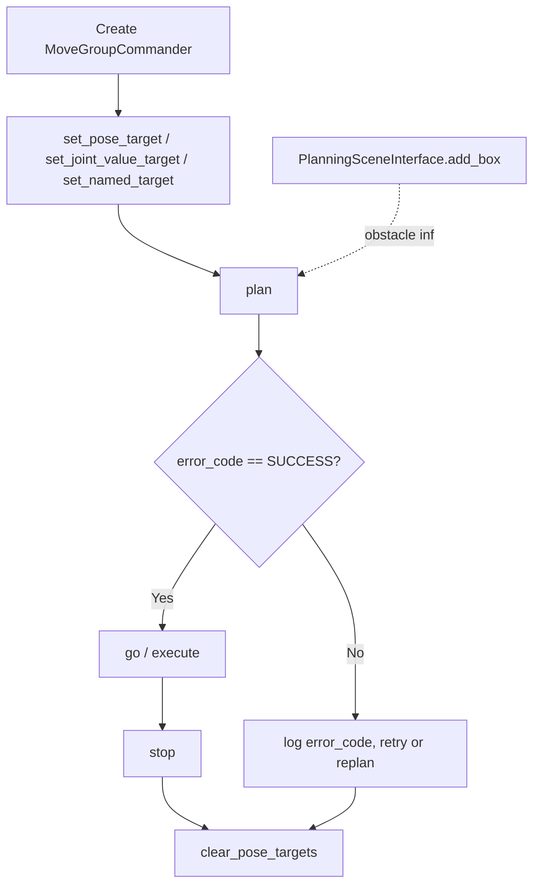

# Mastering with ROS: TIAGo - Melodic — Unit 5: Motion Planning with MoveIt: Part 2

Part 1 taught you to plan by dragging a marker in RViz. This unit does the same job from code with MoveIt's Python interface — the step that turns motion planning into something you can call from a larger program instead of a person clicking buttons. Everything you learned about planning groups, planning scenes, and the plan-then-execute habit in Part 1 still applies here; you're just driving it through `moveit_commander` instead of the GUI, which is what makes it possible to script sequences (Part 3) instead of clicking through them one goal at a time.

The diagram below traces the programmatic plan/execute call sequence, including how a collision object added via `PlanningSceneInterface` feeds into planning and how a failed plan is checked against MoveIt's error code before anything moves.



## The MoveGroupCommander

`moveit_commander` wraps the `move_group` node behind a Python object scoped to one planning group. Creating one and asking it for the robot's current pose is the standard first move in any MoveIt script:

```python
import sys, rospy, moveit_commander

moveit_commander.roscpp_initialize(sys.argv)
rospy.init_node("tiago_moveit_demo")

arm_group = moveit_commander.MoveGroupCommander("arm_torso")
print(arm_group.get_current_pose().pose)
print(arm_group.get_current_joint_values())
print(arm_group.get_planning_frame())       # usually "base_footprint" or "odom"
print(arm_group.get_end_effector_link())
```

`get_planning_frame()` and `get_end_effector_link()` are worth printing once at the start of every new script — every pose you build with `set_pose_target` is interpreted relative to the planning frame, and mixing up frames is a common source of plans that succeed but move the arm somewhere unexpected.

## Setting pose and joint targets

You can ask for a target in Cartesian space (a pose for the end effector), joint space (explicit joint angles), or — if your MoveIt config defines them — a **named target**, a pre-recorded joint configuration stored in the SRDF. TIAGo's config typically ships a "home" pose for `arm_torso`, which is the safest way to return the arm to a known, collision-free configuration between tasks:

```python
from geometry_msgs.msg import Pose

target = Pose()
target.position.x, target.position.y, target.position.z = 0.5, 0.1, 0.8
target.orientation.w = 1.0

arm_group.set_pose_target(target)
success, trajectory, planning_time, error_code = arm_group.plan()
if success:
    arm_group.go(wait=True)
arm_group.stop()                 # ensure no residual motion
arm_group.clear_pose_targets()

# Return to a known configuration instead of planning a new pose:
arm_group.set_named_target("home")
arm_group.go(wait=True)
```

Always call `stop()` after `go()` and clear your targets afterward — leftover targets silently carry over into the next planning call and are a common source of "why did it move somewhere I didn't ask for" bugs. `go(wait=True)` blocks until execution finishes and is the right default; passing `wait=False` returns immediately and hands you responsibility for knowing when the motion is actually done, which is only worth the complexity once you're coordinating the arm against something else happening concurrently.

## Reading the plan outcome properly

Checking `success` is enough for a demo script, but `plan()` also hands back the `moveit_msgs/MoveItErrorCodes` value that explains *why* a plan failed, which is what you actually want while debugging:

```python
from moveit_msgs.msg import MoveItErrorCodes

if error_code.val != MoveItErrorCodes.SUCCESS:
    rospy.logwarn("Planning failed (code %d) after %.2fs", error_code.val, planning_time)
```

If a target that's clearly reachable keeps failing to plan, two knobs are worth adjusting before you assume the goal is unreachable: `arm_group.set_planning_time(10.0)` gives OMPL more time per attempt, and `arm_group.set_num_planning_attempts(10)` has it retry with different random seeds and keep the best result. Both trade wall-clock time for a better chance of success — reasonable while developing, worth tightening back down once a script runs in a loop.

## Adding the world: collision objects

A pose that's kinematically reachable can still be a bad plan if it collides with something MoveIt doesn't know about. You describe real-world obstacles with a `PlanningSceneInterface`, most simply as boxes:

```python
from moveit_commander import PlanningSceneInterface
from geometry_msgs.msg import PoseStamped

scene = PlanningSceneInterface()
table_pose = PoseStamped()
table_pose.header.frame_id = "base_footprint"
table_pose.pose.position.x, table_pose.pose.position.z = 0.6, 0.4
scene.add_box("table", table_pose, size=(0.6, 1.0, 0.05))
rospy.sleep(1.0)   # give the scene time to publish before planning against it
```

Once added, `table` is a permanent obstacle for every subsequent plan until you `scene.remove_world_object("table")` — this is exactly how you'll model TIAGo's surroundings before pick-and-place attempts in later units. The `rospy.sleep(1.0)` after `add_box` isn't cosmetic: the scene update travels over a topic to `move_group` asynchronously, and planning immediately after adding an object can race ahead of it, silently planning against a stale, empty scene.

## Try it yourself

Write a script that adds a box collision object directly in front of TIAGo's current end-effector position, then requests a pose target on the *far side* of that box. Confirm the returned plan routes around the obstacle rather than through it by checking `error_code.val` against `MoveItErrorCodes.SUCCESS` before calling `go()`. Then remove the object with `remove_world_object` and re-plan the identical pose target — the new plan should take the direct path, since MoveIt has no reason to route around obstacles it no longer believes are there.
