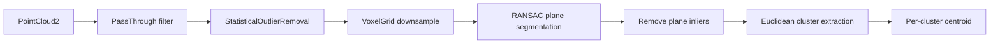

# Mastering with ROS: TIAGo - Melodic — Unit 8: Perception with PCL

OpenCV told you *what* pixel something is at; this unit tells you *where it is in 3D*. TIAGo's head sensor is RGB-D, publishing a colored point cloud alongside the plain image, and the Point Cloud Library (PCL) is the standard toolkit for turning that raw cloud into "there is an object, here, with this size." Everything downstream — a MoveIt grasp target, a `move_base` obstacle — starts from a 3D point, and PCL is how you get one out of raw sensor data.

The diagram below follows a raw point cloud through filtering, plane segmentation, and clustering to per-object 3D centroids.



## Getting a point cloud into your node

Depth-capable cameras publish `sensor_msgs/PointCloud2` on a topic such as `/xtion/depth_registered/points`. In Python you'll typically pull points out with `sensor_msgs.point_cloud2`, or hand the raw message to `pcl_ros`/`python-pcl` bindings for heavier processing; in C++, `pcl_conversions` converts the ROS message into a native PCL cloud, which the rest of this unit's C++ snippets assume you've already done:

```python
import rospy, sensor_msgs.point_cloud2 as pc2
from sensor_msgs.msg import PointCloud2

def cloud_callback(msg):
    points = list(pc2.read_points(msg, field_names=("x", "y", "z"), skip_nans=True))
    rospy.loginfo("Cloud has %d valid points", len(points))

rospy.init_node("tiago_cloud_listener")
rospy.Subscriber("/xtion/depth_registered/points", PointCloud2, cloud_callback)
rospy.spin()
```

```cpp
#include <pcl_conversions/pcl_conversions.h>

void cloudCallback(const sensor_msgs::PointCloud2ConstPtr& msg) {
    pcl::PointCloud<pcl::PointXYZ>::Ptr cloud(new pcl::PointCloud<pcl::PointXYZ>);
    pcl::fromROSMsg(*msg, *cloud);   // cloud->width/height still match the image grid
}
```

A fresh depth camera cloud is *organized* — points laid out row-by-row like the image, with `NaN` entries wherever the sensor couldn't measure a valid depth (reflective, transparent, or too-close/too-far surfaces). Filtering below normally leaves you with an *unorganized* cloud, which is fine — everything after that point only cares about 3D position, not pixel layout.

## Filtering: cut the cloud down before you process it

Raw clouds are large — a 640×480 depth image is already close to 300,000 points before you've done anything — and mostly irrelevant to any given task, so every PCL pipeline starts by throwing points away. Three filters do most of the work:

- **PassThrough** — keep only points within a range on one axis (e.g. `z` between 0.3 m and 1.5 m, to discard the floor and ceiling).
- **StatisticalOutlierRemoval** — drop sparse noise points whose neighbors are unusually far away, common at depth-discontinuity edges on RGB-D sensors and a frequent cause of spurious extra clusters later.
- **VoxelGrid** — downsample by averaging points inside a 3D grid cell, trading resolution for speed.

```cpp
pcl::PassThrough<pcl::PointXYZ> pass;
pass.setInputCloud(cloud);
pass.setFilterFieldName("z");
pass.setFilterLimits(0.3, 1.5);
pass.filter(*cloud_filtered);

pcl::StatisticalOutlierRemoval<pcl::PointXYZ> sor;
sor.setInputCloud(cloud_filtered);
sor.setMeanK(30);              // neighbors examined per point
sor.setStddevMulThresh(1.0);   // reject points beyond 1 std dev of the mean distance
sor.filter(*cloud_denoised);

pcl::VoxelGrid<pcl::PointXYZ> voxel;
voxel.setInputCloud(cloud_denoised);
voxel.setLeafSize(0.01f, 0.01f, 0.01f);   // 1 cm cells
voxel.filter(*cloud_downsampled);
```

## Segmentation: finding the table, then finding objects on it

The single most common TIAGo perception task is "find objects sitting on a flat surface," and PCL's standard recipe for it is: fit a plane with RANSAC (`pcl::SACSegmentation`) to find the dominant flat surface, remove those inlier points to leave everything *above* the table, then run Euclidean cluster extraction to split the remaining points into separate objects.

```cpp
pcl::SACSegmentation<pcl::PointXYZ> seg;
seg.setModelType(pcl::SACMODEL_PLANE);
seg.setMethodType(pcl::SAC_RANSAC);
seg.setDistanceThreshold(0.01);
seg.setInputCloud(cloud_downsampled);
seg.segment(*plane_inliers, *coefficients);   // coefficients: the plane equation ax+by+cz+d=0

pcl::ExtractIndices<pcl::PointXYZ> extract;
extract.setInputCloud(cloud_downsampled);
extract.setIndices(plane_inliers);
extract.setNegative(true);          // keep everything NOT on the plane
extract.filter(*objects_cloud);
```

## Clustering and computing 3D centroids

`objects_cloud` is still one undifferentiated blob of points sitting above the table — `pcl::EuclideanClusterExtraction` splits it into per-object groups by growing regions of points that are close together in 3D:

```cpp
pcl::search::KdTree<pcl::PointXYZ>::Ptr tree(new pcl::search::KdTree<pcl::PointXYZ>);
tree->setInputCloud(objects_cloud);

std::vector<pcl::PointIndices> cluster_indices;
pcl::EuclideanClusterExtraction<pcl::PointXYZ> ec;
ec.setClusterTolerance(0.02);     // points within 2 cm belong to the same cluster
ec.setMinClusterSize(50);         // reject clusters too small to be a real object
ec.setMaxClusterSize(25000);
ec.setSearchMethod(tree);
ec.setInputCloud(objects_cloud);
ec.extract(cluster_indices);
```

Each entry in `cluster_indices` is (approximately) one object. Compute its centroid with `pcl::compute3DCentroid` and you have a real 3D point you can publish or feed straight into the MoveIt pose targets from Units 5 and 6:

```cpp
Eigen::Vector4f centroid;
pcl::compute3DCentroid(*objects_cloud, cluster_indices[0], centroid);

geometry_msgs::PointStamped pt;
pt.header.frame_id = "xtion_rgb_optical_frame";
pt.header.stamp = ros::Time::now();
pt.point.x = centroid[0];
pt.point.y = centroid[1];
pt.point.z = centroid[2];
centroid_pub.publish(pt);   // transform through tf2 before handing this to MoveIt
```

## Visualizing and debugging in PCL and RViz

Point cloud bugs are hard to reason about from numbers alone, so lean on visualization the way Unit 3 leaned on RViz for costmaps. Add a `PointCloud2` display for each intermediate topic — raw, filtered, plane-removed, per-cluster — with distinct colors so you can see exactly which stage produced garbage. For offline work away from the robot, capture a single cloud to disk and replay it as often as you like:

```bash
rosrun pcl_ros pointcloud_to_pcd input:=/xtion/depth_registered/points
```

That writes a timestamped `.pcd` file, inspectable standalone with `pcl_viewer capture.pcd` or loadable in a C++ node with `pcl::io::loadPCDFile<pcl::PointXYZ>("capture.pcd", *cloud)` — handy for iterating on filter and segmentation parameters without the robot or simulator running.

## Try it yourself

Capture one point cloud from TIAGo's camera with `pointcloud_to_pcd`, then, using either the C++ pipeline above or `python-pcl`/`open3d` bindings if that's what's available in your environment, process it end-to-end: filter, denoise, segment out the dominant plane, cluster what's left, and print the centroid (x, y, z) of the largest remaining cluster. Then tweak `setClusterTolerance` and `setMinClusterSize` and observe how easily over- or under-segmentation creeps in — that sensitivity is exactly why the next unit's grasp pipeline treats "no cluster found" as an expected outcome, not an error.
