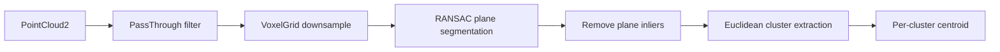

# Mastering with ROS: TIAGo - Melodic — Unit 8: Perception with PCL

OpenCV told you *what* pixel something is at; this unit tells you *where it is in 3D*. TIAGo's head sensor is RGB-D, publishing a colored point cloud alongside the plain image, and the Point Cloud Library (PCL) is the standard toolkit for turning that raw cloud into "there is an object, here, with this size."

The diagram below follows a raw point cloud through filtering, plane segmentation, and clustering to per-object 3D centroids.



## Getting a point cloud into your node

Depth-capable cameras publish `sensor_msgs/PointCloud2` on a topic such as `/xtion/depth_registered/points`. In Python you'll typically pull points out with `sensor_msgs.point_cloud2`, or hand the raw message to `pcl_ros`/`python-pcl` bindings for heavier processing; in C++, PCL nodes convert the ROS message straight into a `pcl::PointCloud<PointXYZRGB>`.

```python
import rospy, sensor_msgs.point_cloud2 as pc2
from sensor_msgs.msg import PointCloud2

def cloud_callback(msg):
    points = list(pc2.read_points(msg, field_names=("x", "y", "z"), skip_nans=True))
    rospy.loginfo("Cloud has %d valid points", len(points))

rospy.init_node("tiago_cloud_listener")
rospy.Subscriber("/xtion/depth_registered/points", PointCloud2, cloud_callback)
rospy.spin()
```

## Filtering: cut the cloud down before you process it

Raw clouds are large and mostly irrelevant to any given task, so every PCL pipeline starts by throwing points away. Two filters do most of the work:

- **PassThrough** — keep only points within a range on one axis (e.g. `z` between 0.3 m and 1.5 m, to discard the floor and ceiling).
- **VoxelGrid** — downsample by averaging points inside a 3D grid cell, trading resolution for speed.

```cpp
pcl::PassThrough<pcl::PointXYZ> pass;
pass.setInputCloud(cloud);
pass.setFilterFieldName("z");
pass.setFilterLimits(0.3, 1.5);
pass.filter(*cloud_filtered);

pcl::VoxelGrid<pcl::PointXYZ> voxel;
voxel.setInputCloud(cloud_filtered);
voxel.setLeafSize(0.01f, 0.01f, 0.01f);   // 1 cm cells
voxel.filter(*cloud_downsampled);
```

## Segmentation: finding the table, then finding objects on it

The single most common TIAGo perception task is "find objects sitting on a flat surface," and PCL's standard recipe for it is: fit a plane with RANSAC (`pcl::SACSegmentation`) to find the dominant flat surface, remove those inlier points to leave everything *above* the table, then run Euclidean cluster extraction to split the remaining points into separate objects.

```cpp
pcl::SACSegmentation<pcl::PointXYZ> seg;
seg.setModelType(pcl::SACMODEL_PLANE);
seg.setMethodType(pcl::SAC_RANSAC);
seg.setDistanceThreshold(0.01);
seg.setInputCloud(cloud_downsampled);
seg.segment(*plane_inliers, *coefficients);   // coefficients: the plane equation ax+by+cz+d=0

pcl::ExtractIndices<pcl::PointXYZ> extract;
extract.setInputCloud(cloud_downsampled);
extract.setIndices(plane_inliers);
extract.setNegative(true);          // keep everything NOT on the plane
extract.filter(*objects_cloud);
```

Run `pcl::EuclideanClusterExtraction` on `objects_cloud` and each resulting cluster is (approximately) one object — compute each cluster's centroid and you now have real 3D coordinates you can feed straight into the MoveIt pose targets from Units 5 and 6.

## Try it yourself

Using either the C++ pipeline above or `python-pcl`/`open3d` bindings if that's what's available in your environment, process one captured point cloud from TIAGo's camera end-to-end: filter, segment out the dominant plane, cluster what's left, and print the centroid (x, y, z) of the largest remaining cluster.
