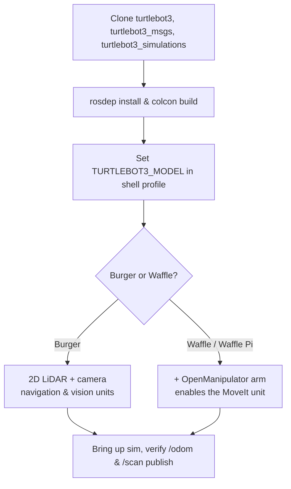

# Mastering with ROS: Turtlebot3 — Unit 1: Introduction to the Course

Turtlebot3 is the de-facto reference platform for learning mobile robotics with ROS: small, cheap enough to own two of, well documented, and popular enough that almost every tutorial, forum post, and package you'll find assumes it. This unit sets expectations for the course, walks through the hardware you'll be working with, and gets your workspace ready so every later unit can jump straight into content.

The diagram below shows the workspace setup sequence and where the Burger/Waffle choice branches, since that choice affects only which unit later touches manipulation.



## Burger vs. Waffle: two robots, one course

Turtlebot3 ships in two main configurations built on the same differential-drive base and the same ROS stack, but with different sensor and payload trade-offs:

- **Burger** — smaller footprint, single-board 2D LiDAR, a Raspberry Pi camera add-on, no room for a manipulator. Cheaper, lighter, and the more common choice for pure navigation and line-following work.
- **Waffle / Waffle Pi** — larger chassis, more payload capacity, wider sensor mounting, and (in the Waffle Pi variant paired with OpenManipulator) the platform used later in this course for the MoveIt unit.

Everything you learn transfers between the two: the ROS interfaces (topics, services, actions), the URDF structure, and the navigation stack are shared. The physical differences mostly show up as different parameter values (wheel separation, footprint radius, sensor topic names) rather than different concepts. This course is written to work on either, and calls out Waffle-specific content explicitly (mainly the manipulation unit).

## What "mastering" means here

By the end of this course you should be able to: bring up a Turtlebot3 (real or simulated) and drive it manually, build a map of an unknown space and navigate autonomously within it, process camera input to follow a line and track colored objects, recognize objects well enough to act on them, and plan arm motion with MoveIt on the manipulator-equipped variant. The final two units are a project that forces you to combine several of these skills instead of practicing them in isolation — that's deliberate, because in real robotics work the hard part is rarely one capability in isolation, it's making several of them cooperate on one robot at once.

## Setting up your workspace

You'll need a ROS workspace with the `turtlebot3`, `turtlebot3_msgs`, and `turtlebot3_simulations` packages (names are consistent across ROS distributions, though the install command differs between apt and building from source). A minimal source-based setup looks like:

```bash
mkdir -p ~/turtlebot3_ws/src
cd ~/turtlebot3_ws/src
git clone -b <your-ros-distro> https://github.com/ROBOTIS-GIT/turtlebot3.git
git clone -b <your-ros-distro> https://github.com/ROBOTIS-GIT/turtlebot3_msgs.git
git clone -b <your-ros-distro> https://github.com/ROBOTIS-GIT/turtlebot3_simulations.git
cd ~/turtlebot3_ws
rosdep install --from-paths src --ignore-src -r -y
colcon build --symlink-install   # or catkin build, depending on your ROS generation
```

Set `TURTLEBOT3_MODEL` (to `burger` or `waffle`/`waffle_pi`) in your shell profile — nearly every launch file in this ecosystem branches on this environment variable to pick the right URDF, parameter files, and sensor topics. Forgetting to set it is the single most common source of "nothing shows up in RViz" confusion for newcomers.

## Real robot or simulator — and why it barely matters here

This course treats Gazebo (or whichever simulator your ROS distro ships with) as a first-class way to work through every unit. The topics, services, and actions your code talks to are identical whether a real Turtlebot3 or a simulated one is publishing them — that's the point of ROS's hardware abstraction. Use simulation for anything destructive or repetitive (tuning navigation parameters, testing recovery behaviors) and switch to the real robot once your code behaves the way you expect.

## Try it yourself

Set `TURTLEBOT3_MODEL`, build the workspace above, and bring up the empty-world simulation for your chosen model. Confirm you can see the robot publishing on `/odom` and `/scan` with `ros2 topic hz /scan` (or `rostopic hz /scan`) before moving to Unit 2 — if the LiDAR topic isn't publishing, nothing in the rest of the course will work either.
