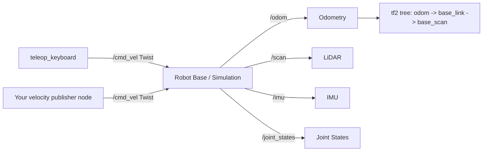

# Mastering with ROS: Turtlebot3 — Unit 2: Basic Usage

Before you can navigate, follow lines, or plan arm motion, you need fluency with the robot's basic control surface: how to bring it up, drive it, and read back what it's telling you about itself. This unit covers that groundwork.

The diagram below shows how velocity commands and sensor data flow between teleop, your own nodes, the robot, and the tf tree this unit introduces.



## Bringing the robot up

On a real Turtlebot3, bringup means launching the OpenCR firmware bridge and the base drivers so the robot starts publishing sensor data and accepting velocity commands:

```bash
ros2 launch turtlebot3_bringup robot.launch.py
```

In simulation, the equivalent is spawning the robot model into a world:

```bash
ros2 launch turtlebot3_gazebo turtlebot3_world.launch.py
```

Either way, once bringup succeeds you should see a steady stream of `/scan` (LiDAR), `/odom` (odometry), `/imu` (if fitted), and `/joint_states` messages. `ros2 node list` and `ros2 topic list` are your first diagnostic stop any time something feels wrong later in the course — most "my code doesn't work" problems turn out to be "the topic I'm publishing/subscribing to doesn't exist or isn't remapped correctly."

## Driving the robot manually

The quickest way to confirm the robot responds to commands is keyboard teleoperation:

```bash
ros2 run turtlebot3_teleop teleop_keyboard
```

This publishes `geometry_msgs/Twist` (or `TwistStamped`, depending on distro) messages on `/cmd_vel` — a linear velocity along x and an angular velocity around z, since the base is a differential-drive robot constrained to planar motion. You can publish the same message type from the command line for scripted testing without writing any code:

```bash
ros2 topic pub /cmd_vel geometry_msgs/msg/Twist \
  "{linear: {x: 0.1}, angular: {z: 0.0}}" --once
```

Understanding `/cmd_vel` matters beyond teleop: navigation, line-following, and every custom controller you write later in the course all ultimately boil down to publishing velocity commands on this same topic. Whoever publishes last (or fastest) wins, so only one node should be driving the robot at a time — a recurring source of bugs is a leftover teleop process still running while your navigation stack tries to take over.

## Reading the robot's state back

Odometry (`/odom`) gives you the robot's estimated pose and velocity, integrated from wheel encoders (and IMU, if fused). It drifts over time — that's precisely why later units introduce localization against a map instead of trusting odometry alone. Inspect it live with:

```bash
ros2 topic echo /odom --field pose.pose
```

The transform tree (`tf2`) is the other piece of state you'll lean on constantly: it tracks how coordinate frames like `base_link`, `odom`, and `base_scan` relate to each other over time, so a point measured by the LiDAR can be expressed in the robot's base frame or the map frame without you doing the trigonometry yourself.

```bash
ros2 run tf2_tools view_frames    # renders the current frame tree to a PDF
ros2 run tf2_ros tf2_echo odom base_link
```

## Writing a minimal velocity publisher

You'll write far more sophisticated controllers later, but the pattern is always this small at its core:

```python
import rclpy
from rclpy.node import Node
from geometry_msgs.msg import Twist

class DriveForward(Node):
    def __init__(self):
        super().__init__('drive_forward')
        self.pub = self.create_publisher(Twist, '/cmd_vel', 10)
        self.timer = self.create_timer(0.1, self.tick)

    def tick(self):
        msg = Twist()
        msg.linear.x = 0.15
        self.pub.publish(msg)

def main():
    rclpy.init()
    rclpy.spin(DriveForward())
```

## Try it yourself

Write a node that drives the robot forward for exactly 2 seconds using elapsed wall-clock time (not a fixed number of timer ticks), then publishes a zero `Twist` to stop it. Verify with `ros2 topic echo /odom` that the robot's x position changed by roughly what you'd expect given the linear speed and duration you chose.
