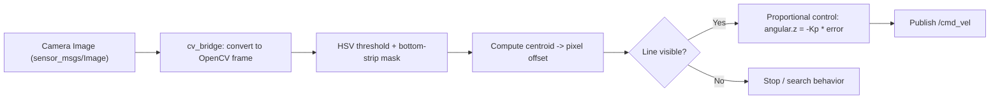

# Mastering with ROS: Turtlebot3 — Unit 4: Follow a Line

Navigation in the previous unit relied on LiDAR and a pre-built map. This unit switches to a purely vision-driven behavior — line following — which is a compact, self-contained introduction to closing a control loop around camera input, a pattern you'll reuse in every remaining perception unit.

The diagram below shows the three-stage vision-to-control pipeline this unit builds, from raw image to a steering command.



## The pipeline: image in, velocity out

Line following breaks into three stages that map cleanly onto three pieces of code: get an image, extract the line's position from it, and convert that position into a steering command. Each stage is independently testable, which matters a lot when debugging — if the robot swerves wildly, you want to know whether the *vision* stage or the *control* stage is at fault before touching either.

## Stage 1: getting images into ROS

The camera publishes `sensor_msgs/Image` (or `CompressedImage`) messages. `cv_bridge` converts between that message type and OpenCV's `numpy` array representation, which is where nearly all image-processing work actually happens:

```python
from cv_bridge import CvBridge
bridge = CvBridge()

def image_callback(self, msg):
    frame = bridge.imgmsg_to_cv2(msg, desired_encoding='bgr8')
    self.process(frame)
```

## Stage 2: extracting the line's position

A common, robust approach: convert to HSV (hue-saturation-value separates color from lighting brightness far better than raw RGB), threshold for the line's color, restrict your search to a horizontal strip near the bottom of the frame (closest to the robot, most relevant to immediate steering), and take the centroid of the resulting mask:

```python
import cv2
import numpy as np

def find_line_offset(frame):
    hsv = cv2.cvtColor(frame, cv2.COLOR_BGR2HSV)
    mask = cv2.inRange(hsv, (0, 0, 0), (180, 255, 60))  # dark line example

    h, w = mask.shape
    strip = mask[int(h * 0.8):h, :]  # bottom 20% of the frame
    moments = cv2.moments(strip)

    if moments['m00'] == 0:
        return None  # line not visible this frame
    cx = int(moments['m10'] / moments['m00'])
    return cx - (w // 2)  # pixel offset from image center
```

The returned offset is your **error signal**: zero means the line is centered under the robot, positive means it's off to one side.

## Stage 3: closing the loop with proportional control

Turn that pixel offset into an angular velocity command. Even a simple proportional controller (P of the classic PID) works surprisingly well for line following at moderate speeds:

```python
def compute_twist(offset, image_width):
    if offset is None:
        return Twist()  # stop (or trigger a search behavior) when line is lost

    normalized_error = offset / (image_width / 2)  # roughly -1 .. 1
    twist = Twist()
    twist.linear.x = 0.1
    twist.angular.z = -1.2 * normalized_error  # Kp = 1.2, sign flips error into a turn
    return twist
```

Tune `Kp` empirically: too low and the robot cuts corners and drifts off the line on curves; too high and it oscillates side to side. Adding a small derivative term (reacting to how fast the error is changing, not just its current size) is a natural next step once P-only control feels unstable — full PID tuning is worth revisiting once you're comfortable with the P-only version.

## Try it yourself

Extend `find_line_offset` to return `None` for a few consecutive frames when the line disappears (a gap, a sharp corner the camera hasn't caught up to yet), and have your control node fall back to slowly rotating in place to search for it rather than stopping dead. Test it on a track with at least one sharp turn and one intentional gap in the line.
