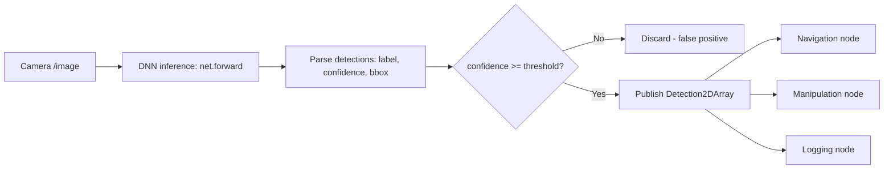

# Mastering with ROS: Turtlebot3 — Unit 6: Object Recognition

Blob tracking found "a colored thing" without knowing what it was. This unit moves from color-based detection to actual recognition — identifying *what* an object is, which is the perception capability the manipulation and project units later in the course will depend on.

The diagram below shows how a detection flows from the camera through the detector to the downstream nodes that consume it.



## Why color thresholding stops being enough

Color-based detection breaks down the moment you need to tell two same-colored objects apart, or find an object regardless of lighting or orientation, or recognize something whose color varies (a face, a specific product, a person). Object recognition solves a different, harder problem: given an image, output what classes of object are present and, usually, where — a bounding box or a segmentation mask per detection.

## Classical vs. learned approaches

Two broad strategies show up in ROS-based robotics:

- **Classical feature matching** (ORB, SIFT-style keypoint descriptors matched via OpenCV) works well for recognizing a specific known, textured object — a particular book cover or product box — without needing training data. It's fast and interpretable but fails on generic categories ("a cup," any cup) and struggles with texture-poor objects.
- **Learned detectors** (CNN-based models such as YOLO-family or SSD-family networks) generalize across a category from training examples and are what most modern robotics perception pipelines actually use, including pretrained models you can drop in without training your own.

For this unit, a pretrained detector is the practical path — you get object-category recognition on day one, and can fine-tune later if you need a custom object class.

## Wiring a detector into ROS

The pattern mirrors earlier perception units: subscribe to the camera topic, run inference on each frame with OpenCV's DNN module (or a framework-specific inference node), and publish structured detections instead of a raw velocity command:

```python
import cv2

net = cv2.dnn.readNet('model.weights', 'model.cfg')  # or readNetFromONNX(...), etc.

def detect(frame):
    blob = cv2.dnn.blobFromImage(frame, scalefactor=1/255.0, size=(416, 416), swapRB=True)
    net.setInput(blob)
    outputs = net.forward(net.getUnconnectedOutLayersNames())
    return parse_detections(outputs, frame.shape)  # -> list of (label, confidence, bbox)
```

Publish results as a proper message type rather than ad hoc printouts — `vision_msgs/Detection2DArray` is the standard ROS convention, giving downstream nodes (navigation, manipulation, logging) a consistent interface regardless of which detector produced the results:

```python
from vision_msgs.msg import Detection2DArray, Detection2D, ObjectHypothesisWithPose

def to_detection_msg(detections, header):
    msg = Detection2DArray()
    msg.header = header
    for label, confidence, bbox in detections:
        det = Detection2D()
        hyp = ObjectHypothesisWithPose()
        hyp.hypothesis.class_id = label
        hyp.hypothesis.score = confidence
        det.results.append(hyp)
        msg.detections.append(det)
    return msg
```

## Confidence thresholds and false positives

Every detector outputs a confidence score alongside each detection — treat this as a knob, not a formality. A low threshold catches more true objects but floods you with false positives; a high threshold is more trustworthy but may miss partially-occluded or oddly-lit objects. When you wire recognition into a behavior later (approach the detected object, avoid it, report it), pick the threshold empirically against your actual camera and environment rather than trusting a default from the model's original training setup.

## Try it yourself

Run your detector on a live camera feed and publish a `Detection2DArray`. Write a second small node that subscribes to it and logs (with `get_logger().info`) whenever a specific class first appears in frame after being absent — this "state change" pattern (not just "is it visible" but "did visibility just change") is what you'll need for triggering behaviors in the project units.
