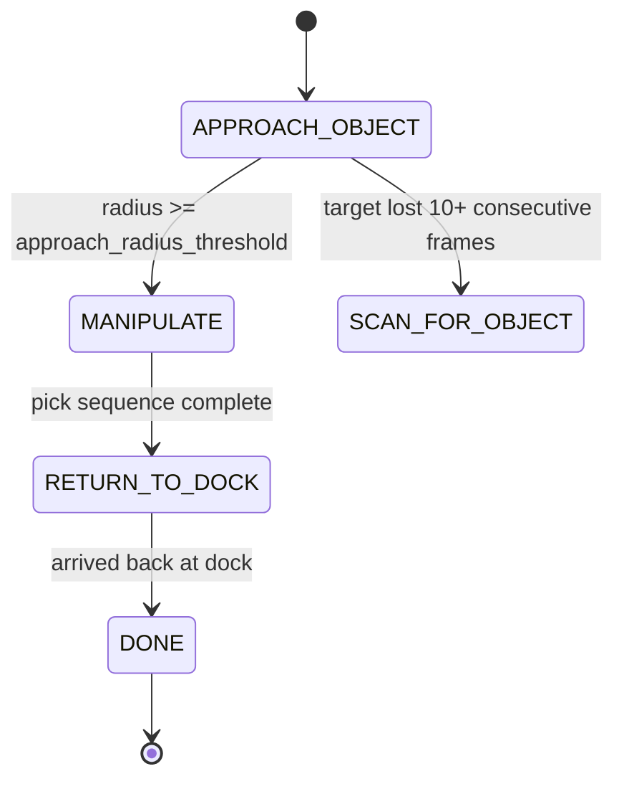

# Mastering with ROS: Turtlebot3 — Unit 9: Project Part 2

Part 1 got the robot to a search zone and confirmed a target detection, handing off into `APPROACH_OBJECT`. Part 2 finishes the project: closing the distance to the object, executing the manipulation (or substitute interaction), and returning home — plus the integration testing that turns "the parts work individually" into "the project actually works."

The diagram below continues the state machine from Part 1, showing the manipulate-and-return sequence along with the fallback path when the target is lost mid-approach.



## Stage 3: approach the object

This is blob/line-style visual servoing (Units 4-5) reused for a new purpose: instead of following a track, you're closing on a confirmed target until it's within manipulation range. Reuse the offset-and-size control law directly:

```python
def handle_approach(self):
    blob = self.latest_detection
    if blob is None:
        self.consecutive_losses += 1
        if self.consecutive_losses > 10:
            self.state = State.SCAN_FOR_OBJECT  # lost it — go back and reacquire
        return
    self.consecutive_losses = 0

    x, y, radius = blob
    error_x = (x - self.frame_width / 2) / (self.frame_width / 2)

    if radius >= self.approach_radius_threshold:
        self.publish_twist(linear_x=0.0, angular_z=0.0)
        self.state = State.MANIPULATE
    else:
        self.publish_twist(linear_x=0.08, angular_z=-1.0 * error_x)
```

Notice the fallback transition back to `SCAN_FOR_OBJECT` — a robust state machine handles losing the target mid-approach, not just the happy path. This is the kind of edge case that only shows up once you stop testing units in isolation.

## Stage 4: manipulate

Once close enough, hand off from base velocity commands to the MoveIt arm interface from Unit 7. This is a clean state boundary: nothing should be publishing to `/cmd_vel` anymore, and the arm's `MoveGroupCommander` takes over:

```python
def handle_manipulate(self):
    if not self.manipulate_started:
        self.manipulate_started = True
        self.arm.set_named_target('pre_grasp')
        self.arm.go(wait=True)
        self.gripper.set_named_target('open')
        self.gripper.go(wait=True)
        self.arm.set_named_target('grasp')
        self.arm.go(wait=True)
        self.gripper.set_named_target('closed')
        self.gripper.go(wait=True)
        self.arm.set_named_target('home')
        self.arm.go(wait=True)
        self.state = State.RETURN_TO_DOCK
```

If you're on a Burger without an arm, substitute a stand-in "interaction" here — flash an LED topic, publish a "reached target" event, or simply pause for a few seconds — the state-machine skeleton and the discipline of a clean handoff is the transferable lesson, not the specific hardware action.

## Stage 5: return to dock, and closing the loop

Send the robot back to its starting pose with the same `BasicNavigator` pattern used to reach the search zone, and transition to a terminal `DONE` state on arrival. At this point run the full sequence start to finish and watch the state-transition log you added in Part 1 — it should read as a clean, ordered story: navigate → scan → approach → manipulate → return → done, with no state visited out of order and no silent stalls.

## Integration testing: what actually breaks

Running each unit's code standalone rarely surfaces the bugs that matter; they show up at the seams. Specifically check: does the approach behavior correctly hand off to manipulation only once genuinely in range (not just "the last frame happened to look close")? Does losing the target mid-approach recover instead of hanging forever? Does a MoveIt planning *failure* (not just success) get handled instead of assumed away? Treat this integration pass as seriously as writing the original code — a project that works once by luck isn't done.

## Try it yourself

Deliberately break one seam and confirm your state machine survives it gracefully: move the target object mid-approach so a detection is briefly lost, or place an obstacle so MoveIt's plan fails on the first attempt. The system should recover or fail loudly (a clear log message) — never fail silently by hanging in a state forever.
