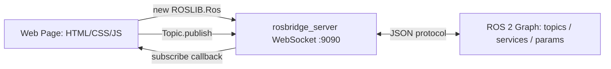

# Developing Web Interfaces for ROS 2 — Unit 0: Course Introduction

This unit sets expectations for the whole course: what you'll be able to build by the end, the pattern every later unit reuses, and what you need installed before Unit 1 starts.

## What this course covers
Every unit in this course teaches one way of connecting an ordinary web page to a live ROS 2 system, using only HTML, CSS, and JavaScript — no ROS client library compiled into the browser. The recurring pattern is: a bridge node (typically `rosbridge_server` from `rosbridge_suite`) exposes the ROS graph over a WebSocket as a small JSON protocol, and a JavaScript library (`roslibjs`) wraps that protocol in an object-oriented API you call from your page. By the end you will have published to topics (teleoperation), subscribed to topics (telemetry), streamed camera images, called services, read/written parameters, rendered an occupancy-grid map, and rendered a 3D robot model — all from a browser tab with zero ROS installed on the client machine.

The diagram below shows the bridging pattern every unit reuses: the browser never talks to ROS directly, only to rosbridge, which relays messages to and from the real ROS 2 graph.



## A quick taste: controlling a robot from a browser
Before diving into setup, it's worth seeing the destination. A minimal teleoperation control, stripped to its essentials, looks like this:

```html
<!-- roslib.js downloaded locally and served alongside your page -->
<script src="js/roslib.min.js"></script>
<button id="forward">Forward</button>
<script>
  const ros = new ROSLIB.Ros({ url: 'ws://localhost:9090' });
  const cmdVel = new ROSLIB.Topic({
    ros: ros,
    name: '/cmd_vel',
    messageType: 'geometry_msgs/msg/Twist'
  });
  document.getElementById('forward').onclick = () => {
    cmdVel.publish(new ROSLIB.Message({ linear: { x: 0.2, y: 0, z: 0 }, angular: { x: 0, y: 0, z: 0 } }));
  };
</script>
```

Three ideas carry the whole course: (1) `ROSLIB.Ros` opens the WebSocket connection to rosbridge, (2) `ROSLIB.Topic` describes a topic name and message type, and (3) `.publish()` / `.subscribe()` move data across that connection. Every later unit is a variation on this shape — services, parameters, images, maps, and 3D models all reuse the same `ros` object.

## Requirements before you start
You should already be comfortable writing HTML/CSS/JS and using a terminal — this course does not re-teach programming syntax, only the ROS-web integration pattern. You will need a working ROS 2 installation (any recent distribution) with `rosbridge_suite` installable via your package manager (`ros-<distro>-rosbridge-suite`), a text editor, and a modern browser with developer tools. A simulated or real differential-drive robot publishing standard topics (`/cmd_vel`, `/odom`, images, a map) is enough to follow every exercise; the specific simulator doesn't matter, only that rosbridge can see its topics.

## Try it yourself
Install `rosbridge_suite`, launch it (`ros2 launch rosbridge_server rosbridge_websocket_launch.xml`), and confirm the WebSocket is alive by opening `ws://localhost:9090` from a small test script or browser console before Unit 1 begins. If it connects (even without sending anything), your environment is ready.
