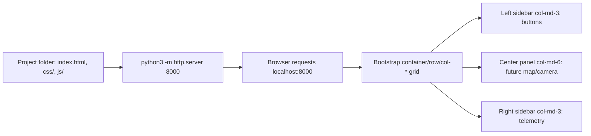

# Developing Web Interfaces for ROS 2 — Unit 1: Setting Up Our Development Environment (Part 1)

Before touching ROS at all, this unit gets a plain web page running and styled — the shell every later unit will drop ROS-connected widgets into. Getting the basics right now (a sane folder layout, a local server, a grid you can lay panels into) means Unit 3 onward is only ever adding ROS logic, not fighting HTML/CSS at the same time.

The diagram below traces how the static files you write end up as a styled, multi-panel page in the browser, ready for ROS widgets in later units.



## Organizing your project folder
Keep `index.html` at the project root with a `css/` folder for stylesheets and a `js/` folder for scripts, even though `js/` will sit empty until Unit 2:

```
robot-console/
├── index.html
├── css/
│   └── bootstrap.min.css
└── js/
```

This isn't just tidiness. Later units drop `js/roslib.min.js` (Unit 3), `js/vue.global.js` (Unit 2), and your own `js/app.js` into that same folder, and once ROS connection code, DOM updates, and UI event handlers all live in one file, debugging gets painful fast. Starting with separate files for structure (HTML), presentation (CSS), and behavior (JS) — even before there's any ROS behavior to speak of — is a habit worth having before the complexity arrives, not after.

## Creating and running a web page
A ROS-connected interface is still, first and foremost, a normal static web page: an `index.html` file plus whatever CSS/JS it references, served by any HTTP server. You don't need a build pipeline for this course — a folder and a simple server are enough:

```html
<!doctype html>
<html lang="en">
<head>
  <meta charset="utf-8">
  <title>Robot Console</title>
</head>
<body>
  <h1>Robot Console</h1>
  <p id="status">Not connected</p>
</body>
</html>
```

```bash
# serve the folder on http://localhost:8000
python3 -m http.server 8000
```

Any static server works equally well here — an editor's built-in "Live Server" extension or `npx serve` behave the same way — the only requirement is that the page loads via `http://`, not `file://`. Browsers restrict things like `fetch()` requests and WebSocket connections when a page is opened directly from disk, so a WebSocket to rosbridge in Unit 3 would silently fail with an origin error if you skipped the server and double-clicked `index.html` instead. Get in the habit of running a local server from Unit 1 onward.

## Adding some styles to the page
Hand-rolling CSS for every control eats time you'd rather spend on the ROS integration, so this course uses Bootstrap as a ready-made component and layout library. Pull in its stylesheet (and optionally its JS bundle for interactive components like modals) and you immediately get a responsive grid, buttons, and form controls that look reasonable with no custom CSS:

```html
<link rel="stylesheet" href="css/bootstrap.min.css">
...
<nav class="navbar navbar-dark bg-dark">
  <span class="navbar-brand mb-0 h1">Robot Console</span>
</nav>
<button class="btn btn-primary">Move Forward</button>
<div class="container">
  <div class="row">
    <div class="col-md-6">Left panel</div>
    <div class="col-md-6">Right panel</div>
  </div>
</div>
```

The `container` / `row` / `col-*` classes are Bootstrap's grid system: a row splits into 12 columns, and `col-md-6` claims half of them on medium-and-larger screens. The `-md-` in that class name is a breakpoint prefix — Bootstrap defines `sm` (≥576px), `md` (≥768px), `lg` (≥992px), and `xl` (≥1200px), and a column reflows to full width below its breakpoint. That's why `col-md-3` panels stack vertically on a narrow phone screen but sit side by side on a laptop, which is exactly the behavior the exercise below asks you to confirm. This is the layout mechanism you'll use to arrange camera feeds, maps, and control panels side by side in later units.

## Building a three-panel layout
With the grid classes in hand, a static three-panel dashboard skeleton — the shape most units in this course reuse — looks like this:

```html
<div class="container-fluid">
  <div class="row">
    <div class="col-md-3">Controls go here</div>
    <div class="col-md-6">Map / camera goes here</div>
    <div class="col-md-3">Telemetry goes here</div>
  </div>
</div>
```

A narrow left sidebar for buttons (`col-md-3`), a wide center panel for a future map/camera view (`col-md-6`), and a right sidebar for telemetry readouts (`col-md-3`) together add up to the full 12-column row. Getting comfortable with this grid now means you won't be fighting CSS later when the panels start holding live ROS data instead of placeholder text.

## Try it yourself
Build the three-panel layout described above as a static page (no ROS yet), with placeholder text in each panel and a Bootstrap-styled heading and navbar at the top. Confirm it stays readable when you resize the browser window narrower than a typical laptop screen — watch the panels stack vertically once the window crosses the `md` breakpoint, rather than squeezing into unreadably thin columns.
