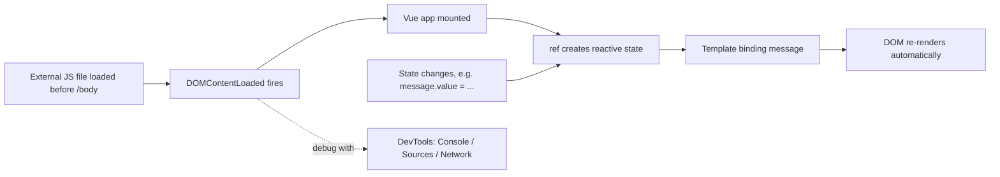

# Developing Web Interfaces for ROS 2 — Unit 2: Setting Up Our Development Environment (Part 2)

With a styled static page in place, this unit adds the piece that makes a web page dynamic — JavaScript — and introduces Vue.js, the framework you'll use to keep ROS data and page content in sync without hand-writing DOM updates everywhere.

The diagram below shows how a script gets loaded and how Vue's reactivity then keeps the DOM in sync with state automatically, instead of manual `textContent` updates.



## Embedding JavaScript in your page
JavaScript reaches a page in three ways: inline in an attribute (avoid this — hard to maintain), inside a `<script>` block, or as a linked external file. For anything beyond a one-liner, use an external file loaded near the end of `<body>` so the DOM exists before your script runs:

```html
<body>
  ...
  <script src="js/app.js"></script>
</body>
```

```javascript
// js/app.js
document.addEventListener('DOMContentLoaded', () => {
  console.log('Page ready, JS is wired up');
});
```

`defer` (`<script src="js/app.js" defer>`) is an alternative to placing the tag at the bottom — it lets the script sit in `<head>` while still waiting for the DOM to parse. Either approach is fine; pick one and be consistent.

## Debugging JavaScript with DevTools
Every modern browser ships a debugger built for exactly this workflow. Open it with F12 or Ctrl+Shift+I, and lean on three panels constantly through this course: the **Console** for `console.log`/errors (this is where WebSocket connection failures and JSON parse errors will show up), the **Sources** panel for setting breakpoints and stepping through code line by line, and the **Network** panel for watching the WebSocket frames rosbridge sends and receives — invaluable once you start debugging why a subscribed topic isn't updating your page. Get comfortable setting a breakpoint inside a `.subscribe()` callback now; you'll use that exact technique in Unit 4.

## Getting started with Vue.js
Manually writing `document.getElementById(...).textContent = ...` every time a ROS message arrives gets unwieldy fast. Vue.js solves this with reactive data binding: you declare a piece of state, bind it into your HTML with template syntax, and Vue keeps the DOM in sync whenever that state changes — which matters enormously once state is being pushed at you asynchronously from a WebSocket.

```html
<div id="app">
  <p>{{ message }}</p>
</div>
<script src="js/vue.global.js"></script>
<script>
  const { createApp, ref } = Vue;
  createApp({
    setup() {
      const message = ref('Waiting for robot...');
      return { message };
    }
  }).mount('#app');
</script>
```

`ref()` creates a reactive value; updating `message.value` anywhere in your code automatically re-renders the `{{ message }}` binding. This is exactly the mechanism Unit 4 will use to display live topic data without manual DOM manipulation.

## Try it yourself
Extend the snippet above: add a second `ref` called `count` starting at 0, a button bound with `@click="count++"`, and display it next to `message`. Confirm the paragraph updates instantly on click with no page reload — that instant-update behavior is what will later make sensor data feel "live" on your dashboard.
