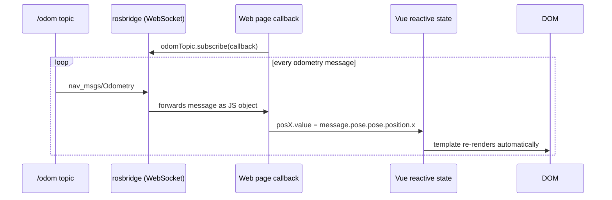

# Developing Web Interfaces for ROS 2 — Unit 4: Tracking the Robot! Subscribing to a topic!

Publishing let you send commands out; this unit covers the reverse direction — pulling live telemetry (odometry, battery, sensor readings) into your page and rendering it as it arrives.

The sequence below shows the reverse flow from Unit 3: a continuous stream of odometry messages arriving over rosbridge, updating reactive Vue state, which the DOM re-renders automatically.



## Subscribing to a topic with roslibjs
Subscribing mirrors publishing almost exactly: describe the topic, then hand it a callback instead of calling `.publish()`.

```javascript
const odomTopic = new ROSLIB.Topic({
  ros: ros,
  name: '/odom',
  messageType: 'nav_msgs/msg/Odometry'
});

odomTopic.subscribe((message) => {
  console.log('Received odometry:', message);
});
```

Unlike a request/response call, this callback fires every time rosbridge forwards a new message — potentially tens of times per second for odometry. Always keep the callback itself cheap (store the value, mark a flag) and do anything expensive (redrawing a chart, hitting the DOM repeatedly) in a throttled or `requestAnimationFrame`-scheduled step instead, or your page will fall behind the incoming stream. Call `odomTopic.unsubscribe()` when a panel is torn down, so you don't leak listeners across page navigations.

## Working with the message object
The object your callback receives is a plain JavaScript object shaped exactly like the ROS message's field structure — rosbridge serializes it straight from the `.msg` definition, so `nav_msgs/msg/Odometry` arrives with nested `pose.pose.position.x`, `pose.pose.orientation`, `twist.twist.linear`, and so on. Knowing the message definition (`ros2 interface show nav_msgs/msg/Odometry`) tells you exactly what to reach for:

```javascript
odomTopic.subscribe((message) => {
  const x = message.pose.pose.position.x;
  const y = message.pose.pose.position.y;
  const speed = message.twist.twist.linear.x;
  updateDashboard(x, y, speed);
});
```

Orientation typically arrives as a quaternion (`x, y, z, w`); if you need a heading in degrees for display, convert it explicitly (`atan2` on the appropriate quaternion terms) rather than assuming a field like "yaw" exists on the raw message.

## Rendering live data in the DOM
This is where Unit 2's Vue.js setup pays off — bind reactive refs to the incoming data and let Vue handle re-rendering instead of manually touching `textContent` on every message:

```javascript
const { ref } = Vue;
const posX = ref(0), posY = ref(0), speed = ref(0);

odomTopic.subscribe((message) => {
  posX.value = message.pose.pose.position.x.toFixed(2);
  posY.value = message.pose.pose.position.y.toFixed(2);
  speed.value = message.twist.twist.linear.x.toFixed(2);
});
```

```html
<p>Position: ({{ posX }}, {{ posY }}) · Speed: {{ speed }} m/s</p>
```

## Try it yourself
Subscribe to `/odom` and implement a "virtual fence": when the robot's `x` position exceeds a threshold you choose, publish a `Twist` that turns it in place until it's heading back the other way, then resume forward motion. This combines everything from Units 3 and 4 — a subscriber driving a publisher — which is the core pattern behind almost every autonomous-looking web behavior in this course.
