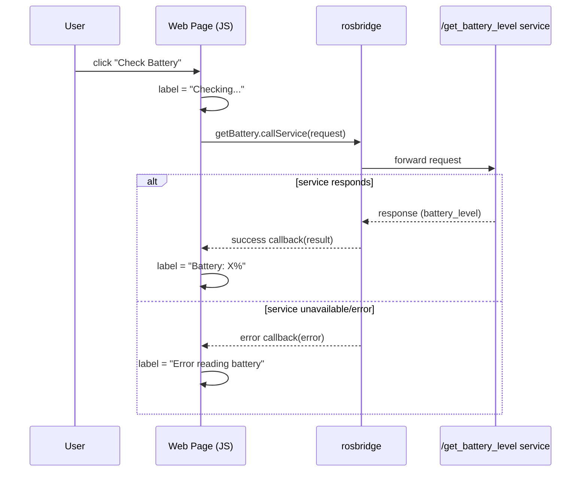

# Developing Web Interfaces for ROS 2 — Unit 6: Calling ROS Services from the Web

Topics are fire-and-forget: publishing a `Twist` or subscribing to `/odom` never tells you whether a message was received or acted on, only that it was sent. This unit covers the opposite pattern — calling a ROS service from the page, waiting for an answer, and updating the UI once it comes back. Anything your dashboard needs to *ask* rather than just *say* — a battery level, a one-shot recalibration, confirmation a mode switch took effect — belongs behind a service, not a topic.

The sequence below shows the battery-check example: a button click triggers a service call that resolves into either a success or an error callback, unlike the fire-and-forget flow of topics.



## Services vs. topics, from the browser's side
A topic publish or subscribe is a one-way stream with no reply. A service call is a single request that expects exactly one response, which makes it the right tool for "ask a question, get an answer right now" interactions — a battery percentage on demand, a one-shot recalibration, toggling a mode. Because the response arrives as a separate WebSocket message some time after the request, you handle it with a callback or a Promise, never a synchronous return value.

Under the hood, `roslibjs` sends the request as a `call_service` message over the same rosbridge WebSocket connection you're already using for topics, tagged with a unique id; rosbridge matches the eventual `service_response` back to that id and routes it to your callback. That's why the API is callback-shaped, not return-value-shaped — request and response are separate WebSocket frames, with your page free to keep rendering in between.

## Calling a service with roslibjs
`ROSLIB.Service` mirrors `ROSLIB.Topic`'s shape: describe the service name and type, then call it with a request object and a callback for the response.

```javascript
const getBattery = new ROSLIB.Service({
  ros: ros,
  name: '/get_battery_level',
  serviceType: 'my_robot_interfaces/srv/GetBatteryLevel'
});

const request = new ROSLIB.ServiceRequest({});   // empty request, no fields needed

getBattery.callService(request, (result) => {
  console.log('Battery level:', result.battery_level);
}, (error) => {
  console.error('Service call failed:', error);
});
```

Always pass the error callback (the third argument). Unlike topics, a failed or unavailable service gives you no other signal that anything went wrong — without it, a missing service just silently never calls back.

## Discovering services and their types
If you don't already know a service's name or fields, ROS 2's CLI gets you there without guessing: `ros2 service list` shows every service on the graph, `ros2 service type /get_battery_level` prints the string to drop into `serviceType`, and `ros2 interface show <package>/srv/<Name>` breaks that type into its request/response fields — the same workflow Unit 4 used for topic messages.

## Worked example
Putting it into a small UI: a button calls the service and writes the result into the page, with a loading state so the user knows the request is in flight. Disabling the button for the duration of the call also guards against a double-click firing a second, overlapping request:

```javascript
document.getElementById('checkBattery').addEventListener('click', (event) => {
  const button = event.target;
  const label = document.getElementById('batteryLabel');
  button.disabled = true;
  label.textContent = 'Checking...';
  getBattery.callService(new ROSLIB.ServiceRequest({}), (result) => {
    label.textContent = `Battery: ${result.battery_level}%`;
    button.disabled = false;
  }, (error) => {
    label.textContent = 'Error reading battery';
    console.error(error);
    button.disabled = false;
  });
});
```

## Guarding against a hung service
`roslibjs` doesn't impose a timeout on a pending call. If the node behind `/get_battery_level` crashes mid-request, or was never running, neither callback fires — the label sits on "Checking..." forever with no visible error. Wrapping the call in a Promise with your own timer catches that:

```javascript
function callServiceWithTimeout(service, request, timeoutMs = 5000) {
  return new Promise((resolve, reject) => {
    const timer = setTimeout(() => reject(new Error('Service call timed out')), timeoutMs);
    service.callService(request, (result) => {
      clearTimeout(timer);
      resolve(result);
    }, (error) => {
      clearTimeout(timer);
      reject(error);
    });
  });
}
```

Swap `getBattery.callService(...)` for `callServiceWithTimeout(getBattery, request).then(...).catch(...)` and a slow node and a missing one land in the same `.catch()`. It doesn't cancel anything on the ROS side — plain services have no cancel operation — it only stops your UI waiting on a reply that may never come.

## When a service isn't the right tool
Not every request/response interaction fits a plain service call. An operation that takes a long time, reports progress, or might need cancelling mid-flight — docking, a navigation goal — is the job of a ROS 2 action, not a service. Actions are outside this course's scope, but the boundary is worth knowing: services suit quick, synchronous-feeling questions; actions suit anything you'd want a progress bar or cancel button for.

## Try it yourself
Add a "Get Battery Level" button to your dashboard that calls a battery-status service and displays the result, including a visible error state if the service isn't reachable (stop the service node while the page is open and confirm your error callback fires instead of the page hanging silently). Then try the timeout wrapper: advertise the service but have the node deliberately never respond, and confirm your UI recovers within the timeout instead of sitting on "Checking..." indefinitely.
