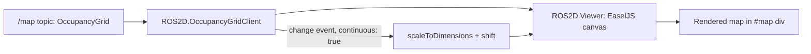

# Developing Web Interfaces for ROS 2 — Unit 7: Showing a Map on the Web Page

Occupancy grid maps are just 2D arrays of cell values, but rendering them well — with correct scale, origin, and live updates — is fiddly enough that RobotWebTools built a dedicated library for it. This unit covers `ros2d.js`, roslibjs's companion for 2D visualization.

The diagram below shows how a raw `OccupancyGrid` message becomes pixels on screen, and how the viewer refits itself once the first message reveals the map's real dimensions.



## How map rendering works
A `nav_msgs/msg/OccupancyGrid` message carries a flat array of cell values (0-100 for occupancy probability, -1 for unknown), plus metadata (`info`) describing the grid's resolution (meters per cell), width/height in cells, and `origin` — the pose of cell `(0, 0)` in the map frame. That data is stored row-major starting from the bottom-left corner by ROS convention, while a canvas indexes pixels from the top-left, so a naive copy comes out upside down. Rendering this by hand means allocating a canvas, mapping array indices to pixel coordinates with that flip accounted for, choosing a color per occupancy value, and redrawing on every update — all before you've added a robot marker. `ros2djs` wraps exactly this: a `ROS2D.OccupancyGridClient` subscribes to the map topic, draws it into an SVG/canvas viewer, and keeps it in sync automatically, coloring free cells light, occupied cells dark, and unexplored `-1` cells a distinct neutral gray.

## Building the page template
A map viewer needs a container element with a defined size, since `ros2djs` draws into it directly:

```html
<link rel="stylesheet" href="css/bootstrap.min.css">
<div id="map" style="width: 600px; height: 600px;"></div>

<script src="js/roslib.min.js"></script>
<script src="js/easeljs.min.js"></script>
<script src="js/ros2d.min.js"></script>
```

`ros2djs` is built on `EaselJS` for 2D canvas drawing, so both libraries must load before your own script runs. The explicit `width`/`height` on the `<div>` matters more than it looks: `ROS2D.Viewer` reads the container's actual rendered size the moment it's constructed. If the div is still `0×0` then — hidden behind an inactive tab, say, or inside a component that hasn't mounted yet — the viewer creates a zero-size canvas, and nothing appears even though your JavaScript runs without error.

## Inserting the map element
With the container in place, connect to rosbridge as usual, then hand the viewer and the ROS connection to an `OccupancyGridClient`:

```javascript
const ros = new ROSLIB.Ros({ url: 'ws://localhost:9090' });

const viewer = new ROS2D.Viewer({
  divID: 'map',
  width: 600,
  height: 600
});

const gridClient = new ROS2D.OccupancyGridClient({
  ros: ros,
  rootObject: viewer.scene,
  continuous: true          // keep redrawing as the map updates, not just once
});

gridClient.on('change', () => {
  // scale the view so the whole map fits once the first message arrives
  viewer.scaleToDimensions(gridClient.currentGrid.width, gridClient.currentGrid.height);
  viewer.shift(gridClient.currentGrid.pose.position.x, gridClient.currentGrid.pose.position.y);
});
```

The `change` event fires once the first `OccupancyGrid` message is received and drawn — your cue to fit the viewer, since you don't know the map's size until data arrives. Skipping `scaleToDimensions`/`shift` doesn't break anything, but the map stays at the viewer's default scale: a 40 m warehouse and a 4 m room both start out looking the same size inside your 600×600 div until fit to their real dimensions.

No map published yet? `nav2_map_server` will republish a saved `.pgm`/`.yaml` map pair so you have something real to point the client at — just remember it's a lifecycle node, so it won't publish until brought up through configure → activate:

```bash
ros2 run nav2_map_server map_server --ros-args -p yaml_filename:=my_map.yaml
ros2 run nav2_util lifecycle_bringup map_server
```

## Practical example: overlaying the robot's pose
A bare map is useful, but a map with the robot's current position on it is what actually makes a dashboard readable at a glance. `ros2djs` ships `ROS2D.NavigationArrow`, a small arrow shape you can add straight to `viewer.scene` alongside the grid and reposition as new pose data arrives:

```javascript
const robotMarker = new ROS2D.NavigationArrow({
  size: 12,
  fillColor: createjs.Graphics.getRGB(255, 0, 0, 0.8)
});
viewer.scene.addChild(robotMarker);

odomTopic.subscribe((message) => {   // odomTopic from Unit 4
  const pos = message.pose.pose.position;
  robotMarker.x = pos.x * viewer.scene.scaleX;
  robotMarker.y = -pos.y * viewer.scene.scaleY;
});
```

Multiplying by `viewer.scene.scaleX`/`scaleY` matters because those are exactly the factors `scaleToDimensions` computed earlier, so the coordinate lands where the map itself does, y flipped for the same reason the grid data is. Driving the marker from `/odom` is fine for a demo, but odometry drifts from the robot's starting point; a real localization stack fixes that with a `map → odom` transform, which is what `ROSLIB.TFClient` — covered properly in Unit 9 — is for. Good enough here; prefer TF for anything trusted over a long shift.

## Try it yourself
Add the map viewer to your dashboard's center panel and confirm it renders your robot's `/map` topic correctly — free cells lighter, occupied cells darker, unknown a distinct neutral color. Then try `continuous: false`: the map draws once and never updates again, fine for a static map but wrong for one still being built by SLAM. Finally, add the `NavigationArrow` overlay and drive the robot with the `Twist` publisher from Unit 3 — watching your marker move across the map is the fastest way to confirm the coordinate scaling is correct.
