# Developing Web Interfaces for ROS 2

This course teaches you to build browser-based dashboards and control panels for ROS 2 robots using nothing but HTML, CSS, and JavaScript — no ROS installation required on the client. Starting from a bridge server (`rosbridge_suite`) that exposes the ROS graph over a WebSocket, and the `roslibjs` library that wraps that connection in a friendly API, each unit adds one capability: publishing commands, subscribing to telemetry, streaming camera video, calling services, reading/writing parameters, and rendering 2D maps and full 3D robot models. By the end you can build a complete operator console — teleoperation, live status, camera view, map, and 3D visualization — running entirely in a browser tab.

The diagram below shows how each unit builds directly on the skills of the one before it, from a bare static page to a full operator console:

```mermaid
flowchart LR
    U0[Unit 0: Course Intro] --> U1[Unit 1: Static Page + Bootstrap]
    U1 --> U2[Unit 2: JavaScript + Vue.js]
    U2 --> U3[Unit 3: Publish /cmd_vel]
    U3 --> U4[Unit 4: Subscribe to Topics]
    U4 --> U5[Unit 5: Camera Streaming]
    U5 --> U6[Unit 6: ROS Services]
    U6 --> U7[Unit 7: 2D Map Rendering]
    U7 --> U8[Unit 8: ROS Parameters]
    U8 --> U9[Unit 9: 3D Visualization]
```

0. [Course Introduction](00-course-introduction.md) — What the course covers, a preview of the full publish/subscribe pattern, and the environment you need before starting.
1. [Setting Up Our Development Environment (Part 1)](01-setting-up-our-development-environment-part-1.md) — Creating and serving a static web page, and styling it with the Bootstrap grid system.
2. [Setting Up Our Development Environment (Part 2)](02-setting-up-our-development-environment-part-2.md) — Embedding JavaScript, debugging with browser DevTools, and reactive UI basics with Vue.js.
3. [Move the Robot! Publishing to a topic!](03-move-the-robot-publishing-to-a-topic.md) — Connecting to rosbridge, handling page/DOM events, and publishing `Twist` messages from buttons and a virtual joystick.
4. [Tracking the Robot! Subscribing to a topic!](04-tracking-the-robot-subscribing-to-a-topic.md) — Subscribing to topics, working with the message object, and rendering live telemetry reactively.
5. [Inside the Robot! Showing the camera on the web page!](05-inside-the-robot-showing-the-camera-on-the-web-page.md) — Video streaming architecture (`web_video_server` vs. compressed images over rosbridge) and embedding a live feed.
6. [Calling ROS Services from the Web](06-calling-ros-services-from-the-web.md) — Request/response calls with `ROSLIB.Service`, error handling, and a worked battery-status example.
7. [Showing a Map on the Web Page](07-showing-a-map-on-the-web-page.md) — Rendering an `OccupancyGrid` with `ros2d.js`, including live updates as the map changes.
8. [Tuning Your Robotics Algorithms! ROS Parameters!](08-tuning-your-robotics-algorithms-ros-parameters.md) — Reading and setting ROS 2 parameters from the page with `ROSLIB.Param`.
9. [3D Visualization for Robots on Webpages](09-3d-visualization-for-robots-on-webpages.md) — Rendering a live, posed 3D robot model in-browser with `ros3d.js`, TF, and the robot's URDF.
