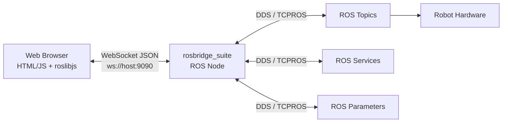

# Developing Web Interfaces for ROS — Unit 1: Introduction

This unit lays the conceptual groundwork for the whole course: how a web browser — which has no notion of nodes, topics, or DDS/TCPROS — can talk to a running ROS graph in real time, and what the pieces of that bridge look like before you write a single line of HTML.

The diagram below shows how the browser reaches the ROS graph only through the rosbridge WebSocket translation layer.



## Why a browser needs a bridge
A ROS node communicates over the ROS transport (DDS in ROS 2, the custom TCPROS/UDPROS protocol in ROS 1). A browser, by design, cannot open arbitrary sockets or speak either of those protocols — its only network primitives are HTTP requests and WebSockets. So every web-to-ROS story starts with something that translates ROS graph events into a browser-friendly protocol and back again. That "something" is a bridge server, and the WebSocket is the transport it exposes to the page.

## The rosbridge architecture
`rosbridge_suite` is the reference implementation of this idea. It runs as an ordinary ROS node, opens a WebSocket server on a port (commonly 9090), and speaks a small, human-readable JSON protocol over that socket. Every interaction — subscribing to a topic, publishing a message, calling a service — is just a JSON object with an `op` field describing the operation. For example, subscribing to a laser scan topic looks like this on the wire:

```json
{"op": "subscribe", "topic": "/scan", "type": "sensor_msgs/msg/LaserScan"}
```

and publishing a velocity command looks like this:

```json
{"op": "publish", "topic": "/cmd_vel", "msg": {"linear": {"x": 0.2}, "angular": {"z": 0.0}}}
```

Anything that can open a WebSocket and emit JSON — a browser tab, a phone app, a Node.js script — becomes a ROS client without linking against ROS libraries at all.

## roslibjs: the JavaScript half of the bridge
On the JavaScript side, `roslibjs` wraps that JSON protocol in a friendly object-oriented API (`ROSLIB.Ros`, `ROSLIB.Topic`, `ROSLIB.Service`, `ROSLIB.Param`) so you rarely write raw JSON by hand — you'll see this API in every unit from here on. Later units use exactly these two pieces — rosbridge on the robot/host side, roslibjs on the page side — for every single interaction: publishing, subscribing, services, parameters, actions, images, maps, and 3D models all ride over the same WebSocket connection.

## What "web interface" means in this course
You are not building a native ROS node with a GUI toolkit; you are building an ordinary web page (HTML, CSS, JavaScript) that happens to have a live, bidirectional data connection to a robot. That distinction matters: your page can be opened on a tablet, a phone, or a laptop with zero ROS installation, because all the ROS-specific work happens on the server side of the WebSocket. This is why rosbridge-based dashboards are so common for teleoperation panels, monitoring consoles, and field-deployed robots — the operator only needs a browser.

## Course roadmap
The units ahead build up a single skill set in layers: environment setup (Units 2-3), publishing and teleoperation (Units 4-5), subscribing and telemetry (Unit 6), streaming camera images (Unit 7), calling services (Unit 8), rendering maps (Unit 9), reading/writing parameters (Unit 10), full 3D visualization (Unit 11), action servers (Unit 12), and a capstone dashboard that combines all of it (Unit 13). Each unit assumes you already know HTML/CSS/JS syntax and general programming — the teaching focus is exclusively on the ROS-web integration pattern for that topic.

## Try it yourself
Before writing any code, sketch (on paper or in a text file) a simple diagram of the data flow for a teleoperation panel: browser → WebSocket → rosbridge → ROS topic → robot base controller, and the reverse path for a battery-level readout. Label which side of the WebSocket each hop lives on. You'll be implementing exactly this diagram by the end of Unit 4.
