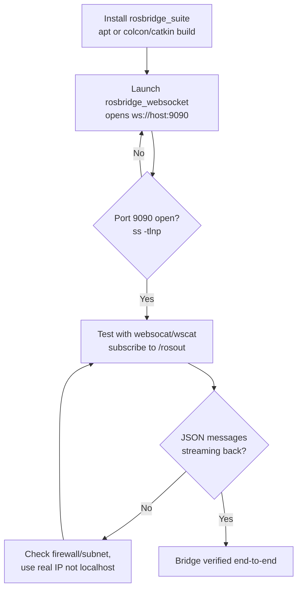

# Developing Web Interfaces for ROS — Unit 2: Setting up our development environment (Part 1)

Everything in this course depends on one running piece of infrastructure: the rosbridge WebSocket server. Unit 1 explained *why* a browser needs a bridge; this unit gets that bridge installed, launched, and verified so later units can focus purely on the web side. Get this part wrong — a bridge that isn't running, or is listening on the wrong interface — and every JavaScript example from Unit 4 onward fails the same unhelpful way: a WebSocket that never opens, with no error message pointing at the real cause. Working through install-launch-verify carefully now saves that debugging pain later.

The diagram below shows the install-launch-verify sequence for getting rosbridge running and reachable.



## What's inside rosbridge_suite
`rosbridge_suite` is a metapackage, not a single binary — installing it pulls in a small family of packages that each do one job:

- **rosbridge_library** implements the JSON protocol itself (the `op`-tagged messages from Unit 1) — parsing incoming operations and serializing outgoing ones.
- **rosbridge_server** wraps that protocol in a WebSocket (and, optionally, a raw TCP) server; this is the piece you actually launch.
- **rosapi** exposes graph introspection — topic lists, service types, parameter names — as ordinary ROS services, so a browser can ask "what topics exist right now?" without any ROS tooling installed locally. `roslibjs` calls into `rosapi` under the hood for methods like `ros.getTopics()`, used starting in Unit 6.

This matters for troubleshooting: if plain publish/subscribe works but `ros.getTopics()` doesn't, the likely cause is `rosapi` missing from your launch, not the WebSocket connection itself.

## Installing rosbridge_suite
`rosbridge_suite` ships as a standard ROS package and is available through your distro's package manager on both ROS 1 and ROS 2:

```bash
# Debian/Ubuntu, ROS 2 (replace <distro> with your installed distro, e.g. humble, jazzy)
sudo apt install ros-<distro>-rosbridge-suite

# ROS 1 equivalent
sudo apt install ros-<distro>-rosbridge-server
```

If a packaged version isn't available for your platform, cloning `rosbridge_suite` into a workspace `src/` directory and building it with `colcon build` (ROS 2) or `catkin build` (ROS 1) works identically — just `source` the workspace's `install/setup.bash` (or `devel/setup.bash`) afterward so ROS can find the new packages.

## Launching the bridge
Start the WebSocket server with the provided launch file:

```bash
# ROS 2
ros2 launch rosbridge_server rosbridge_websocket_launch.xml

# ROS 1
roslaunch rosbridge_server rosbridge_websocket.launch
```

By default this opens a WebSocket endpoint at `ws://<host>:9090`. Watch the terminal output — it logs every client connect/disconnect and, at higher log levels, every message crossing the bridge, which is invaluable for debugging later units. If port 9090 is already taken, both launch files accept a `port` argument instead of forcing you to free the port:

```bash
ros2 launch rosbridge_server rosbridge_websocket_launch.xml port:=9091
```

Just use the matching port in every `ROSLIB.Ros({ url: ... })` call from Unit 3 onward — a mismatched port is a common, easy-to-miss source of connection failures.

## Verifying the bridge is reachable
Before writing any JavaScript, confirm the server is actually listening:

```bash
ss -tlnp | grep 9090        # confirm the port is open
```

A quick sanity check without a browser at all is to use a WebSocket CLI client such as `websocat` or `wscat`:

```bash
websocat ws://localhost:9090
# then paste a rosbridge protocol message and press enter:
{"op":"subscribe","topic":"/rosout"}
```

If ROS log messages start streaming back as JSON, the bridge is healthy end-to-end. This step isolates the ROS-side infrastructure from anything web-related, so if a browser page fails to connect in Unit 3, you already know whether the fault is on the bridge side or the page side.

## Network and firewall considerations
If your robot and your browser are on different machines (the normal case — a laptop or tablet talking to a robot's onboard computer), make sure port 9090 is reachable across that network path: check firewall rules (`ufw status`, `iptables -L`), confirm both machines are on the same subnet or that routing/port-forwarding is set up, and use the robot's real IP address (not `localhost`) in the browser's connection URL. If a firewall is the culprit, opening the port is usually one line:

```bash
sudo ufw allow 9090/tcp
```

This is the single most common source of "it works when I test locally but not from my laptop" bugs in web-ROS projects.

Also keep in mind that rosbridge applies no authentication or access control by default: anything that can reach the port can subscribe to any topic, call any service, and publish messages that move the robot. That's a reasonable trade-off for the development setups this course targets, but it's a firm reason not to expose port 9090 to an untrusted network — or the public internet — without adding your own access controls in front of it.

## Try it yourself
Launch rosbridge on your machine, then use `websocat` (or `wscat`) to subscribe to `/rosout` and to a topic you know is publishing (e.g. `/clock` in simulation, or any sensor topic on a real robot). Confirm you see JSON messages arrive in your terminal before moving on to Unit 3.
