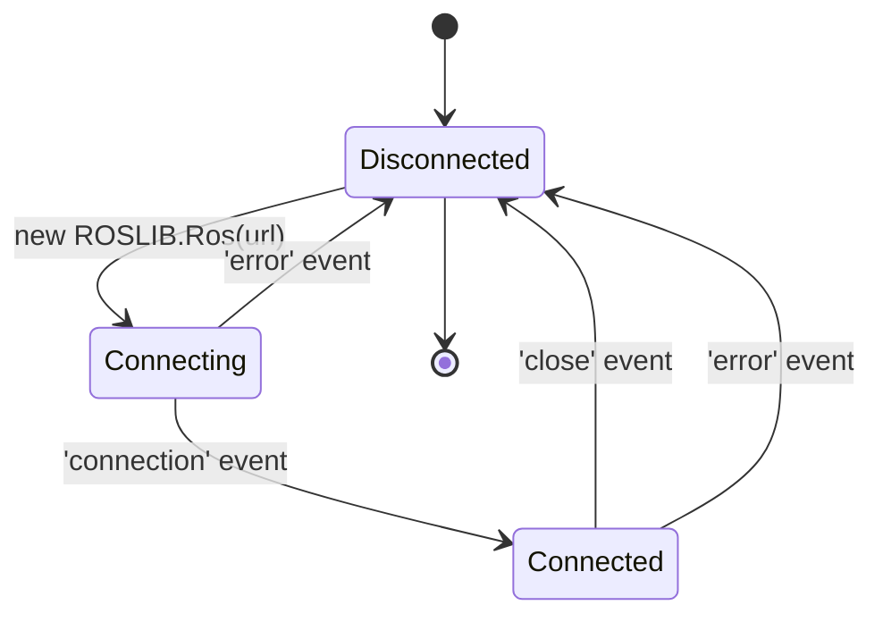

# Developing Web Interfaces for ROS — Unit 3: Setting up our development environment (Part 2)

With rosbridge running (Unit 2), the second half of environment setup happens entirely on the web side: getting `roslibjs` into a page, standing up a local dev server, and establishing the project layout you'll reuse for the rest of the course.

The diagram below shows the ROS connection's lifecycle states as the three event handlers transition between them.



## Getting roslibjs into your project
`roslibjs` can be included two ways. For quick experiments, load it directly in an HTML `<script>` tag from a CDN:

```html
<script src="https://cdn.jsdelivr.net/npm/roslib@1/build/roslib.min.js"></script>
```

If you ship a CDN-loaded script beyond a quick local experiment, pin it with a Subresource Integrity hash so the browser refuses the file if the CDN ever serves something different from what you tested against. jsdelivr publishes the correct `integrity` value for every file on the package's page (e.g. `https://www.jsdelivr.com/package/npm/roslib`) — copy it from there rather than typing one by hand, and pair it with `crossorigin="anonymous"`:

```html
<script src="https://cdn.jsdelivr.net/npm/roslib@1/build/roslib.min.js"
        integrity="sha384-REPLACE_WITH_HASH_FROM_JSDELIVR"
        crossorigin="anonymous"></script>
```

For anything you intend to grow (which is every project after Unit 4), install it as a proper dependency instead — this also sidesteps the CDN-trust question entirely, since the file ships inside your own build:

```bash
npm init -y
npm install roslib
```

and import it with a bundler (Vite, webpack, esbuild) or directly in a module-type script. Using npm from the start means you get versioning, easy upgrades, and the ability to `import` it alongside your own modules.

## A minimal dev server
Browsers block WebSocket-adjacent features and module imports from `file://` pages, so you need to serve your HTML/JS over HTTP even during local development. The fastest option with zero setup:

```bash
python3 -m http.server 8000
```

For a more capable workflow with live reload, `npx vite` (no install needed) scaffolds a project and serves it with instant refresh on save — well worth it once pages grow past a single file.

## Connecting and confirming from JavaScript
Every page in this course starts the same way: create a `ROSLIB.Ros` instance pointed at the bridge, and react to its connection lifecycle events.

```javascript
const ros = new ROSLIB.Ros({ url: 'ws://<robot-ip>:9090' });

ros.on('connection', () => console.log('Connected to rosbridge websocket server.'));
ros.on('error', (error) => console.error('Error connecting to rosbridge:', error));
ros.on('close', () => console.log('Connection to rosbridge closed.'));
```

Save this as `app.js`, reference it from a bare `index.html`, serve the folder, and open it in the browser. The dev tools console (F12) is where you'll spend most of your debugging time in this course — `connection`/`error`/`close` events are your first line of defense against silent failures.

## Project layout for this course
A simple, consistent structure keeps later units easy to follow:

```
web-ros-course/
  index.html
  css/style.css
  js/app.js
  js/ros-connection.js   # shared ROSLIB.Ros setup, reused by every later unit
```

Factor the connection setup into its own module now; every subsequent unit imports it rather than re-declaring `new ROSLIB.Ros(...)`.

## Try it yourself
Build the project skeleton above, wire up the three connection-lifecycle handlers, and confirm the browser console logs "Connected to rosbridge websocket server." when you load the page with rosbridge running. Then stop the rosbridge server and reload the page — confirm the `error` handler fires instead.
