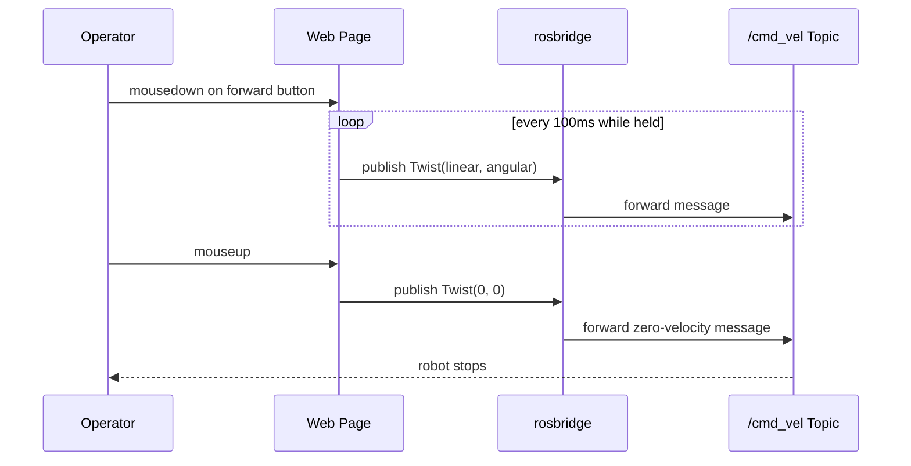

# Developing Web Interfaces for ROS — Unit 4: Move the Robot! Publishing to a topic!

This is the first unit where your browser actually changes what the robot does. You'll use `ROSLIB.Topic` to publish `geometry_msgs/Twist` messages and drive a robot base directly from a web page.

The diagram below shows the timed publish loop that starts on button-down and ends with a guaranteed zero-velocity message on release.



## The ROSLIB.Topic publisher pattern
Every publisher in roslibjs follows the same three-step shape: describe the topic (name + message type), then call `.publish()` with a message object whenever you have data to send. Nothing needs to be "advertised" explicitly first — roslibjs handles that handshake for you on the first publish.

```javascript
const cmdVel = new ROSLIB.Topic({
  ros: ros,
  name: '/cmd_vel',
  messageType: 'geometry_msgs/msg/Twist'   // 'geometry_msgs/Twist' on ROS 1
});

function drive(linearX, angularZ) {
  const twist = new ROSLIB.Message({
    linear:  { x: linearX, y: 0, z: 0 },
    angular: { x: 0, y: 0, z: angularZ }
  });
  cmdVel.publish(twist);
}
```

## Wiring buttons to motion
Bind ordinary DOM events to `drive()` calls. For continuous movement (as opposed to a single nudge), publish repeatedly while a control is held down and publish a zero-velocity Twist the instant it's released — most `cmd_vel` consumers assume a live publisher and will stop the robot if messages stop arriving (a safety behavior you want to lean on, not fight).

```javascript
const forwardBtn = document.getElementById('forward');
let driveInterval = null;

forwardBtn.addEventListener('mousedown', () => {
  driveInterval = setInterval(() => drive(0.3, 0), 100); // 10 Hz
});
forwardBtn.addEventListener('mouseup', () => {
  clearInterval(driveInterval);
  drive(0, 0); // stop
});
```

## Publish rate matters
Publishing once per click is rarely enough — many robot drivers time out and stop if `/cmd_vel` goes quiet for a fraction of a second (a deliberate safety feature). A steady 10 Hz loop while a control is active, as above, is a safe default; going much higher wastes bandwidth without improving responsiveness for teleoperation.

## Confirming it worked, independent of your page
Before trusting your UI, verify the topic is actually receiving your messages using the CLI in a separate terminal:

```bash
ros2 topic echo /cmd_vel        # ROS 2
rostopic echo /cmd_vel          # ROS 1
```

If you see Twist messages appear as you interact with the page, the publish path is correct — any remaining problem is downstream, in how the robot's controller consumes `/cmd_vel`.

## Try it yourself
Build a page with four buttons (forward, back, left, right) that publish appropriate `Twist` messages at 10 Hz while held and stop on release. Verify with `ros2 topic echo /cmd_vel` (or `rostopic echo`) that each button produces the expected linear/angular values, and that releasing a button always results in a final zero-velocity message.
