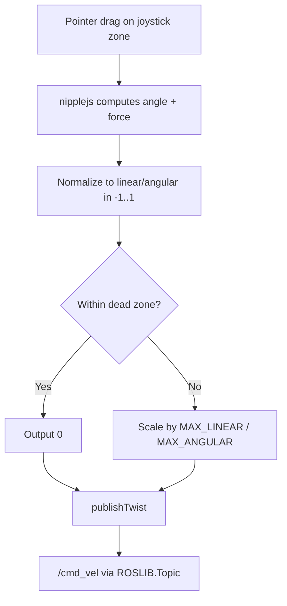

# Developing Web Interfaces for ROS — Unit 5: Move the Robot! Using a Joystick!

Discrete buttons (Unit 4) only give you full-speed or stopped. This unit replaces them with a continuous, two-axis virtual joystick — the standard control widget for teleoperating a mobile base or manipulator smoothly from a touchscreen or mouse.

The diagram below shows how a joystick drag is transformed into a clamped, scaled Twist before it reaches `/cmd_vel`.



## Why a joystick beats buttons for teleop
A joystick's position maps naturally onto a `Twist`'s two independent axes: vertical displacement to linear velocity, horizontal displacement to angular velocity. This gives an operator proportional control — light forward pressure with a gentle turn — instead of jerky full-speed steps, which matters a lot once you're driving near obstacles or people.

## Building or using a joystick widget
You can build a minimal one yourself with pointer events on an SVG or `<div>`, tracking the drag offset from a center point and clamping it to a circle. For anything beyond a class exercise, a small dependency-free library such as `nipplejs` handles the drag math, dead zone, and touch support for you:

```javascript
const joystick = nipplejs.create({
  zone: document.getElementById('joystick-zone'),
  mode: 'static',
  position: { left: '50%', top: '50%' },
  color: 'blue'
});

joystick.on('move', (evt, data) => {
  const linear = Math.cos(data.angle.radian) * data.force;   // simplified mapping
  const angular = -Math.sin(data.angle.radian) * data.force;
  publishTwist(linear, angular);
});

joystick.on('end', () => publishTwist(0, 0));
```

## Mapping stick position to Twist safely
Two details matter more than the raw math: clamping and scaling. Clamp the normalized force to `[-1, 1]` on both axes, then scale by your robot's real maximum linear/angular speed — never publish raw pixel deltas. Also add a small dead zone near center so a stationary finger doesn't cause drift from noise:

```javascript
const MAX_LINEAR = 0.5;   // m/s
const MAX_ANGULAR = 1.0;  // rad/s
const DEAD_ZONE = 0.05;

function publishTwist(normLinear, normAngular) {
  const linear = Math.abs(normLinear) < DEAD_ZONE ? 0 : normLinear * MAX_LINEAR;
  const angular = Math.abs(normAngular) < DEAD_ZONE ? 0 : normAngular * MAX_ANGULAR;
  drive(linear, angular); // the publisher from Unit 4
}
```

## Publish rate and the same 10 Hz habit
Reuse the throttled publishing pattern from Unit 4: fire on a timer at a steady rate while the joystick is active (`nipplejs` fires `move` events fast enough that throttling to ~10 Hz with the last known value is usually sufficient), and always publish a final zero on `end`.

## Try it yourself
Wire a virtual joystick to your `/cmd_vel` publisher with sensible `MAX_LINEAR`/`MAX_ANGULAR` limits and a dead zone. Test edge cases deliberately: drag to the very corner (should not exceed your max speed), release mid-drag (robot must stop), and drag slowly through the dead zone (should produce exactly zero, not a tiny nonzero creep).
