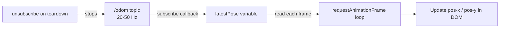

# Developing Web Interfaces for ROS — Unit 6: Tracking the Robot! Subscribing to a topic!

Publishing (Units 4-5) is one direction of the bridge; this unit covers the other — pulling live data out of ROS and rendering it in the DOM, using odometry as the running example. The shift in mindset matters: a publisher runs on your schedule (a button press, a joystick tick), but a subscriber runs on the robot's schedule. Messages arrive whenever the driver or navigation stack decides to publish them, and your JavaScript callback has to be ready for that at any moment, at whatever rate the topic happens to run.

The diagram below shows how subscription rate and render rate are decoupled so high-frequency odometry doesn't overwhelm the DOM.



## The ROSLIB.Topic subscriber pattern
Subscribing mirrors publishing: describe the topic, then register a callback that fires for every incoming message. roslibjs handles the underlying rosbridge `subscribe` handshake for you — under the hood it sends an `{"op": "subscribe", "topic": "/odom", ...}` message over the WebSocket, and rosbridge starts forwarding every message published on that topic back down the same connection as JSON.

```javascript
const odomListener = new ROSLIB.Topic({
  ros: ros,
  name: '/odom',
  messageType: 'nav_msgs/msg/Odometry'   // 'nav_msgs/Odometry' on ROS 1
});

odomListener.subscribe((message) => {
  const { x, y } = message.pose.pose.position;
  updatePositionDisplay(x, y);
});
```

`messageType` has to match the publisher's actual type exactly (including the `nav_msgs/msg/` vs `nav_msgs/` prefix difference between ROS 2 and ROS 1) — get it wrong and rosbridge will either silently fail to deliver anything or hand you a message shape your code doesn't expect. If you're not sure what a topic is publishing, check first with `ros2 topic type /odom` (or `rostopic type /odom`) before writing the subscriber.

## Reducing traffic before it reaches the browser
`ROSLIB.Topic` also accepts a `throttle_rate` option (milliseconds) and a `queue_length`, which are passed straight through to rosbridge's subscribe operation. Setting `throttle_rate: 100` asks rosbridge itself to drop extra messages so at most one arrives every 100ms, rather than shipping all 20-50 Hz of odometry over the WebSocket only to discard most of it in the browser:

```javascript
const odomListener = new ROSLIB.Topic({
  ros: ros,
  name: '/odom',
  messageType: 'nav_msgs/msg/Odometry',
  throttle_rate: 100   // ask rosbridge to forward at most 10 messages/sec
});
```

This is a server-side complement to the client-side pattern below, not a replacement for it — throttling at the source saves bandwidth and browser-side JSON parsing, which matters more over a flaky Wi-Fi link to the robot than it does on localhost.

## Rendering high-frequency data without hammering the DOM
Even after throttling at the source, redrawing the full DOM on every single callback is wasteful and can visibly jank the page — each DOM write can trigger layout/reflow work the browser wasn't asked for. A simple, effective pattern: let the subscriber callback just update a JavaScript variable, and use `requestAnimationFrame` (or a fixed low-rate `setInterval`) to actually paint it.

```javascript
let latestPose = { x: 0, y: 0 };
odomListener.subscribe((msg) => { latestPose = msg.pose.pose.position; });

function renderLoop() {
  document.getElementById('pos-x').textContent = latestPose.x.toFixed(2);
  document.getElementById('pos-y').textContent = latestPose.y.toFixed(2);
  requestAnimationFrame(renderLoop);
}
renderLoop();
```

This decouples "how fast ROS publishes" from "how fast the browser repaints," which keeps the page smooth regardless of sensor rate. Notice the callback itself does no DOM work at all — it's as cheap as possible, which matters because it can fire dozens of times a second no matter what the render loop is doing.

## Confirming your subscription is live
Before trusting what shows up on the page, verify the topic is actually flowing from a separate terminal, independent of your web app:

```bash
ros2 topic hz /odom       # ROS 2: confirm the publish rate you expect
rostopic hz /odom         # ROS 1
```

If the CLI sees messages but your page shows nothing, the problem is in your subscriber code or `messageType`, not in ROS — a useful way to split the debugging in half.

## Unsubscribing cleanly
Leaving a subscription open on a topic the user has navigated away from (a different dashboard panel, a closed tab section) wastes bandwidth and CPU on both ends. Always pair a `subscribe()` with a corresponding `unsubscribe()` when the UI element it feeds is torn down:

```javascript
function stopTrackingOdom() {
  odomListener.unsubscribe();
}
```

## Multiple simultaneous subscriptions
A real dashboard subscribes to several topics at once — odometry, battery state, diagnostics. Each gets its own `ROSLIB.Topic` instance and its own callback; there's no limit imposed by roslibjs or rosbridge beyond what your network and browser can handle:

```javascript
const batteryListener = new ROSLIB.Topic({
  ros: ros,
  name: '/battery_state',
  messageType: 'sensor_msgs/msg/BatteryState'
});
batteryListener.subscribe((msg) => updateBatteryDisplay(msg.percentage));
```

Keep each topic's `ROSLIB.Topic` instance and its DOM update logic in one place so it's obvious which UI elements depend on which subscription when you're debugging.

## Try it yourself
Subscribe to your robot's odometry topic (or a simulated one) and display live X/Y position and heading (from the orientation quaternion — you can extract yaw with `Math.atan2(2*(w*z+x*y), 1-2*(y*y+z*z))`) in the page, updated via `requestAnimationFrame`. Add a "Stop tracking" button that calls `unsubscribe()` and confirm via `ros2 topic info /odom` (or `rostopic info`) that the subscriber count drops when you click it. Then try adding `throttle_rate: 200` and watch the update rate visibly slow down, to see the effect for yourself.
