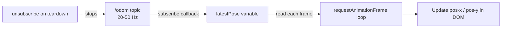

# Developing Web Interfaces for ROS — Unit 6: Tracking the Robot! Subscribing to a topic!

Publishing (Units 4-5) is one direction of the bridge; this unit covers the other — pulling live data out of ROS and rendering it in the DOM, using odometry as the running example.

The diagram below shows how subscription rate and render rate are decoupled so high-frequency odometry doesn't overwhelm the DOM.



## The ROSLIB.Topic subscriber pattern
Subscribing mirrors publishing: describe the topic, then register a callback that fires for every incoming message. roslibjs handles the underlying rosbridge `subscribe` handshake for you.

```javascript
const odomListener = new ROSLIB.Topic({
  ros: ros,
  name: '/odom',
  messageType: 'nav_msgs/msg/Odometry'   // 'nav_msgs/Odometry' on ROS 1
});

odomListener.subscribe((message) => {
  const { x, y } = message.pose.pose.position;
  updatePositionDisplay(x, y);
});
```

## Rendering high-frequency data without hammering the DOM
Odometry often publishes at 20-50 Hz, but redrawing the full DOM that fast is wasteful and can visibly jank the page. A simple, effective pattern: let the subscriber callback just update a JavaScript variable, and use `requestAnimationFrame` (or a fixed low-rate `setInterval`) to actually paint it.

```javascript
let latestPose = { x: 0, y: 0 };
odomListener.subscribe((msg) => { latestPose = msg.pose.pose.position; });

function renderLoop() {
  document.getElementById('pos-x').textContent = latestPose.x.toFixed(2);
  document.getElementById('pos-y').textContent = latestPose.y.toFixed(2);
  requestAnimationFrame(renderLoop);
}
renderLoop();
```

This decouples "how fast ROS publishes" from "how fast the browser repaints," which keeps the page smooth regardless of sensor rate.

## Unsubscribing cleanly
Leaving a subscription open on a topic the user has navigated away from (a different dashboard panel, a closed tab section) wastes bandwidth and CPU on both ends. Always pair a `subscribe()` with a corresponding `unsubscribe()` when the UI element it feeds is torn down:

```javascript
function stopTrackingOdom() {
  odomListener.unsubscribe();
}
```

## Multiple simultaneous subscriptions
A real dashboard subscribes to several topics at once — odometry, battery state, diagnostics. Each gets its own `ROSLIB.Topic` instance and its own callback; there's no limit imposed by roslibjs or rosbridge beyond what your network and browser can handle. Keep each topic's `ROSLIB.Topic` instance and its DOM update logic in one place so it's obvious which UI elements depend on which subscription when you're debugging.

## Try it yourself
Subscribe to your robot's odometry topic (or a simulated one) and display live X/Y position and heading (from the orientation quaternion — you can extract yaw with `Math.atan2(2*(w*z+x*y), 1-2*(y*y+z*z))`) in the page, updated via `requestAnimationFrame`. Add a "Stop tracking" button that calls `unsubscribe()` and confirm via `ros2 topic info /odom` (or `rostopic info`) that the subscriber count drops when you click it.
