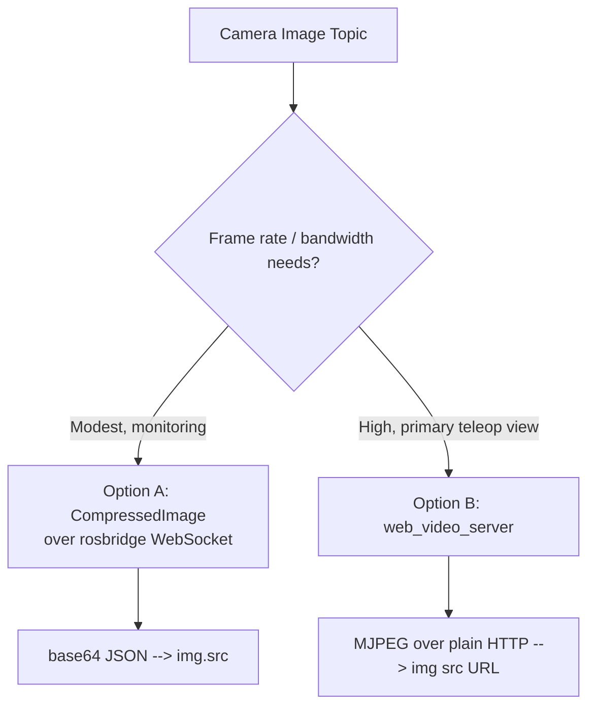

# Developing Web Interfaces for ROS — Unit 7: Inside the Robot! Showing camera on the web page!

Camera feeds are the highest-bandwidth data you'll pipe to a browser in this course, so this unit is as much about picking the right transport as it is about the HTML. There are two genuinely different approaches, and knowing when to use each matters.

The diagram below shows the decision between the two camera-streaming architectures and where each one diverges.



## Option A: compressed images over rosbridge
The simplest path reuses everything from Unit 6: subscribe to a `sensor_msgs/CompressedImage` topic (most camera drivers publish one alongside the raw feed, typically at `<topic>/compressed`) and set the JPEG bytes directly as an `` source.

```javascript
const imageListener = new ROSLIB.Topic({
  ros: ros,
  name: '/camera/image_raw/compressed',
  messageType: 'sensor_msgs/msg/CompressedImage'
});

const imgEl = document.getElementById('camera-view');
imageListener.subscribe((message) => {
  imgEl.src = 'data:image/jpeg;base64,' + message.data;
});
```

This works anywhere rosbridge already works — no extra server, no extra port — but every frame travels as base64-encoded JSON over the same WebSocket as everything else, which is inefficient at video-like frame rates.

## Option B: a dedicated MJPEG stream
For anything beyond low-rate monitoring, route the camera through a purpose-built streaming server such as `web_video_server`, which republishes a ROS image topic as an ordinary MJPEG HTTP stream:

```bash
ros2 run web_video_server web_video_server   # exposes http://<host>:8080/stream?topic=/camera/image_raw
```

Then the browser needs nothing but a plain image tag pointed at that URL — no roslibjs, no WebSocket overhead for the video itself:

```html
:8080/stream?topic=/camera/image_raw" alt="Robot camera feed">
```

This scales far better because MJPEG-over-HTTP is designed for exactly this and bypasses the JSON/base64 overhead entirely.

## Choosing between them
Use the rosbridge/CompressedImage approach when you already have the WebSocket open, frame rate needs are modest (a monitoring thumbnail, an occasional snapshot), and you don't want to run another server. Reach for `web_video_server` (or an equivalent dedicated video relay) whenever the camera feed is the main event — a primary teleoperation view — where smoothness and bandwidth efficiency matter.

## Handling multiple cameras and stream health
For multi-camera rigs, give each `` its own topic parameter (Option B) or its own `ROSLIB.Topic` subscription (Option A), and add an `onerror` handler on the `` element so a dead camera shows a clear placeholder instead of a broken-image icon:

```javascript
imgEl.onerror = () => { imgEl.src = '/assets/no-signal.png'; };
```

## Try it yourself
Implement both approaches against the same camera topic — a `CompressedImage` subscription and a `web_video_server` stream — and open them side by side. Note the visible latency and smoothness difference, and check the Network tab in your browser's dev tools to compare bandwidth usage between the two.
