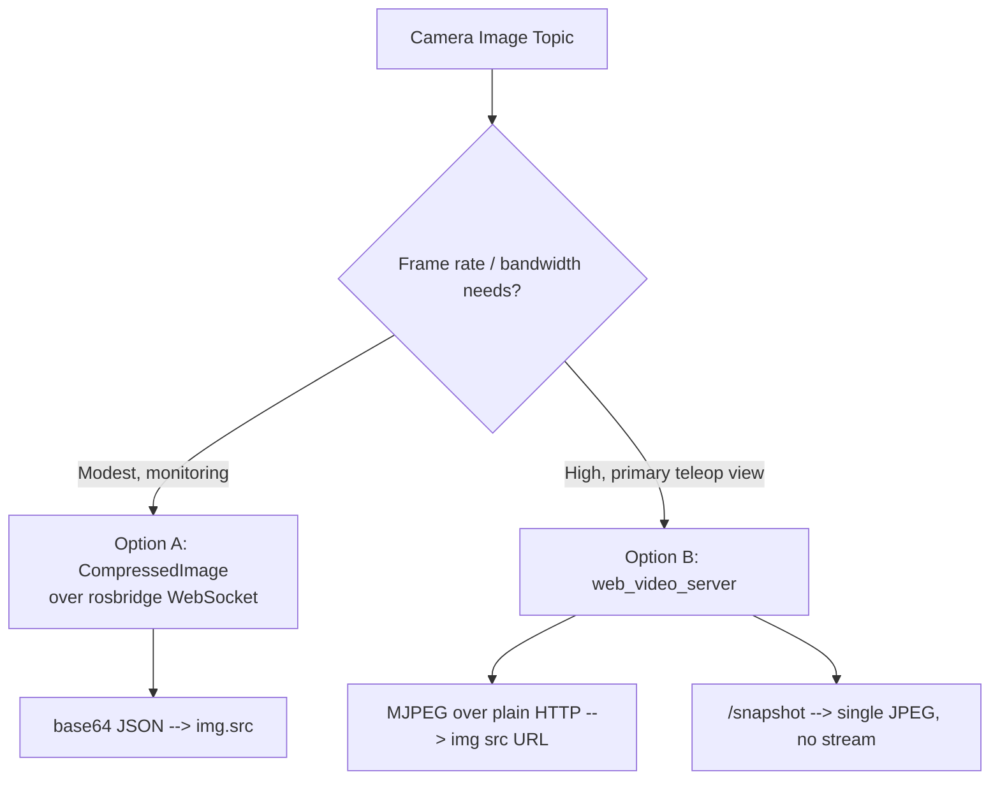

# Developing Web Interfaces for ROS — Unit 7: Inside the Robot! Showing camera on the web page!

Camera feeds are the highest-bandwidth data you'll pipe to a browser in this course, so this unit is as much about picking the right transport as it is about the HTML. Units 4-6 moved small structured messages — twists, odometry — where JSON-over-WebSocket overhead barely registers. Video is different: a single 640x480 JPEG frame can be tens of kilobytes, arriving many times a second, and the wrong transport choice will visibly stutter your page or starve other traffic on the same connection. There are two genuinely different approaches, and knowing when to use each matters.

The diagram below shows the decision between the two camera-streaming architectures and where each one diverges.



## Why the transport matters
rosbridge's default JSON transport can't put raw binary in a JSON document, so every byte of image data gets base64-encoded first — that alone inflates the payload by roughly a third before JSON's usual object/array overhead is even added. Worse, that traffic shares the same WebSocket connection as your teleop commands, odometry subscriptions, and service calls, so a heavy video stream can add latency to everything else riding that socket. Neither problem is fatal at low rates, which is why Option A remains a reasonable choice for the right use case — but it's worth understanding why Option B exists before choosing between them.

## Option A: compressed images over rosbridge
The simplest path reuses everything from Unit 6: subscribe to a `sensor_msgs/CompressedImage` topic (most camera drivers publish one alongside the raw feed, typically at `<topic>/compressed`) and set the JPEG bytes directly as an `` source.

```javascript
const imageListener = new ROSLIB.Topic({
  ros: ros,
  name: '/camera/image_raw/compressed',
  messageType: 'sensor_msgs/msg/CompressedImage'
});

const imgEl = document.getElementById('camera-view');
imageListener.subscribe((message) => {
  imgEl.src = 'data:image/jpeg;base64,' + message.data;
});
```

Note the message's `format` field (a string such as `"jpeg"` or `"png"`) — if you're not sure what your driver emits, read it once and build the `data:` URI's MIME type from it (`data:image/${message.format};base64,...`) rather than hardcoding `jpeg`.

This works anywhere rosbridge already works — no extra server, no extra port — but every frame travels as base64-encoded JSON over the same WebSocket as everything else, which is inefficient at video-like frame rates. Never subscribe to the raw `sensor_msgs/Image` topic this way; uncompressed frames are many times larger than their JPEG counterparts and will overwhelm both the WebSocket and the browser's JSON parser almost immediately.

## Option B: a dedicated MJPEG stream
For anything beyond low-rate monitoring, route the camera through a purpose-built streaming server such as `web_video_server`, which republishes a ROS image topic as an ordinary MJPEG HTTP stream:

```bash
ros2 run web_video_server web_video_server   # exposes http://<host>:8080/stream?topic=/camera/image_raw
```

Then the browser needs nothing but a plain image tag pointed at that URL — no roslibjs, no WebSocket overhead for the video itself:

```html
:8080/stream?topic=/camera/image_raw" alt="Robot camera feed">
```

This scales far better because MJPEG-over-HTTP is designed for exactly this and bypasses the JSON/base64 overhead entirely. `web_video_server` also exposes `/snapshot?topic=/camera/image_raw` for a single still frame instead of a continuous stream — handy for a low-frequency thumbnail grid. When bandwidth to a remote operator is tight, trim the stream itself with query parameters such as `quality` (JPEG quality, lower is smaller) and `width`/`height` (server-side resize), rather than shrinking the `` in CSS and shipping full-resolution pixels for nothing.

## Choosing between them
Use the rosbridge/CompressedImage approach when you already have the WebSocket open, frame rate needs are modest (a monitoring thumbnail, an occasional snapshot), and you don't want to run another server. Reach for `web_video_server` (or an equivalent dedicated video relay) whenever the camera feed is the main event — a primary teleoperation view — where smoothness and bandwidth efficiency matter, or whenever the same feed needs to be watched by more than one browser at once, since each `` pointed at the HTTP stream pulls independently without adding load to rosbridge.

## Handling multiple cameras and stream health
For multi-camera rigs, give each `` its own topic parameter (Option B) or its own `ROSLIB.Topic` subscription (Option A), and add an `onerror` handler on the `` element so a dead camera shows a clear placeholder instead of a broken-image icon:

```javascript
imgEl.onerror = () => { imgEl.src = '/assets/no-signal.png'; };
```

For Option A, pair this with a simple staleness check: track the timestamp of the last received frame, and if the callback hasn't fired for a second or two, treat the feed as dead even though no explicit error occurred — a camera driver that's crashed silently stops publishing rather than emitting an error.

## Try it yourself
Implement both approaches against the same camera topic — a `CompressedImage` subscription and a `web_video_server` stream — and open them side by side. Note the visible latency and smoothness difference, and check the Network tab in your browser's dev tools to compare bandwidth usage between the two. Then try the `/snapshot` endpoint and the `quality`/`width` query parameters on the `web_video_server` stream, and watch how the bandwidth figure in dev tools responds to each change.
