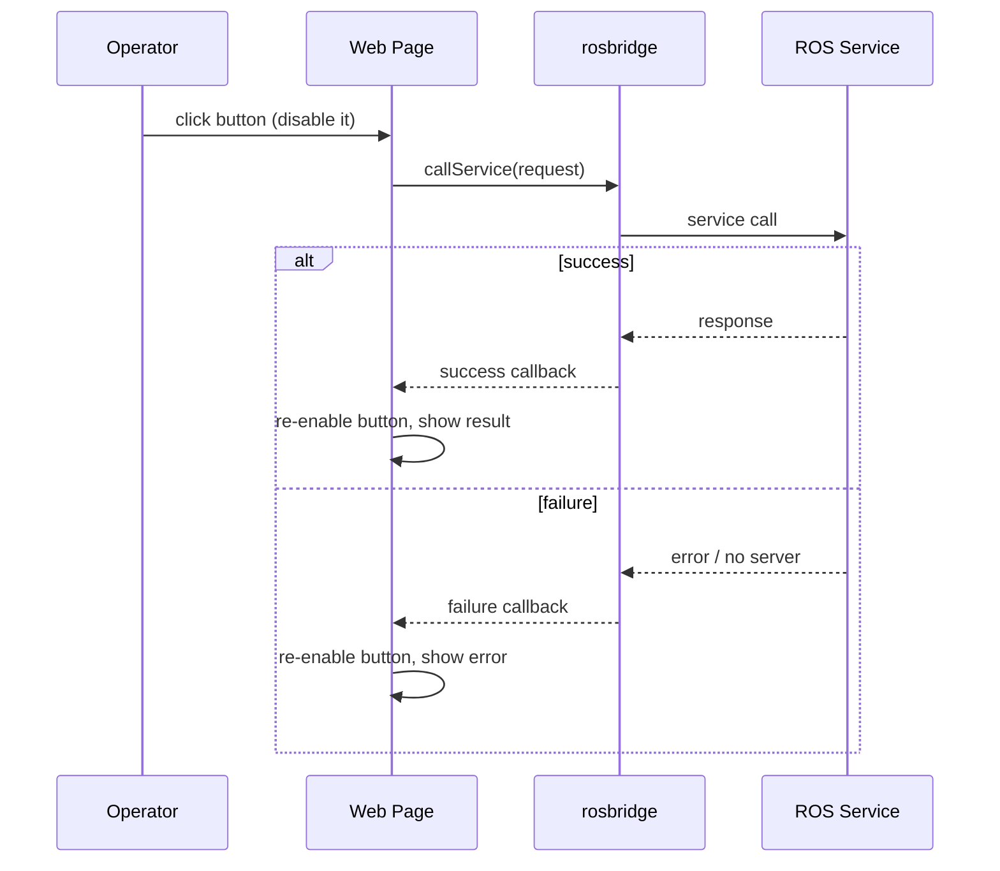

# Developing Web Interfaces for ROS — Unit 8: Calling ROS services from the web

Topics are fire-and-forget streams; services are request/response calls with a defined answer. This unit covers `ROSLIB.Service`, the pattern for anything a web UI needs to ask ROS and wait for a result — resetting odometry, toggling a mode, querying a lookup.

The diagram below shows the request/response exchange for a service call, including the separate success and failure paths.



## The ROSLIB.Service call pattern
Like topics, you declare the service by name and type, then call it with a request object and a callback for the response.

```javascript
const resetOdomClient = new ROSLIB.Service({
  ros: ros,
  name: '/reset_odometry',
  serviceType: 'std_srvs/srv/Empty'   // 'std_srvs/Empty' on ROS 1
});

const request = new ROSLIB.ServiceRequest({});

resetOdomClient.callService(request, (result) => {
  console.log('Odometry reset acknowledged:', result);
}, (error) => {
  console.error('Service call failed:', error);
});
```

Note the two callbacks: success and failure are separate arguments, not a single try/catch — always provide both, since a service that's down or misnamed fails silently in the UI otherwise.

## Services with typed requests and responses
Most real services carry data both ways. Build the request object's fields to match the `.srv` definition exactly (field names and nesting matter):

```javascript
const setModeClient = new ROSLIB.Service({
  ros: ros,
  name: '/set_operating_mode',
  serviceType: 'my_robot_msgs/srv/SetMode'
});

const request = new ROSLIB.ServiceRequest({ mode: 'autonomous' });

setModeClient.callService(request, (result) => {
  if (result.success) {
    statusEl.textContent = `Mode changed: ${result.message}`;
  } else {
    statusEl.textContent = `Mode change rejected: ${result.message}`;
  }
});
```

If you're unsure of a service's exact field layout, check it from the CLI before writing JavaScript against it:

```bash
ros2 interface show my_robot_msgs/srv/SetMode   # ROS 2
rossrv show my_robot_msgs/SetMode               # ROS 1
```

## Discovering what services exist
Before wiring a button to a service call, confirm the service is actually up and matches the name/type you expect:

```bash
ros2 service list                          # ROS 2
ros2 service type /set_operating_mode
rosservice list                            # ROS 1
rosservice type /set_operating_mode
```

A UI button bound to a nonexistent or misspelled service name will simply hang or error via your failure callback — checking the service list first saves a lot of guesswork.

## Disabling controls during in-flight calls
Because a service call is asynchronous and can take a nontrivial amount of time (especially anything touching hardware), disable the triggering button until the callback fires, to prevent duplicate in-flight requests from a double click:

```javascript
button.addEventListener('click', () => {
  button.disabled = true;
  resetOdomClient.callService(request, () => { button.disabled = false; },
                                        () => { button.disabled = false; });
});
```

## Try it yourself
Pick (or create) a simple service such as `std_srvs/Empty` or `std_srvs/SetBool`, wire a button to call it, disable the button while the call is in flight, and display the success/failure result in the page. Confirm with `ros2 service list` (or `rosservice list`) that the service name and type in your JavaScript exactly match what ROS reports.
