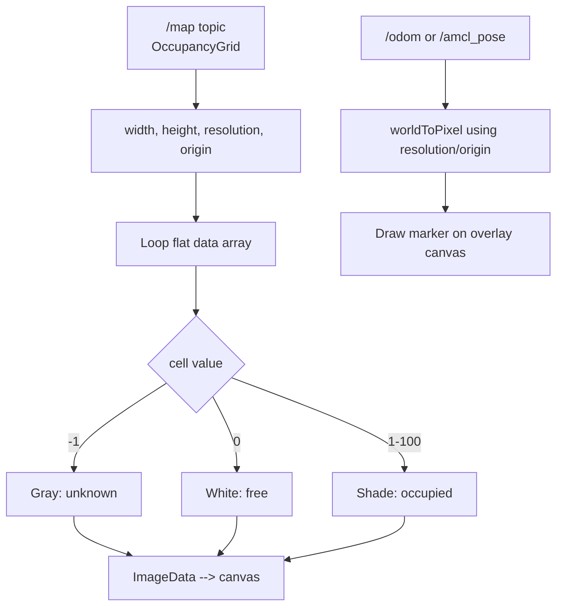

# Developing Web Interfaces for ROS — Unit 9: Showing a map on the web page

Occupancy grid maps are just 2D arrays of numbers wrapped in a ROS message — this unit turns that array into pixels on an HTML `<canvas>`, the foundation of any browser-based navigation or localization dashboard.

The diagram below shows how OccupancyGrid cell values become canvas pixels, plus the separate pose-to-pixel overlay path.



## Anatomy of an OccupancyGrid message
`nav_msgs/OccupancyGrid` carries a header, a `MapMetaData` (resolution in meters/cell, width and height in cells, and the origin pose), and a flat `data` array of length `width * height`. Each cell value is `-1` (unknown), `0` (free), or `1-100` (probability of occupied). Understanding this layout is the whole trick to rendering it — everything else is a nested loop.

```javascript
mapListener.subscribe((mapMsg) => {
  const { width, height } = mapMsg.info;
  drawOccupancyGrid(mapMsg.data, width, height);
});
```

## Rendering the grid to canvas
Map data to a canvas pixel by pixel using `ImageData` for performance — manipulating a canvas one `fillRect` call per cell is noticeably slower for anything beyond a small map.

```javascript
function drawOccupancyGrid(data, width, height) {
  const canvas = document.getElementById('map-canvas');
  canvas.width = width;
  canvas.height = height;
  const ctx = canvas.getContext('2d');
  const imageData = ctx.createImageData(width, height);

  for (let i = 0; i < data.length; i++) {
    const cell = data[i];
    // ROS map data is row-major from the bottom-left; canvas is top-left,
    // so flip the row when computing the destination pixel.
    const row = Math.floor(i / width);
    const col = i % width;
    const destIndex = ((height - 1 - row) * width + col) * 4;

    let shade;
    if (cell === -1) shade = 128;             // unknown -> gray
    else shade = 255 - Math.round(cell * 2.55); // 0 -> white, 100 -> black

    imageData.data[destIndex]     = shade;
    imageData.data[destIndex + 1] = shade;
    imageData.data[destIndex + 2] = shade;
    imageData.data[destIndex + 3] = 255;
  }

  ctx.putImageData(imageData, 0, 0);
}
```

## Subscribing to the map topic
Maps are usually published once (latched/transient-local) and then only again on updates, so a standard subscription is all you need — no special polling.

```javascript
const mapListener = new ROSLIB.Topic({
  ros: ros,
  name: '/map',
  messageType: 'nav_msgs/msg/OccupancyGrid'
});
mapListener.subscribe((mapMsg) => drawOccupancyGrid(mapMsg.data, mapMsg.info.width, mapMsg.info.height));
```

## Overlaying the robot's position
A static map is only half useful — overlay the live pose from Unit 6's odometry (or `/amcl_pose`) as a marker. Convert the robot's world-frame X/Y (meters) into canvas pixel coordinates using the map's `resolution` and `origin`:

```javascript
function worldToPixel(worldX, worldY, mapInfo) {
  const px = (worldX - mapInfo.origin.position.x) / mapInfo.resolution;
  const py = mapInfo.height - (worldY - mapInfo.origin.position.y) / mapInfo.resolution;
  return { px, py };
}
```

Draw the marker on a second, transparent canvas layered on top of the map canvas so you can redraw the fast-moving pose marker without repainting the whole (much larger) map every frame.

## Try it yourself
Render your robot's map (from a simulator or a bagged `/map` topic) to canvas with the unknown/free/occupied shading above, then add a small circular marker for the robot's live pose using the world-to-pixel conversion. Verify the marker's position visually matches the robot's actual location relative to walls in the map.
