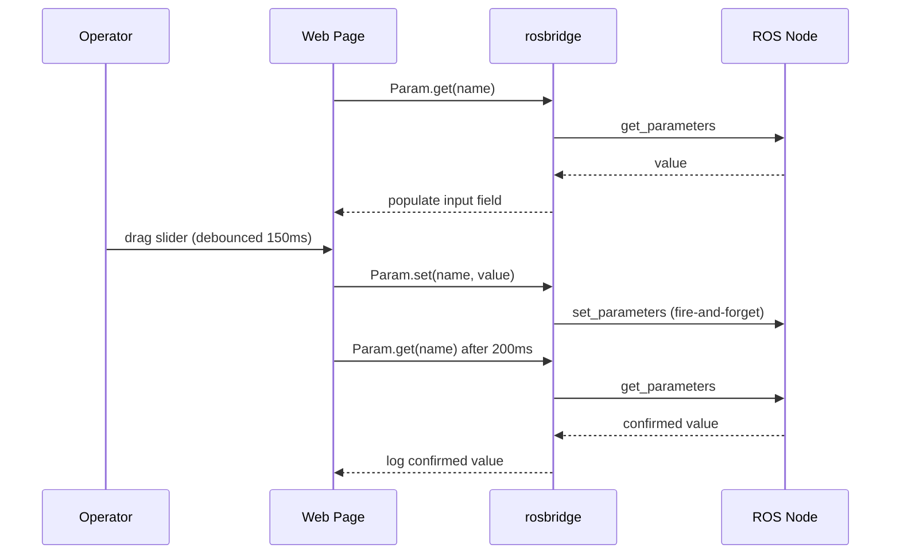

# Developing Web Interfaces for ROS — Unit 10: Tunning your robotics algorithms! ROS Parameters!

Parameters are how you tune a running node's behavior without restarting it — PID gains, speed limits, feature toggles. This unit uses `ROSLIB.Param` to build a web panel that reads and writes them live, which is a genuinely useful tool for tuning control algorithms without touching a terminal.

The diagram below shows the get/set/get-again exchange used to read, write, and confirm a live ROS parameter.



## Reading a parameter
`ROSLIB.Param` wraps the get/set parameter services behind a small, synchronous-feeling API:

```javascript
const maxSpeedParam = new ROSLIB.Param({
  ros: ros,
  name: '/motion_controller/max_linear_speed'   // node_name/param_name
});

maxSpeedParam.get((value) => {
  document.getElementById('max-speed-input').value = value;
});
```

## Writing a parameter
Setting works the same way, just with `.set()` instead of `.get()`. There's no confirmation callback in the base API for `set` — it fires and forgets — so if you need proof the change took effect, read it back afterward.

```javascript
document.getElementById('apply-btn').addEventListener('click', () => {
  const newValue = parseFloat(document.getElementById('max-speed-input').value);
  maxSpeedParam.set(newValue);
  setTimeout(() => maxSpeedParam.get((v) => console.log('Confirmed value:', v)), 200);
});
```

## Naming: know your ROS version's parameter model
This is the one place ROS 1 and ROS 2 genuinely diverge, and it will bite you if ignored. In ROS 1, parameters live on a global, flat-ish server addressed by path (e.g. `/motion_controller/max_linear_speed`). In ROS 2, parameters are strictly per-node — the same `ROSLIB.Param` name typically needs the node name folded in, and you should confirm exact parameter names for the target node from the CLI before wiring up the UI, rather than guessing:

```bash
ros2 param list /motion_controller          # ROS 2 — list a node's parameters
ros2 param get /motion_controller max_linear_speed
ros2 param set /motion_controller max_linear_speed 0.8

rosparam list                                # ROS 1
rosparam get /motion_controller/max_linear_speed
```

## Building a tuning panel
A useful pattern for control-algorithm tuning is a form of labeled sliders/number inputs, one per parameter, each independently wired to its own `ROSLIB.Param`. Debounce slider input so you're not flooding the parameter service on every pixel of drag:

```javascript
let debounceTimer;
slider.addEventListener('input', (e) => {
  clearTimeout(debounceTimer);
  debounceTimer = setTimeout(() => maxSpeedParam.set(parseFloat(e.target.value)), 150);
});
```

## Validating input before sending it
Unlike a terminal, a web form invites accidental garbage input. Always validate ranges client-side (e.g. reject negative max speeds, clamp PID gains to sane bounds) before calling `.set()` — a bad parameter pushed to a running controller can cause immediate, real-world jerky or unsafe motion.

## Try it yourself
Build a small tuning panel with two or three parameters relevant to a controller you have running (or simulate with any node exposing declared parameters), each with a debounced slider, client-side range validation, and a "current value" readout confirmed via `.get()`. Change a value from the CLI (`ros2 param set`/`rosparam set`) and confirm your page picks it up next time you call `.get()`.
