# Developing Web Interfaces for ROS

This course teaches you to build browser-based interfaces that control and monitor a ROS-powered robot in real time, using nothing but HTML, JavaScript, and the `rosbridge_suite` / `roslibjs` bridge that translates the ROS graph into WebSocket-friendly JSON. Starting from a bare development environment, you'll progressively add teleoperation controls, live telemetry, camera streaming, service and action calls, map rendering, parameter tuning, and full 3D visualization, before combining all of it into a single operator dashboard in the final project.

The diagram below shows how each unit builds on the previous one, grouped into four learning phases before the capstone.

```mermaid
flowchart LR
    subgraph Foundations["Foundations"]
        U1[1: Introduction] --> U2[2: Env Setup Part 1] --> U3[3: Env Setup Part 2]
    end
    subgraph Teleop["Teleop & Telemetry"]
        U4[4: Publish / Drive] --> U5[5: Joystick] --> U6[6: Subscribe / Odometry]
    end
    subgraph Perception["Perception & Interaction"]
        U7[7: Camera] --> U8[8: Services] --> U9[9: Map]
    end
    subgraph Advanced["Advanced Visualization"]
        U10[10: Parameters] --> U11[11: 3D Visualization] --> U12[12: Actions]
    end
    U3 --> U4
    U6 --> U7
    U9 --> U10
    U12 --> U13[13: Final Project Dashboard]
```

1. [Introduction](01-introduction.md) — why browsers need a bridge to ROS, and how rosbridge + roslibjs provide one.
2. [Setting up our development environment (Part 1)](02-setting-up-our-development-environment-part-1.md) — installing and launching the rosbridge WebSocket server.
3. [Setting up our development environment (Part 2)](03-setting-up-our-development-environment-part-2.md) — adding roslibjs, a dev server, and a reusable project layout.
4. [Move the Robot! Publishing to a topic!](04-move-the-robot-publishing-to-a-topic.md) — driving a robot base by publishing `Twist` messages from button controls.
5. [Move the Robot! Using a Joystick!](05-move-the-robot-using-a-joystick.md) — proportional teleoperation with a virtual joystick widget.
6. [Tracking the Robot! Subscribing to a topic!](06-tracking-the-robot-subscribing-to-a-topic.md) — reading live odometry and rendering it efficiently in the DOM.
7. [Inside the Robot! Showing camera on the web page!](07-inside-the-robot-showing-camera-on-the-web-page.md) — streaming camera feeds via rosbridge or a dedicated MJPEG server.
8. [Calling ROS services from the web](08-calling-ros-services-from-the-web.md) — request/response calls with `ROSLIB.Service`.
9. [Showing a map on the web page](09-showing-a-map-on-the-web-page.md) — rendering an `OccupancyGrid` to canvas with a live robot-position overlay.
10. [Tunning your robotics algorithms! ROS Parameters!](10-tunning-your-robotics-algorithms-ros-parameters.md) — reading and writing node parameters from a web tuning panel.
11. [3D Visualization for Robots on Webpages](11-3d-visualization-for-robots-on-webpages.md) — loading a URDF and following TF with three.js/ros3djs.
12. [Using ROS Action Servers from the web](12-using-ros-action-servers-from-the-web.md) — long-running, cancelable tasks with `ROSLIB.ActionClient`.
13. [Final Project](13-final-project.md) — combining every panel into one resilient operator dashboard.
