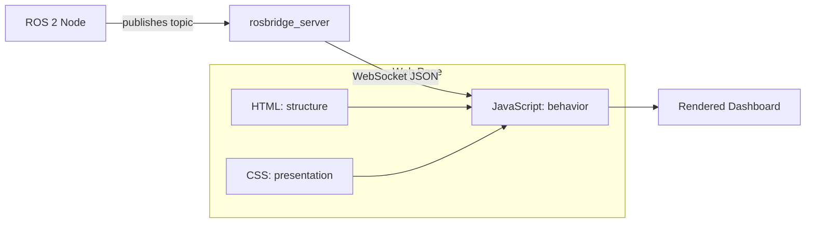

# Web Development for Robotics — Unit 1: Introduction

Robots are increasingly operated and monitored through a browser rather than a terminal or a joystick. This unit lays out the pieces you'll assemble over the course — HTML, CSS, JavaScript, and React — and how they connect to a running robot through Rosbridge, so you know where each later unit fits before you start typing code.

The diagram below shows how the page's three layers combine with the Rosbridge pipeline to get live robot data onto the screen.



## Why a browser for robot interfaces
A web page runs on any device with a browser: a lab tablet, an operator's laptop, a phone on the shop floor. You don't ship an app, you don't manage installs, and updates are just a redeploy of static files. For robotics specifically this matters because your "client" is often a non-technical operator who needs a big red STOP button and a live camera feed, not a command line. The trade-off is that a browser can't directly open a serial port or subscribe to a ROS topic — it needs a bridge, which is where Rosbridge comes in later in the course.

## The three layers of a web page
Every page you build in this course is built from three separable concerns:
- **HTML** — the structure and content (what elements exist: a heading, a table of joint states, a form to send a velocity command).
- **CSS** — the presentation (colors, layout, making the emergency-stop button impossible to miss).
- **JavaScript** — the behavior (reacting to a button click, opening a WebSocket, redrawing the page when new sensor data arrives).

Keeping these separate — rather than inline `style="..."` and `onclick="..."` attributes everywhere — is what makes a page maintainable once it grows past a demo.

```html
<!-- index.html: structure only -->
<!doctype html>
<html lang="en">
<head>
  <meta charset="utf-8">
  <title>Robot Dashboard</title>
  <link rel="stylesheet" href="style.css">
</head>
<body>
  <h1>Robot Status</h1>
  <p id="battery">Battery: -- %</p>
  <script src="app.js"></script>
</body>
</html>
```

## From ROS topics to browser pixels
The pipeline you'll build toward looks like this:

```
ROS 2 node (publishes /battery_state)
        │
   rosbridge_server  (WebSocket, JSON <-> ROS messages)
        │
   roslibjs (JavaScript library, runs in the browser)
        │
   your HTML/CSS/JS page (renders the number on screen)
```

Rosbridge translates ROS topics, services, and actions into JSON messages sent over a WebSocket. Your JavaScript never talks to ROS directly — it talks to Rosbridge, which talks to ROS. This decoupling means the same dashboard code works whether the robot is next to you or across the network.

## Course roadmap
Units 2-6 build your static front-end skills (HTTP serving, HTML, forms, CSS). Units 7-8 add JavaScript so pages become interactive and data-driven. Units 9-10 introduce React so you can organize a growing dashboard into reusable components instead of one sprawling script. By the end you'll be able to build a page that displays live robot data and sends commands back.

## Try it yourself
Create the `index.html` file above in an empty folder, open it directly in your browser (double-click it, or `file://` URL), and confirm the heading and placeholder battery text render. Then add one more line inside `<body>` — a `<button>` with the text "Stop Robot" — and view the result. You've just made your first HTML edit; don't wire it up yet, that's coming in later units.
