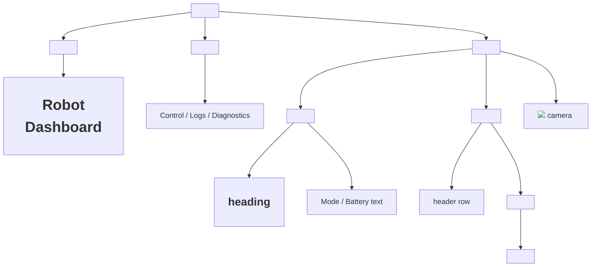

# Web Development for Robotics — Unit 3: HTML basics

HTML is the vocabulary you use to describe what's on a page — headings, text, tables, images — so the browser (and screen readers, and search engines) understand what each piece of content actually is. Get this layer right and the later units get easier: CSS selectors target meaningful elements instead of a soup of generic `<div>`s, and JavaScript has real hooks (`id`, `class`, `data-*`) to grab instead of counting child nodes. This unit covers the elements you'll reuse constantly when building robot dashboards.

The tree below shows how the elements covered in this unit nest inside a page's `<body>`, including the landmark elements a dashboard's shell is usually built from.



## Document structure and semantics
Every page needs the boilerplate from Unit 1, but the content inside `<body>` should use the element that matches the content's meaning, not just its appearance. Use `<h1>`-`<h6>` for headings in hierarchical order, `<p>` for paragraphs, `<nav>` for navigation, `<section>`/`<article>` to group related content. This "semantic HTML" matters more than it looks: it's what lets screen readers describe your page and what keeps your CSS selectors meaningful instead of a pile of generic `<div>`s.

`<header>`, `<nav>`, `<main>`, and `<footer>` are landmark elements — a screen reader user can jump straight to "navigation" or "main content" by name instead of tabbing through every element. A page built entirely from `<div>`s has no landmarks for assistive tech to jump between. Putting the pieces together for a small dashboard shell looks like this:

```html
<body>
  <header>
    <h1>Robot Dashboard</h1>
  </header>
  <nav>
    <a href="control.html">Control</a>
    <a href="logs.html">Logs</a>
    <a href="diagnostics.html">Diagnostics</a>
  </nav>
  <main>
    <section id="status-panel">
      <h2>Robot Status</h2>
      <p>Mode: <span id="mode">Idle</span></p>
      <p>Battery: <span id="battery">--</span>%</p>
    </section>
  </main>
</body>
```

## Displaying structured data with tables
Robot telemetry is naturally tabular — joint names and angles, sensor names and readings. `<table>` with `<thead>`/`<tbody>`/`<tr>`/`<th>`/`<td>` is the right tool, not nested `<div>`s with CSS grid pretending to be a table.

```html
<table>
  <thead>
    <tr>
      <th scope="col">Joint</th>
      <th scope="col">Position (rad)</th>
      <th scope="col">Velocity (rad/s)</th>
    </tr>
  </thead>
  <tbody id="joint-table-body">
    <tr><td>shoulder_pan</td><td>0.42</td><td>0.00</td></tr>
    <tr><td>elbow</td><td>-1.10</td><td>0.05</td></tr>
  </tbody>
</table>
```

The `scope="col"` attribute on each `<th>` associates that header with the whole column, so a screen reader announces "Position (rad), column header" for each data cell — an association a `<div>`-based grid has no standard way to express. Later, when JavaScript reads live joint states, you'll replace the contents of `#joint-table-body` on each update rather than rewriting the whole table.

## Links, images, and media
`` embeds an image — the `alt` text matters both for accessibility and as a fallback if the feed drops. For a live MJPEG camera stream (a common ROS web_video_server output), the same `` tag works directly, since MJPEG is just a sequence of JPEG frames over one long HTTP response:

```html

```

The `onerror` attribute is a standard HTML event handler: if the stream URL fails (robot rebooting, network drop), the browser swaps in a placeholder image instead of leaving a broken-image icon on an operator's screen.

`<a href="...">` creates links; useful for a dashboard's navigation between "Control", "Logs", and "Diagnostics" pages, as shown in the shell above.

## IDs, classes, and attributes
`id="battery"` uniquely identifies one element — this is your hook for JavaScript (`document.getElementById('battery')`) and for CSS. IDs must be unique per page; if you accidentally reuse one, `getElementById` silently returns only the first match and the duplicate becomes an invisible bug once the page grows. `class="warning"` can apply to many elements at once, for shared styling or shared JavaScript selection (`document.querySelectorAll('.warning')`). Custom `data-*` attributes let you attach robot-specific metadata without inventing new tags:

```html
<tr data-joint-name="elbow" data-joint-index="1">
  <td>elbow</td><td class="position">-1.10</td>
</tr>
```

In JavaScript these show up on the element's `dataset` object, with the kebab-case name converted to camelCase automatically: `row.dataset.jointName` reads `"elbow"`, `row.dataset.jointIndex` reads `"1"` (always a string — convert with `Number()` before doing math). You'll lean on this pattern in later units to identify which physical joint a table row corresponds to, without parsing text out of a `<td>`.

## Validating your markup
Browsers are forgiving — an unclosed `<td>` or a `<p>` nested inside another `<p>` usually still renders something — but "renders something" isn't the same as "correct." A misplaced closing tag can silently swallow or duplicate sibling elements, which later shows up as CSS that "isn't applying" or JavaScript that "can't find" an element that's visually right there. Check the dev tools Elements panel (F12) — it shows the DOM the browser actually parsed, not your raw source — and for a page worth keeping, run it through the [W3C Markup Validator](https://validator.w3.org/).

## Try it yourself
Build a page with a `<section>` containing an `<h2>`, a `<table>` listing three sensors (name, value, unit) with a unique `id` on each value cell, and an `` placeholder for a camera feed with meaningful `alt` text. Validate it opens cleanly and the table renders with a header row distinct from the data rows, then open dev tools' Elements panel to confirm the parsed DOM matches what you wrote.
