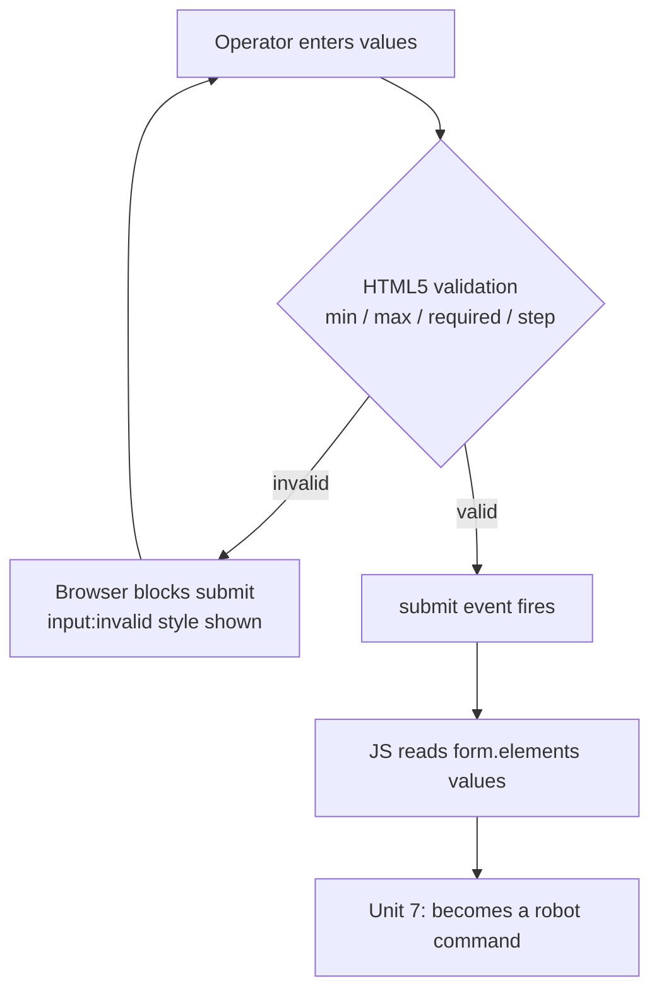

# Web Development for Robotics — Unit 4: Working with Forms

Dashboards aren't just for watching a robot — you need to send it commands: a target velocity, a named waypoint, a mode switch. HTML forms are the standard way to collect structured input from a user before your JavaScript turns it into a command.

The flow below shows why validation sits before the value ever reaches JavaScript or the robot.



## Form basics and input types
A `<form>` groups related inputs and, in a traditional web app, submits them to a server. In a robotics dashboard you'll usually intercept the submit event with JavaScript instead of letting the browser navigate away (more on that in Unit 7), but the markup is the same either way:

```html
<form id="velocity-form">
  <label for="linear">Linear velocity (m/s)</label>
  <input type="number" id="linear" name="linear" step="0.1" min="-1" max="1" value="0">

  <label for="angular">Angular velocity (rad/s)</label>
  <input type="range" id="angular" name="angular" step="0.1" min="-1.5" max="1.5" value="0">

  <button type="submit">Send Command</button>
</form>
```

`type="number"` gives you a spinner with built-in bounds; `type="range"` gives a slider — better for a value an operator adjusts by feel, like turn rate. Always pair an `<input>` with a `<label for="...">` matching its `id`: it's what makes the label clickable and what screen readers announce.

## Choices: radio, checkbox, select
For a fixed set of options — choosing a navigation mode, picking a saved waypoint — don't use free text.

```html
<fieldset>
  <legend>Mode</legend>
  <label><input type="radio" name="mode" value="manual" checked> Manual</label>
  <label><input type="radio" name="mode" value="auto"> Autonomous</label>
</fieldset>

<label for="waypoint">Go to waypoint</label>
<select id="waypoint" name="waypoint">
  <option value="dock">Charging Dock</option>
  <option value="kitchen">Kitchen</option>
  <option value="lobby">Lobby</option>
</select>

<label><input type="checkbox" id="estop" name="estop"> Emergency Stop</label>
```

Radio buttons (grouped by shared `name`) are mutually exclusive; checkboxes are independent toggles; `<select>` is best once you have more than about five options, to save screen space.

## Validation before it reaches the robot
Bad input sent to a robot is worse than bad input rejected by a form. Use built-in HTML validation attributes as your first line of defense — `min`, `max`, `step`, `required`, `pattern` — before anything reaches JavaScript or the network:

```html
<input type="number" id="max-speed" required min="0" max="2" step="0.05">
```

The browser refuses to submit the form until this passes, and `input:invalid { border-color: red; }` in CSS gives visual feedback for free. Client-side validation is a usability feature, not a security boundary — always validate again wherever the command is actually consumed (your ROS node, your server), since anyone can send malformed data straight to your bridge.

## Reading form values
Regardless of how submission is handled, you retrieve values the same way:

```js
const form = document.getElementById('velocity-form');
const linear = form.elements['linear'].valueAsNumber;
const mode = form.querySelector('input[name="mode"]:checked').value;
```

You'll use exactly this pattern in Unit 7 to turn a submitted form into a ROS command message.

## Try it yourself
Extend the page from Unit 3 with a form containing a numeric speed input (bounded 0-2), a radio group for "Manual"/"Auto" mode, and a submit button. Add `required` to the speed input and confirm the browser blocks submission when it's empty or out of range.
