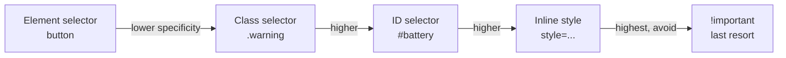

# Web Development for Robotics — Unit 5: CSS - Styles for webpages

Structure alone doesn't make an operator trust a dashboard — a cluttered, unstyled page is hard to scan quickly, and quick scanning matters when the content is "is the robot about to hit something." This unit introduces CSS selectors and the core styling model.

The chain below shows increasing specificity — the order to check when two rules conflict, before reaching for `!important`.



## Attaching CSS and selector basics
Prefer an external stylesheet linked from `<head>` (as in Unit 1) over inline styles — it keeps presentation separate from structure and lets one stylesheet cover an entire dashboard. Selectors decide which elements a rule applies to:

```css
/* element selector: every <button> */
button { padding: 0.5em 1em; font-size: 1rem; }

/* class selector: only elements with class="warning" */
.warning { color: #b00; font-weight: bold; }

/* id selector: the one element with id="battery" */
#battery { font-size: 1.5rem; }

/* descendant selector: <td> elements inside #joint-table-body */
#joint-table-body td { text-align: right; }

/* attribute selector: inputs currently failing validation */
input:invalid { border: 2px solid #b00; }
```

Specificity — the rule for which selector wins when two rules conflict — roughly follows id > class > element, with later rules of equal specificity winning. When two rules fight over a color and you can't tell why, check specificity before reaching for `!important`.

## The box model
Every element is a rectangular box made of four layers, from inside out: **content**, **padding**, **border**, **margin**. Understanding this is what makes layout predictable instead of mysterious:

```css
.status-panel {
  padding: 1em;        /* space inside the border */
  border: 1px solid #ccc;
  margin-bottom: 1em;   /* space outside the border */
  box-sizing: border-box; /* width/height include padding+border */
}
```

`box-sizing: border-box` is worth setting globally (`*, *::before, *::after { box-sizing: border-box; }`) — without it, adding padding silently grows an element beyond its declared width, a classic source of layout bugs.

## Color, typography, and state
A dashboard needs colors that communicate status at a glance, not just look nice:

```css
:root {
  --color-ok: #2e7d32;
  --color-warn: #f9a825;
  --color-error: #c62828;
  --font-mono: "SFMono-Regular", Consolas, monospace;
}

.status.ok    { color: var(--color-ok); }
.status.warn  { color: var(--color-warn); }
.status.error { color: var(--color-error); }

#battery { font-family: var(--font-mono); } /* numbers align better in monospace */
```

CSS custom properties (`--color-ok`) defined on `:root` act like named constants you can reuse everywhere and change in one place — essential once a dashboard has more than a couple of colors.

## Try it yourself
Style the form from Unit 4: give the submit button padding and a background color, make `input:invalid` show a red border, and define three CSS custom properties for ok/warn/error colors, applying the "warn" color to the battery text when you manually set its class to `warn` in the HTML.
