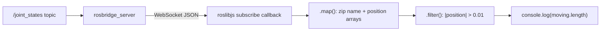

# Web Development for Robotics — Unit 8: Working with Arrays

Robot data is full of arrays — joint positions, laser scan ranges, a list of detected objects — so JavaScript's `Array` methods are some of the most-used tools in a robotics dashboard. This unit covers the core array API and applies it to live data coming from Rosbridge.

The pipeline below shows how a `/joint_states` message flows through chained array methods to reach a usable result, the pattern used in this unit's roslibjs example.



## Core array methods: map, filter, reduce
These three functional methods replace most hand-written loops and, unlike a `for` loop, always return a new array (or value) without mutating the original — which keeps your rendering code predictable.

```js
const ranges = [0.8, 1.2, 0.3, 2.5, 0.9]; // a laser scan, meters

const inCm = ranges.map(r => r * 100);          // [80, 120, 30, 250, 90]
const tooClose = ranges.filter(r => r < 0.5);    // [0.3]
const minRange = ranges.reduce((min, r) => Math.min(min, r), Infinity); // 0.3

const anyObstacle = ranges.some(r => r < 0.5);   // true — like Python's any()
const allClear = ranges.every(r => r > 0.2);      // true — like Python's all()
```

`Math.min(...ranges)` (spread into arguments) is a shorter alternative to `reduce` for a simple min/max, but `reduce` is worth knowing since it generalizes to running totals, grouping, and building objects from arrays.

## Searching, sorting, and iterating
```js
const jointNames = ["shoulder_pan", "shoulder_lift", "elbow", "wrist"];

jointNames.indexOf("elbow");                 // 2
jointNames.includes("wrist");                // true
jointNames.find(n => n.startsWith("wrist")); // "wrist"

const sorted = [...ranges].sort((a, b) => a - b); // spread first: sort() mutates in place!

jointNames.forEach((name, i) => {
  console.log(`Joint ${i}: ${name}`);
});
```

The `sort()` gotcha is worth memorizing: it sorts in place and, without a comparator, sorts numbers as strings (`[10, 2, 1].sort()` gives `[1, 10, 2]`). Always pass `(a, b) => a - b` for numeric sorts, and spread (`[...arr]`) first if you need to keep the original order intact.

## Reading a live array from the robot with roslibjs
`roslibjs` is the JavaScript client library for Rosbridge — it wraps the WebSocket protocol so you subscribe to a topic like you would in `rclpy`, but with JS callbacks. A `/joint_states` message carries parallel arrays of names and positions, a natural fit for the methods above. Rather than pulling the library from a CDN with a hand-picked integrity hash, install it locally (`npm install roslib`) or download it from the project's GitHub releases and serve it from your own `www/` folder alongside your other static files — that way the exact file you audited is the exact file that ships:

```html
<script src="lib/roslib.min.js"></script>
<script>
const ros = new ROSLIB.Ros({ url: 'ws://localhost:9090' });

const jointStateListener = new ROSLIB.Topic({
  ros: ros,
  name: '/joint_states',
  messageType: 'sensor_msgs/msg/JointState'
});

jointStateListener.subscribe((message) => {
  // message.name and message.position are parallel arrays
  const pairs = message.name.map((n, i) => ({ name: n, position: message.position[i] }));
  const moving = pairs.filter(j => Math.abs(j.position) > 0.01);
  console.log(`${moving.length} joints away from zero`);
});
</script>
```

`message.name.map((n, i) => ...)` zipping two parallel arrays by index is a pattern you'll reuse often with ROS array messages, since ROS message definitions frequently split related data into separate arrays rather than an array of objects.

## Try it yourself
Given `const distances = [1.1, 0.4, 3.2, 0.2, 0.9, 5.0];` (meters from a simulated ultrasonic sensor), write one expression using `filter` to get readings under 0.5 m ("obstacles"), and one using `reduce` to compute their average. Log both results to the console.
