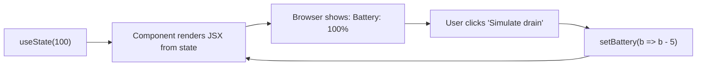

# Web Development for Robotics — Unit 9: ReactJS

Once a dashboard grows past a handful of DOM elements, hand-written `document.getElementById` calls scattered through your JavaScript become hard to track — you lose sight of what depends on what. React organizes a page as a tree of components that each own their own state and re-render automatically when that state changes. This unit gets a minimal React project running.

The cycle below is the core mental shift this unit introduces: you never touch the DOM directly, you update state and React re-renders for you.



## Why a framework, and why React
Plain JavaScript (Units 7-8) is fine for a page with a few live values. But a real robot dashboard has a camera feed, a joint table, a command form, a log panel, and a connection-status badge — all updating independently as different topics publish. Manually keeping each DOM node in sync with the right piece of state is exactly the class of bug component frameworks were built to eliminate: you describe *what the UI should look like for a given state*, and the framework figures out *what actually needs to change in the DOM*.

React isn't the only option (Vue and Svelte solve the same problem differently), but it's the most widely used, and its component model maps naturally onto a dashboard's panels — which is why this course builds toward it.

## Setting up a project
The fastest path today is Vite, a build tool that scaffolds a working React project with a dev server and hot-reload out of the box:

```bash
npm create vite@latest robot-dashboard -- --template react
cd robot-dashboard
npm install
npm run dev
```

This starts a dev server (typically `http://localhost:5173`) that rebuilds and refreshes the browser automatically as you edit files — a much faster loop than manually refreshing `index.html`. The scaffolded project gives you `src/main.jsx` (the entry point) and `src/App.jsx` (your root component) to build from.

## JSX: HTML-like syntax inside JavaScript
React components describe their output using JSX, which looks like HTML but is actually JavaScript — anything in `{curly braces}` is a real JS expression:

```jsx
function BatteryDisplay() {
  const battery = 87;
  const isLow = battery < 20;

  return (
    <div className={isLow ? 'battery low' : 'battery'}>
      <p>Battery: {battery}%</p>
      {isLow && <p className="warning">Low battery!</p>}
    </div>
  );
}
```

Note `className` instead of `class` (a JS reserved word) and that a component is just a function returning JSX — no special syntax to memorize beyond that.

## State: the piece that makes it dynamic
`useState` gives a component a value that persists between renders and, when updated, triggers React to re-render automatically:

```jsx
import { useState } from 'react';

function BatteryDisplay() {
  const [battery, setBattery] = useState(100);

  return (
    <div>
      <p>Battery: {battery}%</p>
      <button onClick={() => setBattery(b => b - 5)}>Simulate drain</button>
    </div>
  );
}
```

Calling `setBattery(...)` is what triggers the re-render — directly mutating a variable would not. This is the core mental shift from Unit 7's manual DOM updates: you never write `element.textContent = ...` yourself again; you update state and let React handle the DOM.

## Try it yourself
Scaffold a Vite + React project, replace the contents of `App.jsx` with the `BatteryDisplay` component above, run `npm run dev`, and confirm clicking "Simulate drain" decreases the displayed percentage. Then add a second `useState` for a "Charging" boolean toggled by a checkbox, and render "Charging..." text when it's true.
