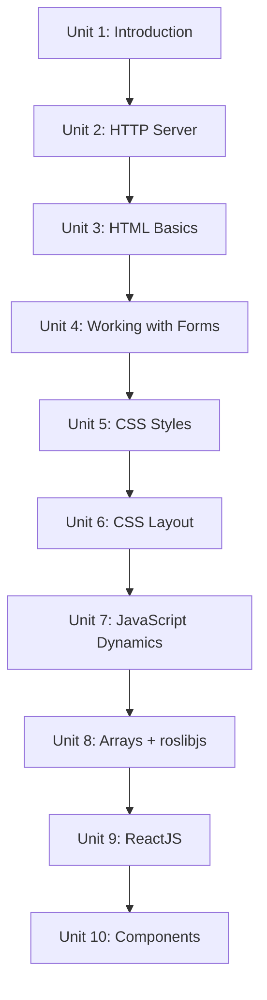

# Web Development for Robotics

Robots increasingly need a front end — an operator dashboard, a teleop panel, a diagnostics page — that anyone can open in a browser without installing anything. This course builds that skill set from the ground up: serving pages during development, structuring and styling them with HTML and CSS, making them dynamic with JavaScript (including reading live robot data over Rosbridge), and finally organizing a growing dashboard into reusable React components. By the end you'll be able to build a small, live, interactive web interface for a robot and understand every layer underneath it.

The diagram below shows how each unit's skills build directly on the one before it, from serving a page to a fully componentized live dashboard.

1. [Introduction](01-introduction.md) — Course roadmap: how HTML, CSS, JavaScript, React, and Rosbridge fit together to put a robot on a web page.
2. [HTTP Server](02-http-server.md) — Serving your pages over `http://` during development instead of opening files directly.
3. [HTML basics](03-html-basics.md) — Structuring page content with semantic elements, tables, images, and data attributes.
4. [Working with Forms](04-working-with-forms.md) — Collecting and validating operator input before it becomes a robot command.
5. [CSS - Styles for webpages](05-css-styles-for-webpages.md) — Selectors, the box model, and color/typography for a scannable dashboard.
6. [CSS - Exploring attributes](06-css-exploring-attributes.md) — `display`, Flexbox, Grid, and responsive layout with media queries.
7. [JavaScript - Making pages dynamic](07-javascript-making-pages-dynamic.md) — JS variables, objects/arrays, functions, and DOM/event handling.
8. [Working with Arrays](08-working-with-arrays.md) — Array methods (`map`/`filter`/`reduce`/`sort`) applied to live robot data via roslibjs.
9. [ReactJS](09-reactjs.md) — Scaffolding a React project and the core `useState` mental model.
10. [Creating components](10-creating-components.md) — Splitting a dashboard into reusable components with props and lifted state.
