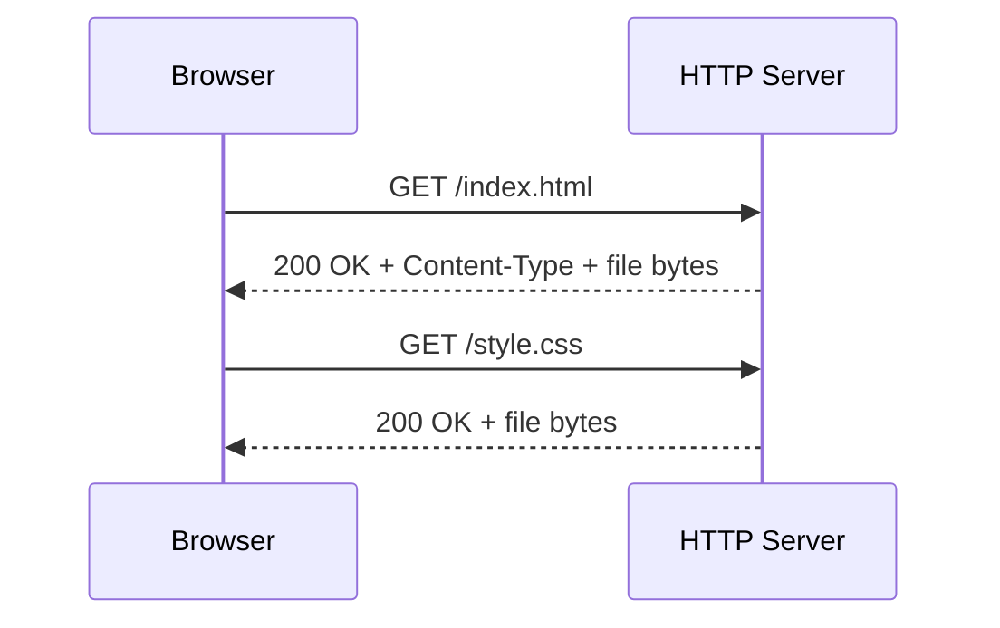

# Web Development for ROS 2 — Unit 2: HTTP Server

Before you can view a web page in a browser, something has to serve it — and "just double-click the HTML file" breaks the moment your page needs to load JavaScript modules or make network requests, both of which are restricted under the `file://` protocol. This unit gets a proper local HTTP server running so every later unit has somewhere to load its pages from.

The sequence below shows what actually happens, request by request, when a browser loads a page from this server.



## What is an HTTP server?
An HTTP server is a program that listens on a TCP port and responds to browser requests (`GET /index.html`, `GET /style.css`, ...) by returning the matching file's bytes plus a `Content-Type` header telling the browser how to interpret them. This matters for two concrete reasons in web development: browsers enforce stricter security rules for pages loaded over `http://` than `file://` (JavaScript modules, `fetch`, and WebSocket connections to Rosbridge all expect a proper origin), and it mirrors how your page will eventually be deployed — served from a server, not opened as a local file.

## Preparing the development environment
You don't need a heavyweight server like Apache or Nginx for local development — Python ships one, and Node.js has lightweight equivalents. Pick whichever matches the rest of your toolchain; you'll use Node.js again in the React units, so it's a reasonable default:

```bash
# Option A: Python's built-in server (zero install if Python 3 is present)
python3 -m http.server 8000

# Option B: Node.js, via a zero-install package runner
npx http-server -p 8000
```

Both serve the current directory's contents on the given port with no configuration.

## Running HTTP server
Create a project folder with a minimal `index.html`, then serve it:

```bash
mkdir ros2-web-panel && cd ros2-web-panel
printf '<!doctype html>\n<html><body><h1>Robot Panel</h1></body></html>\n' > index.html
python3 -m http.server 8000
```

Open `http://localhost:8000/` in your browser — you should see "Robot Panel". Any file you add to this folder becomes reachable at `http://localhost:8000/<filename>`, and any edit you save is visible on a browser refresh (no server restart needed for static files). Keep this server running in its own terminal for the rest of the course; every unit's exercise assumes a page is being served this way rather than opened directly.

## Time to practice!
Add a second HTML file, `about.html`, with a short paragraph about the robot you'll be building a panel for. Confirm you can reach both `http://localhost:8000/index.html` and `http://localhost:8000/about.html` while the same server process is running, and link one page to the other with a plain `<a href="about.html">` tag.

## Conclusions
You now have a repeatable way to serve any page you build for the rest of this course, and you understand why it beats opening files directly. From here, everything is about what goes *inside* the pages this server hosts — starting with HTML structure in the next unit.

A quick note on ports: `8000` above is arbitrary — pick any free port above 1024 to avoid needing elevated permissions. Keep it consistent for this course so bookmarked URLs like `http://localhost:8000/panel.html` keep working as you add files. If you ever see "address already in use," a previous server instance is still running in another terminal; stop it (`Ctrl+C`) before starting a new one on the same port.
