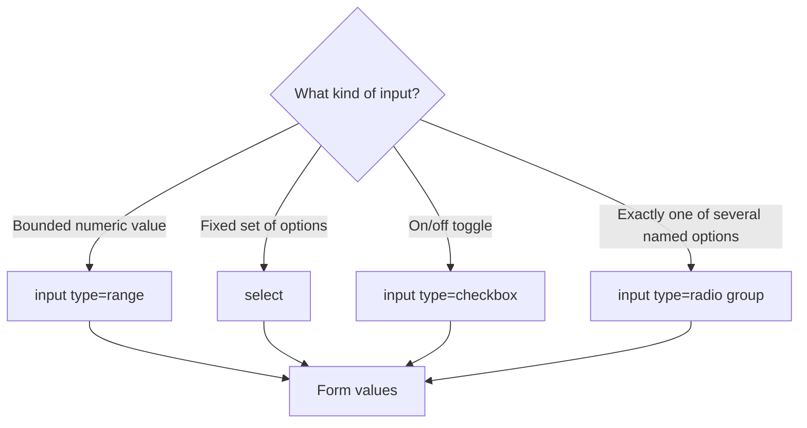

# Web Development for ROS 2 — Unit 4: Working with Forms

So far your panel can only display fixed content and fire fixed commands from hardcoded buttons. Forms are how a web page collects arbitrary input from a user — a target velocity, a goal pose, a named waypoint — and this unit covers the input types you'll actually use to control a robot.

The diagram below shows how the kind of value you need to collect determines which form control to reach for.



## Forms
A `<form>` groups a set of input controls and, in traditional web development, submits them to a server on a button click. For a robot panel you'll rarely want a full page reload on submit — instead you intercept the submit event in JavaScript (covered properly in Unit 7) and use the values directly. For now, focus on building forms whose *structure* captures the right kind of input:

```html
<form id="velocity-form">
  <label for="linear">Linear speed (m/s)</label>
  <input type="range" id="linear" name="linear" min="0" max="1" step="0.1" value="0.2">

  <label for="angular">Angular speed (rad/s)</label>
  <input type="number" id="angular" name="angular" min="-1" max="1" step="0.1" value="0">

  <label for="mode">Drive mode</label>
  <select id="mode" name="mode">
    <option value="manual">Manual</option>
    <option value="autonomous">Autonomous</option>
  </select>

  <label>
    <input type="checkbox" id="safety" name="safety" checked>
    Enable safety stop
  </label>

  <button type="submit">Send command</button>
</form>
```

A few choices worth noting: `<input type="range">` is a natural fit for a bounded velocity — the `min`/`max`/`step` attributes constrain input at the browser level, so you don't need to validate "is this a sane speed" in JavaScript later. `<select>` beats free-text for a fixed set of modes, since it can't produce an invalid value. Always pair an `<input>` with a `<label for="...">` matching its `id` — beyond accessibility, clicking the label focuses or toggles the input, which matters a lot for small checkboxes and radio buttons on a touch display.

Radio buttons are the right choice when exactly one of several named options must be picked (e.g. selecting which robot to control, if your panel manages more than one):

```html
<fieldset>
  <legend>Target robot</legend>
  <label><input type="radio" name="robot" value="robot1" checked> Robot 1</label>
  <label><input type="radio" name="robot" value="robot2"> Robot 2</label>
</fieldset>
```

## Time to practice!
Extend your `panel.html` from Unit 3 with the velocity form above. Don't wire it to Rosbridge yet — that's Unit 7's job once you know JavaScript. For now, open your browser's developer tools, move the range slider, and confirm in the Elements/Inspector panel that the input's `value` attribute updates live as you drag it.

## Conclusions
You can now build the input side of a robot panel — sliders, dropdowns, checkboxes, and radio groups — with the browser doing basic validation for you. The next two units make these forms and the rest of your page look intentional rather than like unstyled default HTML.
