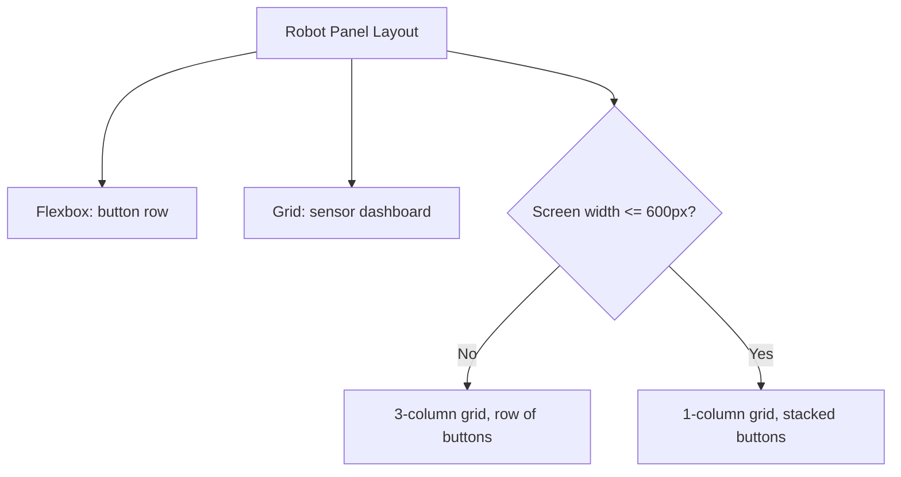

# Web Development for ROS 2 — Unit 6: CSS - Exploring attributes

Unit 5 covered CSS fundamentals — selectors and the box model — which style individual elements one at a time. This unit covers the layout attributes that arrange *many* elements relative to each other, turning a stack of styled elements into an actual panel: controls arranged in a row, sensor readouts grouped in a grid, a status badge pinned to a corner. It closes with media queries, which make that panel adapt to different screen sizes instead of only looking good on your desktop monitor.

The diagram below shows how the panel's layout is composed from flexbox and grid, then adapted by a media query for narrow screens.



## Flexbox: one-dimensional layout
Flexbox is the workhorse for one-dimensional layout — arranging a row of buttons, or a column of status lines. Setting `display: flex` on a container turns its direct children into flex items laid out along a single axis, controlled by `flex-direction` (`row` by default, `column` to stack vertically):

```css
.controls {
  display: flex;
  flex-direction: row;   /* default: items sit side by side */
  gap: 8px;               /* spacing between children, no margin hacks needed */
  align-items: center;    /* aligns items on the cross axis (vertically, here) */
  justify-content: flex-start; /* aligns items on the main axis (horizontally, here) */
  flex-wrap: wrap;        /* let buttons drop to a new line instead of overflowing */
}
```

```html
<div class="controls">
  <button class="danger">Stop</button>
  <button>Forward</button>
  <button>Reverse</button>
</div>
```

`justify-content` positions items along the main axis — `flex-start` (default), `center`, or `space-between` are the ones you'll reach for most, e.g. `space-between` to push a "Connect" button to one side and a "Stop" button to the other. `align-items` does the equivalent on the cross axis, which is how `.controls` above vertically centers buttons of different heights with no manual padding math. `flex-direction: column` is worth remembering for a sidebar of stacked status messages.

## Grid: two-dimensional layout
Grid is the workhorse for two-dimensional layout — a dashboard of sensor tiles laid out in rows *and* columns at once, which flexbox can only approximate by wrapping a row:

```css
.dashboard {
  display: grid;
  grid-template-columns: repeat(3, 1fr);  /* 3 equal-width columns */
  gap: 12px;
}
.tile {
  border: 1px solid #ccc;
  padding: 12px;
  border-radius: 4px;
}
```

```html
<div class="dashboard">
  <div class="tile">Battery: <span id="battery">--</span>%</div>
  <div class="tile">Speed: <span id="speed">--</span> m/s</div>
  <div class="tile">Range: <span id="range">--</span> m</div>
</div>
```

`fr` is a grid-only unit meaning "one fraction of the remaining space" — `repeat(3, 1fr)` is shorthand for three equal columns that share the container's width evenly as the window resizes. A more advanced but genuinely useful pattern is letting the grid pick its own column count: `grid-template-columns: repeat(auto-fit, minmax(150px, 1fr))` fits as many 150px-or-wider tiles as the container allows, wrapping automatically as the panel narrows — for a dashboard with a variable number of sensors, this can remove the need for a dedicated mobile media query on the grid entirely.

## Positioning
`position` is the third layout tool worth knowing, and it works differently from flexbox and grid: instead of arranging siblings relative to each other, it places one element relative to a reference point. `position: relative` on a container establishes that reference point without moving the container itself; `position: absolute` on a child then positions it relative to that container — exactly how you'd overlay a small connection-status badge in the corner of the panel:

```css
.panel { position: relative; }
.status-badge {
  position: absolute;
  top: 8px;
  right: 8px;
}
```

`position: fixed` positions an element relative to the browser viewport instead, so it stays glued in place regardless of scrolling — useful for a persistent emergency-stop button you want reachable no matter how far down a long sensor log the operator has scrolled.

## Time to practice!
Rebuild your `panel.html` layout using flexbox for the button row and grid for the sensor readouts, replacing the plain `<table>` from Unit 3 with the `.dashboard`/`.tile` pattern above. Add a small `.status-badge` showing "connected"/"disconnected" positioned in the corner of the panel using `position: absolute`. Confirm the buttons stay in a neat row, the tiles stay evenly spaced, and the badge stays pinned to the corner as you resize your browser window.

## Media query: responsive web pages
A media query applies CSS rules only when a condition — most often screen width — is met, which is how the same page adapts from a wide desktop layout to a narrow phone layout:

```css
.dashboard {
  grid-template-columns: repeat(3, 1fr);
}

@media (max-width: 600px) {
  .dashboard {
    grid-template-columns: 1fr;   /* stack tiles in a single column */
  }
  .controls {
    flex-direction: column;       /* stack buttons vertically */
  }
}
```

600px is a common breakpoint for "phone vs. everything else," but there's nothing magic about the number — pick breakpoints based on where your own layout starts to look cramped. This matters concretely for a robot panel: an operator glancing at a phone while standing near the robot needs large, stacked, thumb-reachable controls, not a shrunk-down copy of the desktop layout.

## Conclusions
Your panel now has real structure — grouped controls, a dashboard grid, a positioned status badge, and a layout that adapts to screen size. Everything so far is static, though: the values in your tiles don't actually change and the badge never flips from "disconnected" to "connected". That's what JavaScript, starting next unit, is for.
