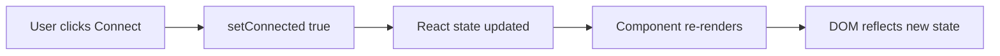

# Web Development for ROS 2 — Unit 9: ReactJS

Manually calling `document.getElementById(...).textContent = ...` for every changing value, as you did in Units 7-8, gets unwieldy fast on a panel with a dozen live readouts and controls. React solves this by letting you describe *what the UI should look like given the current data*, and re-rendering the DOM for you whenever that data changes.

The diagram below shows React's declarative update cycle: a state change triggers a re-render instead of you touching the DOM directly.



## What is ReactJS?
React is a JavaScript library for building UIs out of **components** — small, self-contained functions that return markup (via JSX, an HTML-like syntax embedded in JavaScript) describing what should appear on screen. The core idea is declarative rendering: instead of writing "when this message arrives, find this element and update its text" (imperative, what you did in Unit 8), you write "this element's text is this piece of state" and React handles updating the DOM whenever that state changes. The quickest way to get a project scaffolded is Vite:

```bash
npm create vite@latest robot-panel -- --template react
cd robot-panel
npm install
npm run dev
```

`npm run dev` starts a development server (replacing the plain HTTP server from Unit 2) with hot-reload: save a file, see the change instantly without a manual browser refresh.

## Time to practice!
Open `src/App.jsx` from the scaffolded project and add a new button below the existing content:

```jsx
function App() {
  return (
    <div>
      <h1>Robot Panel</h1>
      <button>Stop</button>
    </div>
  );
}

export default App;
```

Confirm it appears in the browser via `npm run dev`, and that editing the button's label updates live without a manual reload.

## Component State
A plain variable inside a component function resets on every re-render, so React gives you `useState` to hold values that persist and, when updated, *trigger* a re-render:

```jsx
import { useState } from 'react';

function App() {
  const [connected, setConnected] = useState(false);
  const [battery, setBattery] = useState(null);

  return (
    <div>
      <h1>Robot Panel</h1>
      <p>Status: {connected ? 'Connected' : 'Disconnected'}</p>
      <p>Battery: {battery ?? '--'}%</p>
      <button onClick={() => setConnected(true)}>Connect</button>
    </div>
  );
}
```

`useState(initialValue)` returns a `[value, setterFunction]` pair. Calling the setter (`setConnected(true)`) is what tells React "re-render this component with the new value" — directly assigning to `connected` would not update the screen. This is the React equivalent of the manual `element.textContent = ...` calls from Unit 7, except React decides what DOM to touch instead of you.

## Time to practice!
Add a `speed` state variable initialized to `0`, plus two buttons that call `setSpeed` to increase and decrease it by `0.1`, displaying the current value in the JSX. Confirm clicking each button updates the displayed number immediately.

## Conclusions
You've replaced manual DOM manipulation with React's state-driven rendering for a single component. Real panels need more than one component, though — Unit 10 covers splitting this growing `App` into small, reusable pieces.
