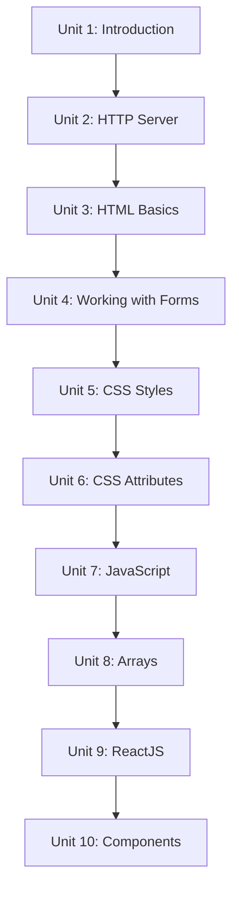

# Web Development for ROS 2

A robot with no interface can only be driven by whoever wrote its code; a web interface opens it up to anyone with a browser, with no ROS 2 install required on the client. This course builds that interface from the ground up — serving a page locally, structuring it with HTML, styling it with CSS, and scripting it with JavaScript — then bridges it to a live ROS 2 graph with Rosbridge, and finally rebuilds the same panel as a set of reusable React components. By the end you'll have a working robot control panel: buttons that publish velocity commands and live tiles that display streaming sensor data such as laser scans and battery state.

The diagram below shows how each unit builds on the one before it, from serving a bare page to a full React-based robot panel.

1. [Introduction](01-introduction.md) — Course goals, the robots and simulation used, and prerequisites before you start.
2. [HTTP Server](02-http-server.md) — Serve your web pages locally instead of opening them as bare files.
3. [HTML Basics](03-html-basics.md) — Core HTML elements, document structure, and your first Rosbridge-driven robot movement.
4. [Working with Forms](04-working-with-forms.md) — Sliders, dropdowns, checkboxes, and radio groups for collecting user input.
5. [CSS - Styles for webpages](05-css-styles-for-webpages.md) — Selectors, stylesheets, and the CSS box model.
6. [CSS - Exploring attributes](06-css-exploring-attributes.md) — Flexbox, grid, and responsive layout with media queries.
7. [JavaScript - Making pages dynamic](07-javascript-making-pages-dynamic.md) — DOM manipulation, variables, functions, and objects, culminating in a real Rosbridge publish call.
8. [Working with Arrays](08-working-with-arrays.md) — Processing array-shaped sensor data (like laser scans) with map/filter/reduce.
9. [ReactJS](09-reactjs.md) — Scaffolding a React project and managing UI state with `useState`.
10. [Creating components](10-creating-components.md) — Splitting a panel into reusable components with props, callbacks, and `useEffect`.
