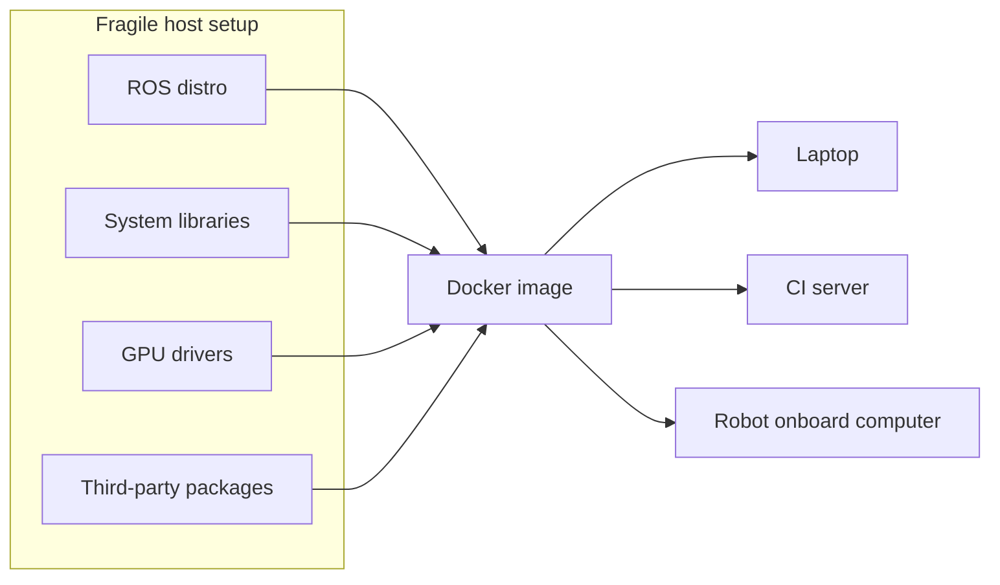

# Docker Basics for Robotics — Unit 1: Introduction to the Course

This unit sets the stage: why a robotics developer should care about Docker, what the course will cover unit by unit, and a small hands-on demo so you leave with a container already running before diving into theory.

The diagram below shows how Docker packages a fragile, multi-piece host setup into a single portable image that runs identically everywhere it's needed.



## Why Docker matters in robotics
Robotics software stacks are notoriously fragile to set up: a specific ROS distro, a specific set of system libraries, GPU drivers, and dozens of third-party packages all need to line up exactly. "Works on my machine" is a bigger problem here than in most software domains because the "machine" is often also a robot with limited storage, a specific OS image, and no internet access in the field. Docker solves this by packaging an application together with its entire runtime environment (OS libraries, dependencies, configuration) into a single, portable unit called an image. Anyone who runs that image — on a laptop, a CI server, or the robot's onboard computer — gets byte-for-byte the same environment.

In this course, Docker is the tool that lets you reproduce a teammate's exact ROS environment in minutes, test on a target architecture (like an ARM-based Jetson) from an x86 laptop, and deploy a robot's software stack the same way every time.

## Course roadmap
The course builds up in layers:
- **Units 2-5**: Core Docker mechanics — images, containers, and volumes. These are general-purpose skills, not robotics-specific yet.
- **Unit 6**: Docker Compose and networking, for coordinating multiple containers as one system.
- **Units 7-8**: Applying all of the above specifically to ROS — building ROS images, running nodes in containers, and handling the networking quirks of distributed ROS systems.
- **Unit 9**: Dev Containers, for using Docker as your everyday development environment rather than just a deployment artifact.
- **Unit 10**: Shipping containers to a real robot and keeping them running reliably.

## Setting up your environment
Before the next unit, install Docker Engine (or Docker Desktop) for your platform and confirm it works:

```bash
docker --version
docker run hello-world
```

If `hello-world` prints its welcome message, Docker pulled a tiny image, started a container from it, ran it, and let it exit — the whole lifecycle you'll be working with for the rest of this course.

## A first practical demo
Let's run something more interesting than `hello-world` to preview what's coming: a lightweight web server, so you can see a container that keeps running and exposes a network port.

```bash
docker run -d -p 8080:80 --name demo nginx:alpine
curl http://localhost:8080
docker logs demo
docker stop demo && docker rm demo
```

Here `-d` runs the container in the background, `-p 8080:80` maps port 8080 on your machine to port 80 inside the container, and `--name` gives it a friendly handle. You'll unpack every one of these flags in Unit 2.

## Try it yourself
Run `docker run hello-world` and then `docker run -it ubuntu:22.04 bash`. Inside the Ubuntu container, run `cat /etc/os-release` and compare it to your host's `/etc/os-release`. Note how the container has a completely separate filesystem and OS identity even though it's sharing your machine's kernel — this is the core idea you'll build on for the rest of the course.
