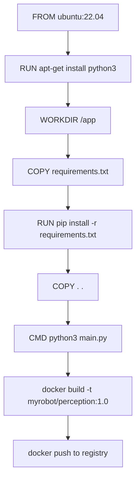

# Docker Basics for Robotics — Unit 3: Docker Images

Now that you can pull and run other people's images, this unit teaches you to build your own — the skill you'll rely on for every robotics project you containerize from here on.

The diagram below follows a Dockerfile from its first instruction through the cached layers it produces to a tagged image pushed to a registry.



## Writing a Dockerfile
A Dockerfile is a script of instructions for building an image, executed top to bottom. Each instruction produces a new filesystem **layer**, and Docker caches layers so unchanged steps don't need to be rerun on subsequent builds.

```dockerfile
FROM ubuntu:22.04

RUN apt-get update && apt-get install -y \
    python3 \
    python3-pip \
    && rm -rf /var/lib/apt/lists/*

WORKDIR /app
COPY requirements.txt .
RUN pip3 install -r requirements.txt
COPY . .

CMD ["python3", "main.py"]
```

Key instructions: `FROM` sets the base image, `RUN` executes a command at build time, `COPY` brings files from your build context into the image, `WORKDIR` sets the working directory for subsequent instructions, and `CMD` sets the default command run when a container starts (overridable at `docker run` time, unlike `ENTRYPOINT`).

## Building and tagging
```bash
docker build -t myrobot/perception:1.0 .
docker build -t myrobot/perception:latest .
docker history myrobot/perception:1.0
```

`docker history` shows every layer and its size — invaluable for spotting a bloated `RUN apt-get install` step. Tag deliberately: use a meaningful version tag (`1.0`, a git SHA, a ROS distro name) rather than relying solely on `latest`, so a deployed robot can be pinned to a known-good image.

## Layer caching and image size
Order your Dockerfile from least-to-most frequently changing: dependency installation before source code copy, so editing your Python/C++ source doesn't invalidate the expensive `apt-get`/`pip install`/`colcon build` layers. Combine related commands into a single `RUN` with `&&` and clean up package caches in the same layer — otherwise the deleted files still bloat the earlier layer.

```bash
# Bad: two layers, second one doesn't shrink the first
RUN apt-get update && apt-get install -y build-essential
RUN rm -rf /var/lib/apt/lists/*

# Good: cleanup happens within the same layer
RUN apt-get update && apt-get install -y build-essential \
    && rm -rf /var/lib/apt/lists/*
```

Multi-stage builds let you compile in a "builder" stage with all your build tools, then copy only the resulting binaries into a slim final image — very relevant for compiled robotics code (C++ nodes, CUDA kernels) where the build toolchain is much larger than the runtime footprint.

## Sharing images
```bash
docker login
docker tag myrobot/perception:1.0 yourusername/perception:1.0
docker push yourusername/perception:1.0
```

Anyone (or any robot) with network access to the registry can now `docker pull yourusername/perception:1.0` and run the exact environment you built.

## Try it yourself
Write a Dockerfile that starts `FROM python:3.11-slim`, installs `numpy`, copies in a one-line script that prints `numpy.__version__`, and sets it as the `CMD`. Build it, tag it `numpy-check:1.0`, and run it. Then use `docker history numpy-check:1.0` to identify which layer is the largest.
