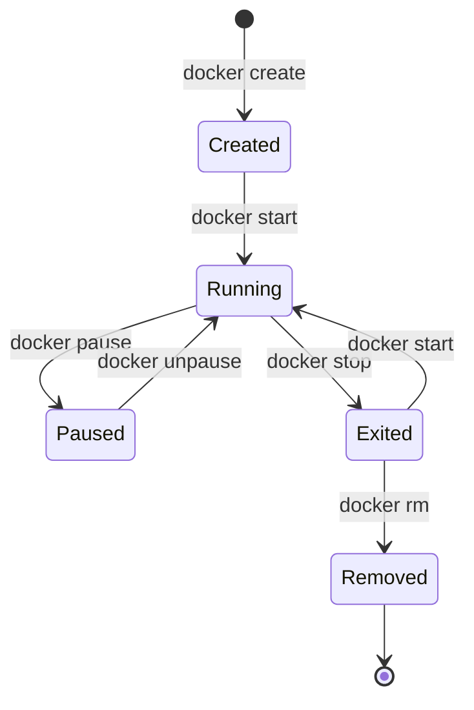

# Docker Basics for Robotics — Unit 4: Docker Containers

With image-building covered, this unit goes deeper on the container side: the full lifecycle, how to interact with containers while they run, and how to diagnose the problems you'll inevitably hit. Unlike a VM, a container has no independent existence once its main process ends — that link explains most "why did my container just stop?" surprises.

The diagram below maps the container lifecycle states this unit covers and the commands that move a container between them.



## The container lifecycle
A container moves through states: created, running, paused, exited (stopped), and removed. `docker create` allocates the container's writable layer and configuration without starting any process — rarely used on its own, but handy for preparing several containers ahead of time and starting them together later. `docker run` is shorthand for create + start, which is why it's what you reach for almost every time.

```bash
docker create --name c1 ubuntu:22.04 sleep 300
docker start c1
docker pause c1        # freeze all processes in the container
docker unpause c1
docker stop c1          # SIGTERM, then SIGKILL after ~10s grace period
docker start c1          # a stopped container can be restarted, state preserved
docker rm c1
```

`docker ps` only lists running containers by default; add `-a` to see every container regardless of state, which is the first command to reach for when a container you expected to be running isn't.

Restart policies control what happens when a container exits on its own, which matters a lot once you're running long-lived services (covered further in Unit 10):

```bash
docker run -d --restart unless-stopped --name watcher myimage
```

| Policy | Behavior | Good fit for |
|---|---|---|
| `no` (default) | Never restarts automatically | one-off jobs, interactive debugging |
| `on-failure[:N]` | Restarts only on nonzero exit, up to `N` times if given | tasks that should give up after repeated crashes |
| `always` | Restarts unconditionally, even after the daemon restarts | core services that must always be up |
| `unless-stopped` | Like `always`, but a manual `docker stop` is remembered | long-lived robot services you sometimes pause on purpose |

## Attaching and executing inside running containers
`docker attach` connects your terminal to the container's main process (PID 1) — risky, because exiting the shell can stop the container. `docker exec` is almost always the better tool: it starts a *new*, independent process inside an already-running container, leaving the main process untouched, and you can open several `exec` sessions at once without them interfering with each other.

```bash
docker exec -it webserver bash
docker exec webserver ps aux
docker exec -e DEBUG=1 webserver python3 script.py
docker exec -u root webserver apt-get install -y iputils-ping   # run as a different user
```

On a robot, this lets you `docker exec -it perception bash` to check `ros2 topic list` or tail a log file mid-stream, without touching the running frame-processing loop.

## Diagnosing problems
The most common failure mode is a container that exits immediately after `docker run`. This is usually not a Docker bug — a container's lifetime is tied directly to its PID 1 process, so if that process is short-lived, the container has nothing left to do and stops, even though the image itself is fine. Start diagnosing with:

```bash
docker ps -a                          # find the exit code in the STATUS column
docker logs <container>               # see stdout/stderr from the crashed process
docker inspect <container> --format '{{.State.ExitCode}}'
```

| Exit code | Meaning |
|---|---|
| `0` | Clean exit — the process finished normally |
| `1` (or other nonzero) | The application itself errored — check the logs |
| `137` | Process received SIGKILL (128 + 9); frequently an out-of-memory kill — check `docker inspect` for `OOMKilled: true` |
| `143` | Process received SIGTERM (128 + 15) — the normal result of `docker stop` |

For a container that's running but misbehaving rather than exiting, `docker stats` shows live CPU/memory usage per container, and `docker top <container>` lists its processes:

```bash
docker stats --no-stream
docker top webserver
```

## Resource limits
Containers share the host kernel and, by default, can use as much CPU and memory as is available. On a robot's onboard computer, an unbounded container can starve other critical processes — a runaway perception node can leave nothing for the motor controller. Docker enforces limits through cgroups, set at `docker run` time:

```bash
docker run -d \
  --name perception \
  --restart unless-stopped \
  --memory=512m --memory-swap=512m \
  --cpus=1.5 \
  myrobot/perception:1.0
```

`--memory` caps RAM usage (the container is OOM-killed if it exceeds this — hence exit code 137). Setting `--memory-swap` equal to `--memory` disables additional swap, which is usually what you want on a robot backed by a slow SD card or eMMC: better a clean, fast OOM kill than the whole board thrashing. `--cpus` caps CPU usage in fractional cores, keeping other processes responsive. Watch `docker stats` under real load before picking final numbers — limits set too low will throttle or kill a healthy process.

## Try it yourself
Start a container that immediately fails: `docker run --name broken ubuntu:22.04 badcommand`. Use `docker ps -a`, `docker logs broken`, and `docker inspect broken --format '{{.State.ExitCode}}'` to figure out exactly why it exited without re-running it. Then fix the command and confirm it runs cleanly.
