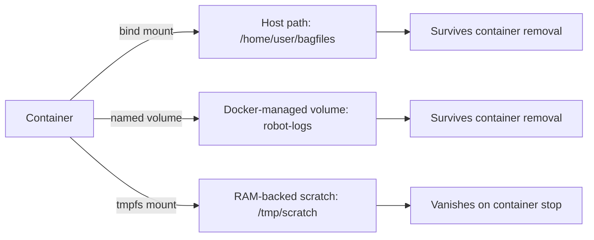

# Docker Basics for Robotics — Unit 5: Docker Volumes

A container's writable layer disappears the moment the container is removed. For anything you actually need to keep — sensor logs, recorded bag files, maps, calibration data, trained model weights — you need volumes. Get this wrong on a real robot and a week of field-testing data can vanish the instant someone runs `docker rm` to clear disk space.

The diagram below contrasts the three storage mechanisms a container can use and which ones actually persist data beyond the container's own life.



## Why containers lose data
By default, all files a container writes live in its own thin writable layer, which is deleted along with the container. Prove it to yourself:

```bash
docker run --name temp ubuntu:22.04 bash -c "echo hello > /data.txt"
docker rm temp
# /data.txt is gone forever — it never existed outside the container
```

This is a *feature*, not a bug: it's what makes containers disposable and reproducible. The lesson isn't "avoid this behavior," it's "decide deliberately which paths should escape it."

## Bind mounts vs. named volumes
**Bind mounts** map a specific path on the host directly into the container. They're ideal during development, when you want a container to see your live source tree or a directory of test data on the host — edits on either side are visible instantly on the other, with no copying.

```bash
docker run -v /home/user/bagfiles:/data/bagfiles myimage
docker run -v $(pwd):/workspace -it myimage bash   # mount current dir for live editing
```

**Named volumes** are managed entirely by Docker (stored under Docker's own data directory) rather than a path you choose. They're the better choice for data a container produces that you want to persist and reattach across container recreations, without caring where it physically lives, and they're portable across machines in a way a hardcoded host path isn't.

```bash
docker volume create robot-logs
docker run -v robot-logs:/var/log/robot myimage
docker volume ls
docker volume inspect robot-logs
```

Both examples use the short `-v host:container` syntax. Docker also supports a more explicit `--mount` form, which is easier to read once you have several mounts on one command and fails loudly (rather than silently creating a directory) if you typo a path:

```bash
docker run --mount type=bind,source=/home/user/bagfiles,target=/data/bagfiles myimage
docker run --mount type=volume,source=robot-logs,target=/var/log/robot myimage
```

## tmpfs mounts
For sensitive or high-churn data that should never touch disk (e.g. a scratch buffer for a perception pipeline), `--tmpfs` mounts a RAM-backed filesystem that vanishes when the container stops:

```bash
docker run --tmpfs /tmp/scratch:size=256m myimage
```

## File ownership: a common gotcha
Most robotics base images run processes as `root` by default. When such a container writes into a bind-mounted host directory, the files land on the host owned by `root` too — which then blocks your regular user account from editing or deleting them without `sudo`. This bites people constantly once they start bind-mounting bag file directories.

```bash
docker run --rm -v $(pwd):/workspace myimage touch /workspace/test.txt
ls -l test.txt   # likely owned by root, not you

# Fix: run as your own host UID/GID instead
docker run --rm -v $(pwd):/workspace --user $(id -u):$(id -g) myimage touch /workspace/test.txt
ls -l test.txt   # now owned by your user
```

Named volumes sidestep this in day-to-day use since you rarely inspect their files directly, but the same `--user` flag is the fix whenever it matters for either type.

## Managing volume lifecycle
Volumes outlive containers by design, which means they also accumulate if you're not careful:

```bash
docker volume ls
docker volume rm robot-logs
docker volume prune          # remove all volumes not referenced by any container
docker system df -v          # see how much space volumes are consuming
```

## Backing up and restoring a named volume
Because a named volume isn't just a path you can `cp` from, the standard trick is a short-lived helper container that mounts the volume alongside a host directory and archives it:

```bash
# Back up
docker run --rm -v robot-logs:/data -v $(pwd):/backup busybox \
  tar czf /backup/robot-logs.tar.gz -C /data .

# Restore into a (possibly new) volume
docker volume create robot-logs-restored
docker run --rm -v robot-logs-restored:/data -v $(pwd):/backup busybox \
  tar xzf /backup/robot-logs.tar.gz -C /data
```

## A robotics example
A common pattern is separating "throwaway" container state from "keep forever" robot data:

```bash
docker run -d \
  --name recorder \
  -v /home/user/bagfiles:/data/bagfiles \
  -v robot-config:/etc/robot \
  myimage ros2 bag record -a -o /data/bagfiles/session1
```

Here the bag recording (large, transient, easiest to browse from the host) uses a bind mount, while long-lived robot configuration uses a named volume that persists even if you reorganize your host filesystem.

## Try it yourself
Create a named volume called `scratch-data`. Run a container that mounts it and writes a timestamped line to a file inside it. Remove the container, then start a *new* container mounting the same volume and confirm the file — and its contents — are still there. Then back up `scratch-data` to a `.tar.gz` on your host using the helper-container pattern above, and restore it into a second volume to confirm the archive is valid.
