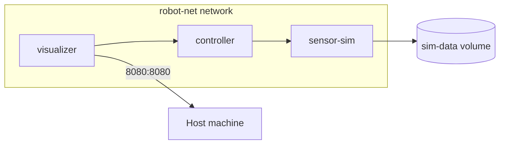

# Docker Basics for Robotics — Unit 6: Docker Compose & Network

Real robotics systems are rarely a single container: a perception node, a controller, a database, and a visualization tool might all need to run and talk to each other. This unit covers Docker's networking model and Compose, the tool for defining and launching multi-container systems as one unit.

The diagram below shows the multi-container Compose stack from this unit's example: three services discoverable by name on one shared network.



## Docker networking basics
By default, `docker run` attaches a container to the `bridge` network, where it gets a private IP address and can reach the outside world through NAT, but is not reachable from the host without explicit port publishing (`-p`). Containers on the same **user-defined** bridge network can resolve each other by container name via Docker's built-in DNS — this is the mechanism Compose relies on.

```bash
docker network create robot-net
docker run -d --name talker --network robot-net myimage
docker run -it --network robot-net myimage ping talker   # resolves by name
docker network ls
docker network inspect robot-net
```

There's also `--network host`, which gives the container the host's network stack directly with no isolation — occasionally used for ROS 1/2 workloads that need multicast discovery to "just work," at the cost of losing network isolation.

## Defining a multi-container system with Compose
A `docker-compose.yml` file describes a set of services, their images/build contexts, networks, volumes, and dependencies declaratively:

```yaml
services:
  controller:
    build: ./controller
    depends_on:
      - sensor-sim
    environment:
      - ROS_DOMAIN_ID=5
    networks:
      - robot-net

  sensor-sim:
    image: myrobot/sensor-sim:1.0
    volumes:
      - sim-data:/data
    networks:
      - robot-net

  visualizer:
    image: myrobot/rviz-web:1.0
    ports:
      - "8080:8080"
    networks:
      - robot-net

networks:
  robot-net:

volumes:
  sim-data:
```

## Running and managing a Compose stack
```bash
docker compose up -d          # build/pull and start every service
docker compose ps             # list services and their status
docker compose logs -f controller   # follow logs for one service
docker compose down           # stop and remove containers, networks (volumes kept by default)
docker compose down -v        # also remove named volumes
```

Compose automatically creates a dedicated network for the project and joins every service to it, so `controller` can simply connect to `sensor-sim` by that name — no manual IP management.

## depends_on and startup ordering
`depends_on` controls start *order*, not readiness — a database container can be "started" long before it's actually accepting connections. For robotics nodes that need a dependency to be truly ready (e.g. a simulator fully booted before the controller connects), add an application-level retry/backoff on connection, or a `healthcheck:` block with `condition: service_healthy`.

## Try it yourself
Write a `docker-compose.yml` with two services on a shared network: one running `nginx:alpine` named `web`, and one running `curlimages/curl` named `client` with `command: sleep infinity`. Bring the stack up, then `docker compose exec client curl http://web` and confirm you get nginx's welcome page back — proving name-based service discovery works without any port publishing.
