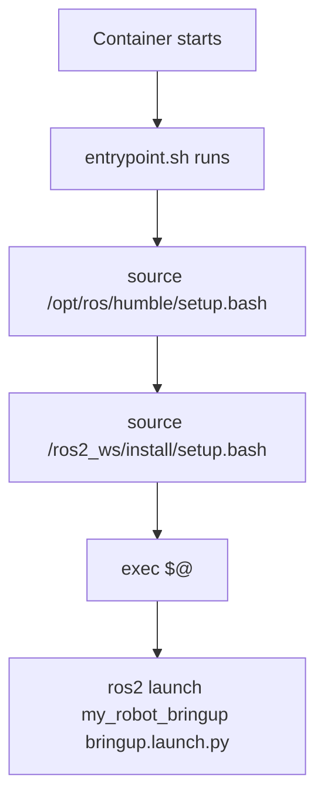

# Docker Basics for Robotics — Unit 7: Docker with ROS Part 1

This is where the course turns specifically to ROS: building images that contain a working ROS installation and your own packages, and running ROS nodes inside containers.

The diagram below traces the entrypoint sourcing pattern: how a container goes from starting up to running your ROS launch command with the environment fully sourced.



## Choosing a base image
Official ROS images are published on Docker Hub (and mirrored by Open Robotics under `osrf/ros`), typically tagged as `<distro>-ros-core`, `<distro>-ros-base`, or `<distro>-desktop` — `ros-core` is minimal (just the middleware and client libraries), `ros-base` adds common build/dev tools, and `desktop` adds GUI tools like rviz. Pick the smallest variant that has what you need; a `desktop` image inside a headless deployment container is wasted space.

```dockerfile
FROM osrf/ros:humble-ros-base

RUN apt-get update && apt-get install -y \
    ros-humble-demo-nodes-cpp \
    && rm -rf /var/lib/apt/lists/*
```

## Building a workspace inside the image
A typical robotics Dockerfile builds a `colcon` workspace as part of the image build, so the container starts with your packages already compiled:

```dockerfile
FROM osrf/ros:humble-ros-base

WORKDIR /ros2_ws
COPY src ./src

RUN apt-get update && rosdep update \
    && rosdep install --from-paths src --ignore-src -r -y \
    && rm -rf /var/lib/apt/lists/*

RUN . /opt/ros/humble/setup.sh \
    && colcon build --symlink-install

COPY entrypoint.sh /entrypoint.sh
ENTRYPOINT ["/entrypoint.sh"]
CMD ["ros2", "launch", "my_robot_bringup", "bringup.launch.py"]
```

`rosdep` resolves your package's declared dependencies to actual apt packages — running it inside the Dockerfile keeps the image self-sufficient rather than relying on the host having the right packages installed.

## Sourcing the environment: the entrypoint pattern
ROS environments are set up by sourcing shell scripts (`setup.bash`/`setup.sh`), which doesn't happen automatically for a container's `CMD`. The standard fix is an entrypoint script that sources the environment and then executes whatever command was passed in:

```bash
#!/bin/bash
# entrypoint.sh
set -e
source /opt/ros/humble/setup.bash
source /ros2_ws/install/setup.bash
exec "$@"
```

With `ENTRYPOINT ["/entrypoint.sh"]` and `CMD [...]` set as above, `docker run myimage ros2 topic list` runs `ros2 topic list` with the full ROS environment sourced first.

## Running and verifying a node
```bash
docker build -t my_robot_bringup:1.0 .
docker run --rm --network host my_robot_bringup:1.0 ros2 topic list
docker run -it --rm --network host my_robot_bringup:1.0 bash
```

`--network host` is used heavily with ROS 2 in single-machine setups because DDS (the middleware underneath ROS 2) relies on multicast discovery that doesn't traverse Docker's default bridge network cleanly. Unit 8 covers the networking implications and alternatives in more depth.

## Try it yourself
Build a minimal image `FROM osrf/ros:humble-ros-core` that installs `ros-humble-demo-nodes-cpp`, with an entrypoint that sources `/opt/ros/humble/setup.bash`. Run the built-in `talker` demo (`ros2 run demo_nodes_cpp talker`) in one container with `--network host`, and in a second terminal run `ros2 topic echo /chatter` inside another container from the same image, also with `--network host`. Confirm the echo container receives messages from the talker container.
