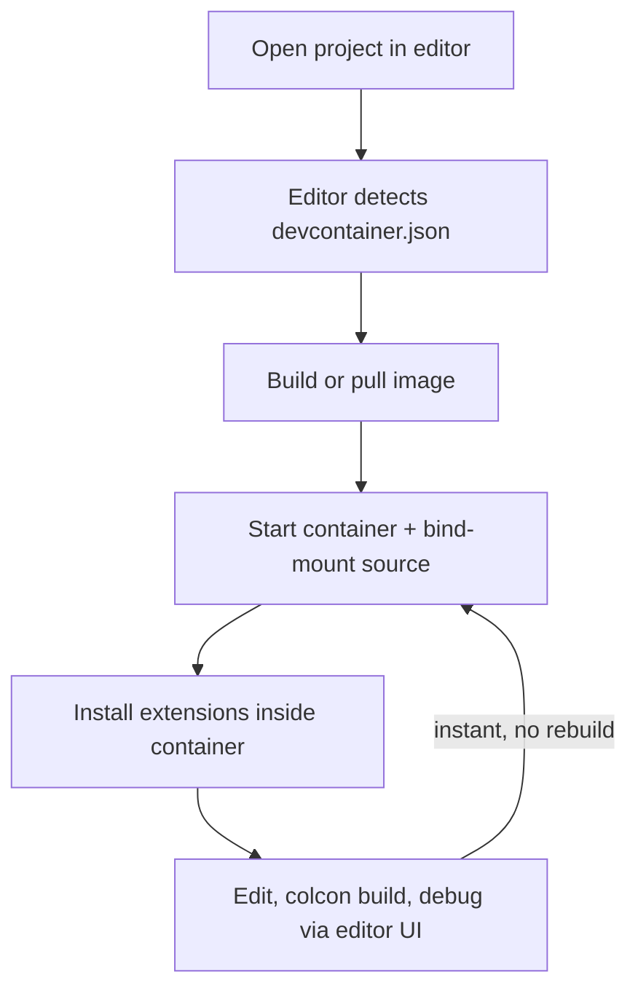

# Docker Basics for Robotics — Unit 9: Dev Containers

So far Docker has been mostly about running finished software. This unit flips that around: using Docker as your everyday development environment, so your editor, debugger, and shell all run against the exact same environment your code will eventually ship in.

The diagram below walks through the dev container workflow, highlighting how the bind-mounted source lets you loop back to editing without rebuilding the image.



## Why develop inside a container
Without dev containers, you either install ROS and every dependency directly on your host (which can conflict with other projects or your OS's own packages), or you build inside a container but edit code outside it and constantly rebuild the image to test a one-line change — slow and disruptive to a normal edit-debug loop. A dev container solves this by mounting your live source tree into a running container and pointing your editor at that container's toolchain, so edits are instant and the build/runtime environment is still fully containerized and reproducible.

## The devcontainer.json convention
VS Code (and other editors that support the open Dev Containers specification) look for a `.devcontainer/devcontainer.json` file describing how to build or select an image, which extensions to install, and how to mount your project:

```json
{
  "name": "ros2-humble-dev",
  "image": "osrf/ros:humble-desktop",
  "workspaceFolder": "/ros2_ws",
  "workspaceMount": "source=${localWorkspaceFolder},target=/ros2_ws,type=bind",
  "customizations": {
    "vscode": {
      "extensions": [
        "ms-vscode.cpptools",
        "ms-python.python",
        "ms-iot.vscode-ros"
      ]
    }
  },
  "postCreateCommand": "rosdep update && rosdep install --from-paths src --ignore-src -r -y",
  "remoteUser": "root"
}
```

`image` can instead be `build: { dockerfile: "Dockerfile" }` if you need a custom image rather than an off-the-shelf one. `postCreateCommand` runs once after the container is created — a good place for one-time setup like `rosdep install` that shouldn't be baked into the image itself.

## Bind-mounting source vs. baking it into the image
Notice the dev container mounts your source as a **bind mount** (Unit 5) rather than `COPY`ing it in at build time. This is the key difference between a dev image and a deployment image: in development, you want file changes on your host to appear instantly inside the container without a rebuild; in deployment (Unit 10), you want the code baked in so the image is a complete, self-contained artifact.

## A typical workflow
1. Open the project folder in your editor; it detects `.devcontainer/devcontainer.json` and offers to reopen inside the container.
2. The editor builds (or pulls) the image, starts a container, mounts your source, and installs the configured extensions inside that container.
3. You edit, build (`colcon build`), and debug entirely inside the container — but through your normal editor UI on the host.
4. Terminal, debugger, and language server all run inside the container, so they see the same package versions and paths your teammates and your CI pipeline see.

```bash
# Equivalent to what the editor does under the hood, if you want to do it by hand:
docker run -it --rm \
  -v $(pwd):/ros2_ws \
  -w /ros2_ws \
  osrf/ros:humble-desktop bash
```

## Try it yourself
Write a minimal `.devcontainer/devcontainer.json` for a small existing project (or an empty folder) that uses `image: "osrf/ros:humble-ros-base"`, mounts the folder as `/workspace`, and sets a `postCreateCommand` that runs `echo "container ready"`. If you have VS Code with the Dev Containers extension, reopen the folder in the container and confirm a terminal inside the editor shows you're running inside the ROS image (`echo $ROS_DISTRO`).
