# Docker Basics for Robotics

A hands-on introduction to Docker aimed squarely at robotics work: pulling and running images, building your own, managing containers and persistent volumes, coordinating multi-container systems with Compose, and applying all of it to the specific challenges of ROS — networking, GUI tools, GPU access, reproducible dev environments, and shipping a container stack to a real robot's onboard computer.

The diagram below shows how each unit builds on the ones before it, from core Docker mechanics through ROS-specific application to production deployment.

```mermaid
flowchart LR
    U1[Unit 1: Introduction] --> U2[Unit 2: Docker Basics]
    U2 --> U3[Unit 3: Images]
    U3 --> U4[Unit 4: Containers]
    U4 --> U5[Unit 5: Volumes]
    U5 --> U6[Unit 6: Compose & Network]
    U6 --> U7[Unit 7: ROS Part 1]
    U7 --> U8[Unit 8: ROS Part 2]
    U8 --> U9[Unit 9: Dev Containers]
    U9 --> U10[Unit 10: Deployment]
```

1. [Introduction to the Course](01-introduction-to-the-course.md) — Course roadmap, why Docker matters for robotics, and a first practical demo.
2. [Introduction to Docker](02-introduction-to-docker.md) — Images vs. containers, pulling public images, and the core `docker run`/`ps`/`exec`/`logs` workflow.
3. [Docker Images](03-docker-images.md) — Writing Dockerfiles, building and tagging images, layer caching, and pushing to a registry.
4. [Docker Containers](04-docker-containers.md) — The container lifecycle, attaching vs. executing, diagnosing crashes, and resource limits.
5. [Docker Volumes](05-docker-volumes.md) — Bind mounts, named volumes, tmpfs, and managing persistent robot data.
6. [Docker Compose & Network](06-docker-compose-and-network.md) — Docker's networking model and defining multi-container systems declaratively with Compose.
7. [Docker with ROS Part 1](07-docker-with-ros-part-1.md) — Choosing a ROS base image, building a colcon workspace into an image, and the entrypoint sourcing pattern.
8. [Docker with ROS Part 2](08-docker-with-ros-part-2.md) — Multi-container ROS systems, DDS discovery across containers, X11 forwarding for GUI tools, and GPU passthrough.
9. [Dev Containers](09-dev-containers.md) — Using Docker as a reproducible everyday development environment with `devcontainer.json`.
10. [Docker for Robot Deployment](10-docker-for-robot-deployment.md) — Cross-building for ARM targets, boot-time bringup with systemd and Compose, and deployment constraints on embedded hardware.
