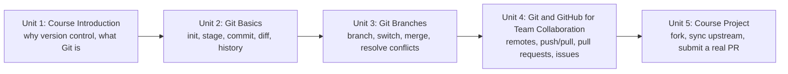

# Git and GitHub Basics

Git is the version control system underneath nearly every robotics codebase you'll touch, and GitHub is where most of that code — including ROS 2 itself — actually lives. This course takes you from a completely untracked project folder to confidently forking, branching, and submitting pull requests against real repositories: first the local Git workflow (staging, committing, history, diffing), then branching and merging, then the collaborative layer GitHub adds on top (remotes, pushing/pulling, pull requests, issues), and finally a capstone where you carry a real contribution through the full fork-to-merge pipeline.

The diagram below shows how each unit builds directly on the skills learned in the one before it.

1. [Course Introduction](01-course-introduction.md) — Why version control matters for robotics, what Git is, and how the course is structured.
2. [Git Basics](02-git-basics.md) — Initializing a repository, staging and committing, viewing history and diffs, amending commits, and retrieving older versions.
3. [Git Branches](03-git-branches.md) — Creating, switching, and comparing branches; merging and resolving conflicts; cleaning up branches.
4. [Git and GitHub for Team Collaboration](04-git-and-github-for-team-collaboration.md) — Connecting a remote, pushing and pulling, the pull request review workflow, and GitHub Issues.
5. [Course Project](05-course-project.md) — Forking, staying in sync with upstream, and submitting a real pull request from start to merge.
