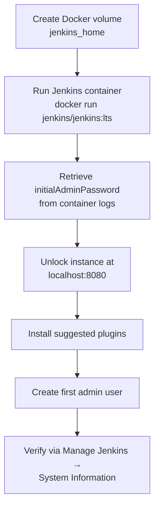

# Jenkins Basics for Robotics — Unit 2: Installation and Initial Setup

Before you can automate anything, you need a running Jenkins controller. This unit walks through getting Jenkins installed reproducibly (via a script, not by hand) and through the first-run wizard that unlocks it.

The diagram below shows the end-to-end sequence this unit follows, from the scripted Docker install through to a verified, working dashboard.



## Choosing an installation method
Jenkins can run as a native package (Debian/RPM), inside Docker, or as a standalone Java process (the `.war` file). For robotics work, two options dominate:

- **Docker** — fastest to get running, easiest to tear down and recreate, and keeps Jenkins isolated from the host's ROS/build toolchain versions. Good default for learning and for personal projects.
- **Native package (apt)** — better if Jenkins needs direct access to hardware, USB devices, or a pre-installed robotics toolchain on the host itself (e.g. an agent that talks to a real robot over serial).

This unit uses Docker for the controller, since it is the most reproducible and easiest to script.

## Scripting the install
Treat the installation as code, not a set of manual clicks — write a small script so you (or a teammate) can recreate the exact same Jenkins setup later.

```bash
#!/usr/bin/env bash
set -euo pipefail

# Persistent volume so Jenkins config survives container restarts/recreation
docker volume create jenkins_home

docker run -d \
  --name jenkins \
  --restart unless-stopped \
  -p 8080:8080 \
  -p 50000:50000 \
  -v jenkins_home:/var/jenkins_home \
  -v /var/run/docker.sock:/var/run/docker.sock \
  jenkins/jenkins:lts
```

Notes on the flags: `-p 8080:8080` exposes the web UI, `-p 50000:50000` is the port inbound Jenkins agents connect on, and the volume mount keeps all job configuration, plugins, and credentials outside the container's writable layer so an image upgrade doesn't wipe your setup. Mounting the Docker socket is optional and only needed if you want Jenkins itself to launch Docker-based build agents later — be aware it gives the Jenkins process root-equivalent access to the host, so don't do this on a shared or production machine without understanding the tradeoff.

## The initial setup wizard
On first boot, Jenkins generates a random admin password and writes it to a log file inside the container.

```bash
docker logs jenkins 2>&1 | grep -A2 "initialAdminPassword"
# or, more directly:
docker exec jenkins cat /var/jenkins_home/secrets/initialAdminPassword
```

Paste that password into `http://localhost:8080` to unlock the instance. The wizard then offers "Install suggested plugins" (a reasonable default set covering Git, pipelines, and common build steps) or "Select plugins to install" if you want to be deliberate — for this course, the suggested set is fine, and you'll add specific plugins as later units need them. Finally, create your first admin user rather than continuing as the default `admin` account — this matters more once you cover users and security in Unit 5.

## Verifying and troubleshooting the install
Once past the wizard, confirm the instance is healthy from **Manage Jenkins → System Information**, which shows the Jenkins version, Java version, and installed plugins. If the container won't start, check `docker logs jenkins` first — the most common early issues are a port already in use (`8080` claimed by something else) or a permissions mismatch on the mounted volume.

## Try it yourself
Turn the script above into your own `install_jenkins.sh`, run it, retrieve the initial admin password programmatically (no manual log-reading), and complete the setup wizard through to a working dashboard at `localhost:8080`. Then run `docker exec jenkins jenkins-plugin-cli --list` to see which plugins the "suggested" install actually gave you.
